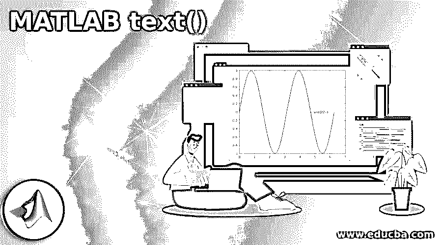
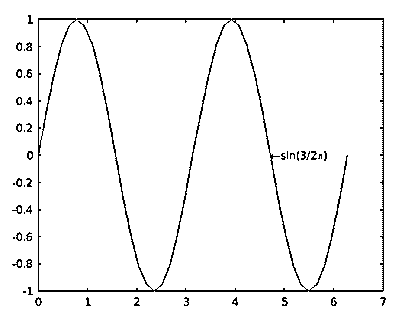
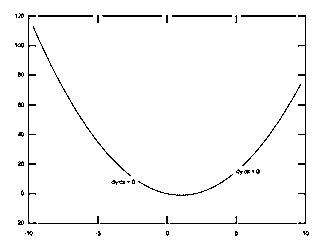
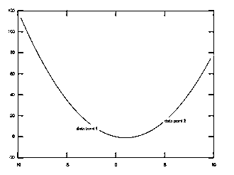
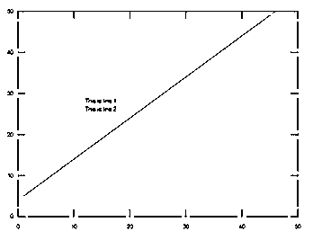
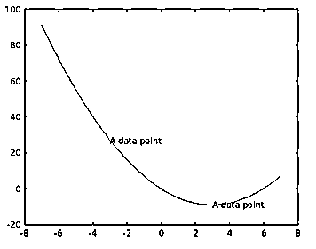
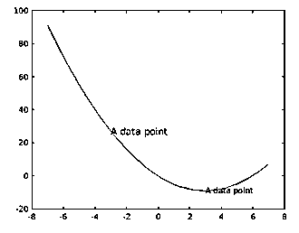
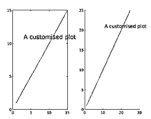

# MATLAB 文本()

> 原文：<https://www.educba.com/matlab-text/>

## MATLAB 文本介绍

MATLAB 函数 text()被定义为将描述文本放置到图上的数据点。将文本包含到单个数据点是通过将文本添加到用 x 和 y 作为标量指定的一个点来实现的。而多点文本是通过将 x 和 y 指定为等长向量来添加的。MATLAB 支持文本显示和位置的定制，如决定字体大小、字体样式、颜色、对齐等。text()函数的不同属性也使 MATLAB 能够执行不同的特殊格式，例如显示上标、下标和特殊字符。

### MATLAB 文本的语法

matlab text()的语法如下所示:

<small>Hadoop、数据科学、统计学&其他</small>

| **语法** | **描述** |
| 文本(x，y，txt) | 此表可用于向当前轴中的一个或多个数据点(x，y)添加文本内容，指定为“txt”。 |
| 文本(x，y，z，txt) | 此表可用于将文本内容(指定为 txt)添加到当前轴中的一个或多个三维数据点(x，y，z)。 |
| 文本(___，名称，值) | 此表单可用于以名称-值对的形式指定任何文本对象属性，以编辑文本的表示。 |
| 文本(ax，_ _ _ _ _ _) | 该表格可用于在地理、笛卡尔或极轴中创建文本，该文本被设置为指定为“ax”的新轴，而不是当前轴，即 gca。 |
| t =文本(___) | 该表单可用于返回绘图的文本内容，存储在一个或多个文本对象中。此文本对象可用于修改文本对象的属性，以便更改文本的外观，即使在创建文本对象之后。 |

### MATLAB 文本示例

下面是一些例子:

#### 示例#1

下面的代码片段是为了在一个数据点上放置一行文本而编写的。

**代码:**

`x = 0:pi/20:2*pi;
y = sin(2*x);
str=strcat("\leftarrow","sin(","3/2","\pi)");
plot(x,y)
text(3/2*pi,0,str)`

**输出**:

结果图在(3/2π，0)处有配置的文本“sin(3/2π)”，前面有向左箭头。

#### 示例 2–在多个数据点配置相同的文本

MATLAB 支持使用单个命令在图中的多个数据点配置文本对象的功能。

下面的代码将变量“txt”定义的文本放在向量“xt”和“yt”给出的数据点上。

**代码:**

`x = linspace(-10,10);
y = x.^2-2*x;
plot(x,y)
xt = [-4 5];
yt = [8 15];
txt = 'dy/dx = 0';
text(xt,yt,txt)`

**输出**:

#### 示例 3–为不同的数据点放置不同的文本

以下代码将由向量“txt”定义的不同文本对象放置在由向量“xt”和“yt”给出的不同数据点集合中。

**代码:**

`x = linspace(-10,10);
y = x.^2-2*x;
plot(x,y)
xt = [-4 5];
yt = [8 15];
txt = {'data point 1','data point 2'};
text(xt,yt,txt)`

**输出**:

#### 示例 4–单个数据点处的多行文本

代码被编写为将由向量“str”定义的两个文本对象放置在一个数据点(12，27)。

**代码:**

`plot(5:50)
str = {'This is line 1','This is line 2'};
text(12,27,str)`

**输出**:

#### 示例 5–使用文本对象存储文本内容

MATLAB 支持在创建文本内容后编辑文本内容的显示，方法是将创建的文本内容存储在文本对象中。

下面的代码片段编写为在创建时为 2 个数据点设置一个文本内容，并使用 text 对象的属性更改第一个数据点的文本内容的颜色和字体。

**第一阶段:**

`x = linspace(-7,7);
y = x.^2-6*x;
plot(x,y)
t = text([-3 3],[27 -9],'A data point')`

**输出:**

**第二阶段**:

`t(1).Color = 'blue';
t(1).FontSize = 12;`

**输出:**

##### 属性

MATLAB 中的文本对象包括各种类型的属性，这些属性有助于自定义图中文本的外观，例如:

| **属性** | **描述** | **默认值** |
| 字体大小 | 一个非零标量值，决定所显示文本的字体大小 | 取决于操作系统和语言环境 |
| 字体粗细 | 决定显示文本中字符粗细的字符串 | 常态 |
| 字体 Name | 决定显示文本的字体样式的字符串 | 定宽 |
| 颜色 | 决定显示文本颜色的字符串 | [0,0,0] |
| 水平对齐 | 一个字符串，它根据对“position”属性 x 值的引用决定文本的水平对齐方式。该属性的可能值为左、中或右。 | 左边的 |
| 位置 | 它决定文本的位置，被指定为形式为[x y]的两元素向量或形式为[x y z]的三元素向量 | [0,0,0] |
| 单位 | 它是指位置单位，被指定为 MATLAB 支持的值之一。 | 数据 |
| 解释者 | This attribute decides about applying markup to add subscript or superscript or special display options.文本解释器，指定为以下值之一:

*   ' TeX '—使用 TeX markupsubset 解释字符。
*   ‘latex’—使用 LaTeX 标记子集解释字符。
*   ‘无’—显示文字类型字符。

 | 塑性的涂料 |

#### 实施例 6

下面的示例涉及生成两个图，这两个图在两个不同的数据点具有文本内容，并且通过改变属性 Color 和 FontSize 的值来应用对文本外观的定制。

**C0de:**

`subplot(1,2,1)
plot(1:15)
text(3,11,'A customised plot','Color','blue','FontSize',15)
subplot(1,2,2)
hold on
plot(1:25)
text(11,21,'A customised plot','Color','green','FontSize',12)`

**输出**:

**补充说明:**

*   TeX markup 是一个在 MATLAB 中使用的系统，用于添加上标和下标，修改字体样式、颜色以及使文本支持特殊字符。
*   LaTeX 是一个高质量的排版系统；其中包括为制作科学和技术文件而设计的功能。图中显示的文本使用默认的 LaTeX 字体样式，并且不支持 FontName、font style 和 FontWeight 等属性的影响。为了改变字体样式，需要使用 LaTeX 标记。LaTeX 解释器支持的最大字符长度是 1200 个字符。
*   文本对象的 Clipping 属性始终保持设置为“off”值，默认情况下，文本似乎出现在轴之外。通过将属性值设置为“开”，可以将文本裁剪到轴边界。

### 推荐文章

这是一个 MATLAB 文本指南。在这里，我们还讨论了 matlab text()语法的介绍和语法，以及不同的例子和它的代码实现。您也可以看看以下文章，了解更多信息–

1.  [uigetfile Matlab](https://www.educba.com/uigetfile-matlab/)
2.  [MATLAB 冒号](https://www.educba.com/matlab-colon/)
3.  [复共轭 Matlab](https://www.educba.com/complex-conjugate-matlab/)
4.  [Matlab 积分](https://www.educba.com/matlab-integral/)

