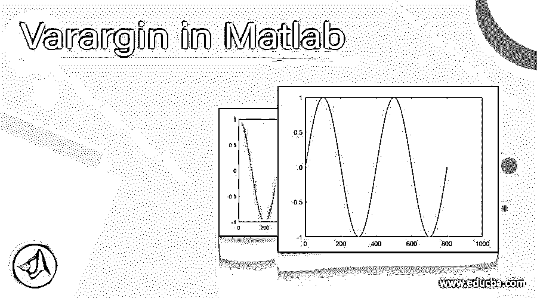
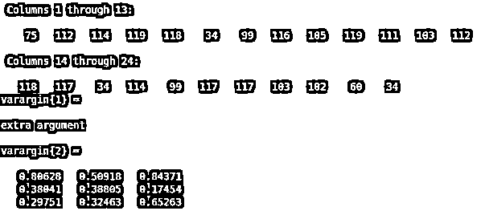
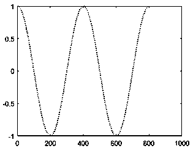
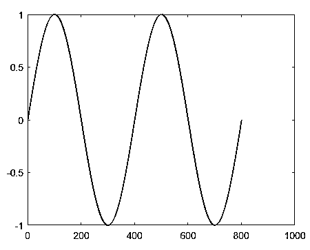

# Matlab 中的 Varargin

> 原文：<https://www.educba.com/varargin-in-matlab/>

## Matlab 中的 Varargin 介绍

MATLAB 是一个交互式的编程环境，用于科学计算。它广泛应用于许多需要解决问题、数据分析、算法开发和实验的技术领域。特定学科的软件大量使用 MATLAB 编写。

在本文中，我们将研究如何在 MATLAB 中使用“varargin”输入变量。

<small>Hadoop、数据科学、统计学&其他</small>

在我们开始学习“vara gin”如何在 MATLAB 中工作之前，让我们理解为什么我们需要“vara gin”输入变量。

### 瓦拉金

我们在函数的定义中使用“varargin ”,这样我们就可以根据需要传递尽可能多的参数。在某些情况下，编码器很难预先决定输入参数的数量。这些情况要求函数定义足够灵活，在调用时可以接受任意数量的参数。

现在让我们来理解 MATLAB 中“varargin”的语法:

**语法:**

`varargin`

**【请记住‘vara gin’是小写的，并作为最后一个参数传递给函数】**

**描述:**

1.  varargin 作为输入变量传递给函数定义
2.  它为函数提供了接受编码者想要的尽可能多的参数的能力。

### Matlab 中 Varargin 的例子

现在，借助各种示例，让我们了解一下 MATLAB 中“varargin”的代码是什么样子的。

#### 示例#1

在本例中，我们将定义一个函数，该函数将简单地显示传递的参数数量。我们需要遵循以下两个步骤:

1.  创建一个存储有函数的文件。这将有。m '扩展
2.  调用上面文件中创建的函数

**代码创建函数并另存为。m 分机:**

`function learningVarargin (varargin)`

**【定义函数 learningVarargin 并传递‘vara gin’命令】**

`disp ("Input arguments passed: " + nargin)`

**['nargin '用于获取输入变量的数量]**

`celldisp (varargin)`

**['celldisp '将显示所有输入变量]**

`end`

**【创建函数后，用你选择的名字保存这个文件，这里我们把我们的文件命名为‘learning varargin . m】**

现在，在新的命令窗口中，使用以下代码:

**调用函数的代码**

`type learningVarargin
learningVarargin ('extra argument', rand (3))`

使用我们选择的参数调用 learningVarargin 函数。这里我们使用了两个参数来调用函数]

**输入 1(创建函数):**

`function learningVarargin (varargin)
disp ("Input arguments passed: " + nargin)
celldisp (varargin)
end`

**输入 2(调用函数):**

`type learningVarargin
learningVarargin ('extra argument', rand (3))`

**输出:**

#### 实施例 2

在本例中，我们将定义一个绘制 cos 波形的函数。我们将根据 or 要求传递参数的数量来格式化绘图的样式。

**代码创建函数并另存为。m 分机:**

`function learningVarargin1 (x, varargin)`

**【定义函数 learningVarargin1 并传递‘vara gin’命令】**

`plot (x, varargin {:})`

**【plot 用于获取图形】**

**vara gin {:}将帮助我们向情节传递尽可能多的参数]**

`end`

**【创建函数后，以您选择的名称保存该文件，这里我们将我们的文件命名为‘learning varargin 1 . m】**

**调用函数的代码**

`type learningVarargin1
learningVarargin1 (cos (0 : pi/200 : 4*pi), 'color', 'r', 'linestyle', ':')`

**[使用我们选择的参数调用 learningVarargin1 函数。在这里，除了强制参数“x”之外，我们还使用了“颜色”和“线条样式”参数来调用函数]**

**输入 1(创建函数):**

`function learningVarargin1 (x, varargin)
plot (x, varargin {:})
end`

**输入 2(调用函数):**

`type learningVarargin1
learningVarargin1 (cos (0 : pi/200 : 4*pi), 'color', 'r', 'linestyle', ':')`

**输出:**

#### 实施例 3

在本例中，我们将定义一个绘制正弦波的函数。我们将传递与上面传递的不同的参数，以格式化情节的风格。

**代码创建函数并另存为。m 分机:**

`function learningVarargin2 (x, varargin)`

**【定义函数 learningVarargin2 并传递‘vara gin’命令】**

**【这里，注意函数的语法基本上保持不变。这就是“varargin”命令的威力，它将帮助我们在调用函数时改变输入参数的数量，而不用担心参数的数量]**

**调用函数的代码**

`type learningVarargin2
learningVarargin1 (sine (0 : pi/200 : 4*pi), 'color', 'r')`

**[使用我们选择的参数调用 learningVarargin2 函数。在这里，除了强制参数“x”之外，我们只使用了颜色参数来调用函数]**

**输入 1(创建函数):**

`function learningVarargin2 (x, varargin)
plot (x, varargin {:})
end`

**输入 2(调用函数):**

`type learningVarargin2
learningVarargin1 (sine (0 : pi/200 : 4*pi), 'color', 'b')`

**输出:**

**

** 

### 结论

当我们不确定调用函数时可能需要多少个参数时，可以在 MATLAB 中使用“varargin”。当使用像 plot 这样的函数时，它提供的灵活性变得非常有用，我们可能需要随时格式化图形。

### 推荐文章

这是一个在 Matlab 中使用 Varargin 的指南。这里我们讨论介绍、语法、描述和代码实现的例子。您也可以浏览我们的其他相关文章，了解更多信息——

1.  [uigetfile Matlab](https://www.educba.com/uigetfile-matlab/)
2.  [费瓦尔 Matlab](https://www.educba.com/feval-matlab/)
3.  [MATLAB 工具箱](https://www.educba.com/matlab-toolbox/)
4.  [MATLAB 冒号](https://www.educba.com/matlab-colon/)

