# Matlab gca

> 原文：<https://www.educba.com/matlab-gca/>

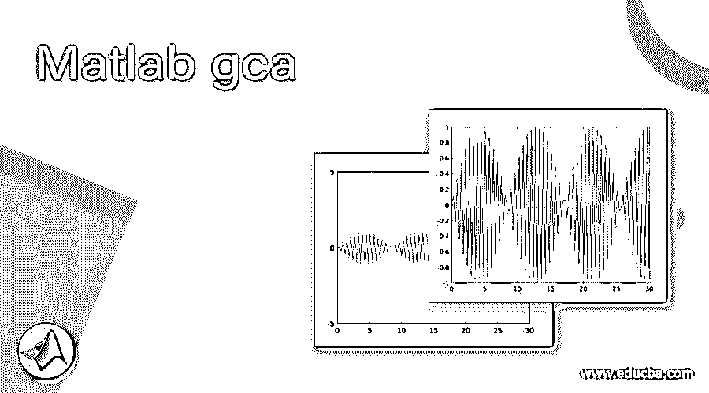

## Matlab gca 简介

MATLAB 的“gca”方法可以用来获得当前轴的句柄。同样，如果我们没有任何句柄，那么“gca”方法会生成一个。为了加深我们对句柄的理解，请记住句柄基本上是一个引用对象的数字。该对象可以是图形、轴或线条。如果我们需要对该对象进行任何更改，我们将需要一个对该对象的引用，这可以使用句柄来完成。

**语法:**

<small>Hadoop、数据科学、统计学&其他</small>

ca = gca 将句柄返回到图中的当前轴。

现在让我们了解如何使用“gca”方法在 MATLAB 中获得当前轴。

### 例子

让我们讨论 Matlab gca 的例子。

#### 示例#1

在这个例子中，我们将使用 gca 方法来获取图形的当前坐标轴。我们将为第一个例子绘制一个指数函数。本例中要遵循的步骤是:

1.  初始化需要当前轴的函数
2.  使用绘图方法显示图形
3.  初始化 gca 方法
4.  设置当前轴的字体大小
5.  为当前轴设置当前轴的限制

**代码:**

`x = linspace (0, 20);
y = exp (2 * x);`

**【初始化 x & y 轴。这里我们使用了一个指数函数]**

`plot (x, y)`

**【使用绘图方法显示图形】**

`ca = gca`

**【使用‘GCA’方法参考当前轴】**

`ca.FontSize = 12;`

**【设置当前轴的字体大小】**

`ca.YLim = [0 20];`

**【设置当前轴的极限】**

**这是我们的输入和输出在 MATLAB 命令窗口中的样子:**

**输入:**

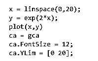

**输出 1:**

**指数函数图**

**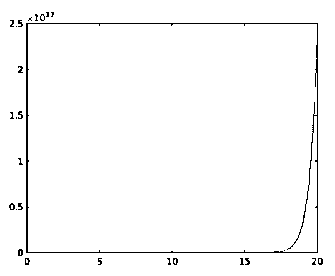

** 

**输出 2:**

**获取上图的当前轴**

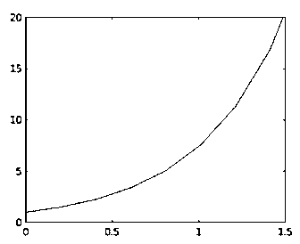

**正如我们在输出中看到的，我们已经获得了我们定义的指数函数的当前轴。**

#### 实施例 2

在这个例子中，我们将使用 gca 方法来获取图形的当前坐标轴。我们将为这个例子绘制一个正弦波。本例中要遵循的步骤是:

1.  初始化需要当前轴的函数
2.  使用绘图方法显示图形
3.  初始化 gca 方法
4.  设置当前轴的字体大小
5.  为当前轴设置当前轴的限制

**代码:**

`x = linspace (0, 30);
y = sin (10 * x);`

**【初始化 x & y 轴。这里我们定义一个正弦波]**

`plot (x, y)`

**【使用绘图方法显示图形】**

`ca = gca`

**【使用‘GCA’方法参考当前轴】**

`ca.FontSize = 12;`

**【设置当前轴的字体大小】**

`ca.YLim = [-5 5];`

**【设置当前轴对当前轴的限制】**

**这是我们的输入和输出在 MATLAB 命令窗口中的样子:**

**输入:**

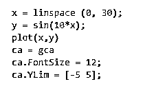

**输出 1:**

**正弦波图**

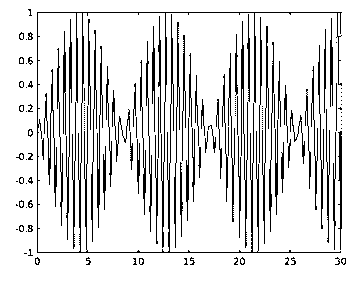

**输出 2:**

**获取上图的当前轴**

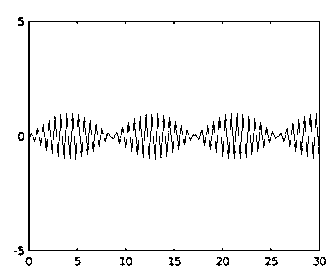

**正如我们在输出中看到的，我们已经获得了我们定义的正弦波的电流轴。**

#### 实施例 3

在这个例子中，我们将使用 gca 方法来获取图形的当前坐标轴。我们将为此示例绘制一个 cos 波形。本例中要遵循的步骤是:

1.  初始化需要当前轴的函数
2.  使用绘图方法显示图形
3.  初始化 gca 方法
4.  设置当前轴的字体大小
5.  为当前轴设置当前轴的限制

**代码:**

`x = linspace (0, 20);
y = cos (10 * x);`

**【初始化 x & y 轴。这里我们定义一个 cos 波]**

`plot (x, y)`

**【使用绘图方法显示图形】**

`ca = gca`

**【使用‘GCA’方法参考当前轴】**

`ca.FontSize = 12;`

**【设置当前轴的字体大小】**

`ca.YLim = [-5 5];`

**【设置当前轴对当前轴的限制】**

**这是我们的输入和输出在 Matlab 命令窗口中的样子:**

**输入:**

**输出 1:**

**cos 波形图**

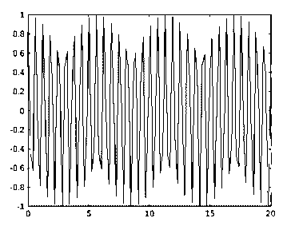

**输出 2:**

**获取上图的当前轴**

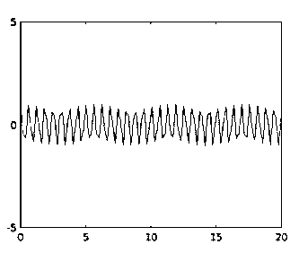

**正如我们在输出中看到的，我们已经获得了我们定义的 cos 波的电流轴。**

#### 实施例 4

在这个例子中，我们将使用 gca 方法来获取图形的当前坐标轴。我们将为这个例子绘制一个对数函数。本例中要遵循的步骤是:

1.  初始化需要当前轴的函数
2.  使用绘图方法显示图形
3.  初始化 gca 方法
4.  设置当前轴的字体大小
5.  为当前轴设置当前轴的限制

**代码:**

`x = linspace (0, 20);
y = log (10 * x);`

**【初始化 x & y 轴。这里我们定义一个对数函数]**

plot (x, y)

**【使用绘图方法显示图形】**

ca = gca

**【使用‘GCA’方法参考当前轴】**

加州。FontSize = 12

**【设置当前轴的字体大小】**

加州。YLim =[0 10]；

**【设置当前轴对当前轴的限制】**

**这是我们的输入和输出在 MATLAB 命令窗口中的样子:**

**输入:**

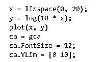

**输出 1:**

**对数函数图**

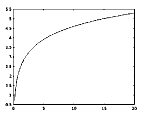

**输出 2:**

**获取上图的当前轴**

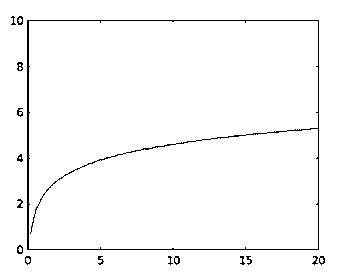

**正如我们在输出中看到的，我们已经获得了我们定义的对数函数的当前轴。**

### 结论

在 MATLAB 中，gca 方法用于获得当前轴的句柄。如果没有句柄，那么“gca”方法会生成一个。

### 推荐文章

这是一个 Matlab 的 gca 指南。为了更好地理解，我们在这里讨论介绍、语法和带有输出的步骤。您也可以看看以下文章，了解更多信息–

1.  [MATLAB 特征值](https://www.educba.com/matlab-eigenvalues/)
2.  [Matlab 排序](https://www.educba.com/matlab-sort/)
3.  [Matlab 格式](https://www.educba.com/matlab-format/)
4.  [Matlab 编写](https://www.educba.com/matlab-fwrite/)

