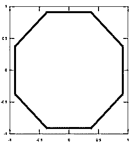
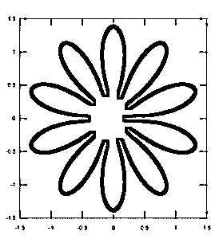

# Matlab 填充()

> 原文：<https://www.educba.com/matlab-fill/>

## Matlab fill 介绍()

在 Matlab 中，fill()函数负责从 X 和 Y 指示的数据创建彩色填充多边形，顶点颜色由包含各种颜色规范的 Colorspec 确认。这里，Colorspec 不是一种函数或命令，而是为我们提供了三种方法来识别 Matlab 图形的颜色，以创建填充区域或其他相关函数。它包括 RBG 三联体、短名和长名等类型。因此，Matlab 中的 Fill()用于绘制填充的多边形，其中颜色阴影的类型取决于矩阵中的参数列表，并且顶点与 X 和 y 指定的数据一起被记录。

**语法:**

<small>Hadoop、数据科学、统计学&其他</small>

以下是 Matlab 中 fill()函数的语法:

`Fill (X, Y, C)              // It produces filled polygons from the data stated by X and Y with color C.
Fill (X, Y, ColorSpec)          // It is used to fill 2D polygons identified by X and Y with the color specified
Fill (X1, Y1, C1, X2, ….., Xn, Yn, Cn)       // It is used for multiple 2D filled areas in Matlab fill ()
Fill (…, ‘property_name’, property_value)
Fill(ax,..)
h = fill (…..)`

### Matlab fill()的工作

*   在 Matlab 中，fill (X，Y，C)函数根据 X 和 Y 中的统计数据以及由 C 标识的顶点颜色创建填充的多边形。在这里，C 被认为是一个矩阵，有助于作为颜色图中的索引。假设，如果我们把 C 看作一个行向量，那么长度(C)应该等于大小(X，2)和大小(Y，2)。同样，当我们将 C 视为列向量时，长度(C)应该等于大小(X，1)和大小(Y，1)。
*   如果需要，Matlab 中的 fill()函数可以通过连接最后一个顶点和第一个顶点来闭合多边形。我们可以在 X 和 y 中添加数值或日期时间、分类或持续时间值。

现在，您可以使用 fill 函数创建任何阴影区域，如下所示:

*   Fill (X，Y，ColorSpec)可以用颜色标识符 ColorSpec 填充由 X 和 Y 表示的二维多边形。
*   为了定义多个二维填充区域，我们可以在具有颜色顶点 C 的 X 和 Y 中使用 fill()函数的以下结构:fill (x1，Y1，C1，X2，Y2，C2，…，Xn，Yn，Cn)其中 n 是矩阵或创建填充多边形所需的项数。
*   此外，fill()函数有助于通过以下语法为特定修补图形项目或对象指定任何属性名称和相应的值:

`Fill (…, ‘property_name’, property_value)`

*   fill (ax，…)在 ax 指定的轴上生成多边形，而不是在当前轴上生成 gca。在旧的语法中，ax 选项可以进一步放在任何输入参数组合的前面。
*   我们要知道在 Matlab 中，h = fill (…)允许提供 patch 对象的向量。

### Matlab fill()示例

下面给出了 Matlab fill()的例子:

#### 示例#1

*   使用 fill()函数在 Matlab 中创建一个红色填充的八边形。

首先，声明数据和对象。然后使用填充函数生成八边形的填充区域，如下所示:

**代码:**

`a = (1 / 16:1 / 8:1) ‘* 2 * pi;
x = cos (a);
y = sin(a);
fill (x, y, ‘r’)
axis square`

**输出:**

#### 实施例 2

多边形的像花设计与下面的代码。

**代码:**

`r = linspace (0, 2*pi, 200);
t = sqrt (abs(2*sin(5*r)));
x = t.*(cos(r));
y = t.*(sin(r));
fill (x, y, ‘k’)
axis (‘square’)`

**输出:**

### 一些需要记住的准则

*   假设 X 和 Y 是矩阵中的数字数据，而另一个是列向量，其元素数量与矩阵中的行数相同，那么您需要填充列向量参数的副本，以便它生成所需大小的矩阵。
*   这里，fill 函数从 X 和 Y 中匹配的元素生成一个顶点，从而从每一列中的数据创建一个多边形。
*   此外，如果 X 或 Y 中存在 NaN 值，则 fill()函数不会填充多边形。
*   在这里，当您使用 ColorSpec 给定颜色时，fill()函数通过将面片对象的属性“FaceColor”声明为等效的 RGB 三元组来产生一个平面阴影类型的多边形。
*   但是，如果您同意使用 C 的颜色，那么 fill 函数将 C 的元素与 axes 属性(即 CLim)所标识的值进行平衡，此后，C 将对颜色图进行索引。
*   如果 C 是行向量，则填充函数产生平面阴影多边形，其中多边形的颜色由矩阵 X 和 y 的相应列定义的每个元素确定。每个面片对象的属性“面颜色”固定为“平面”。CData 属性值由第 n 个 patch 对象的每个 row 元素定义，其中 n 表示 X 和 y 中对应的列。
*   假设如果 C 是一个列向量或矩阵，填充使用顶点颜色的线性插值产生具有插值颜色的多边形。此处，面片图形对象的 FaceColor 属性设置为“interp”。CData 属性值由相应对象的一列中的元素定义。
*   为了创建期望大小的矩阵，其中 C 是列向量，则填充函数重复该列向量。

### 结论

记住，如果你想得到你想要的颜色底纹类型，那么它取决于你传递颜色的参数。在本文中，我们学习了如何使用 fill()函数从数据和顶点索引中填充多边形，以在 Matlab 中执行数据的图形表示。

### 推荐文章

这是 Matlab fill()的一个指南。在这里，我们讨论 Matlab fill()的介绍、示例和工作方式，以及一些指导原则。您也可以看看以下文章，了解更多信息–

1.  [Matlab 叉积](https://www.educba.com/matlab-cross-product/)
2.  [Matlab 中的单位矩阵](https://www.educba.com/identity-matrix-in-matlab/)
3.  [列向量 Matlab](https://www.educba.com/column-vector-matlab/)
4.  [Matlab 中的平方根](https://www.educba.com/square-root-in-matlab/)
5.  [如何用 Matlab 计算？](https://www.educba.com/matlab-count/)
6.  [Matlab 中的 fminsearch 完全指南](https://www.educba.com/fminsearch-in-matlab/)

