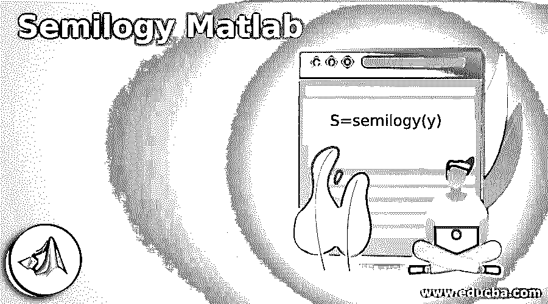
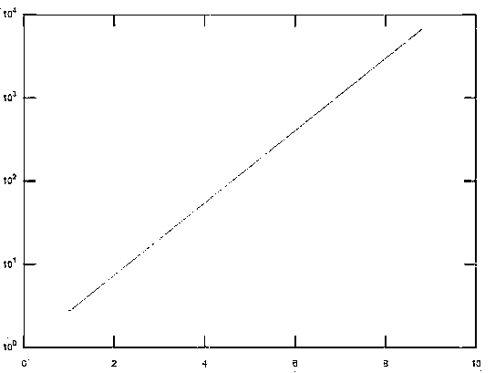
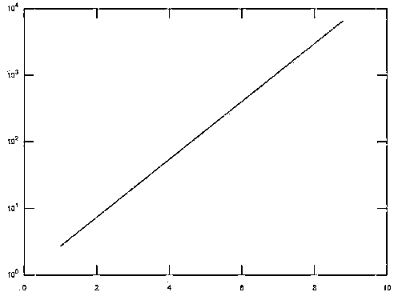
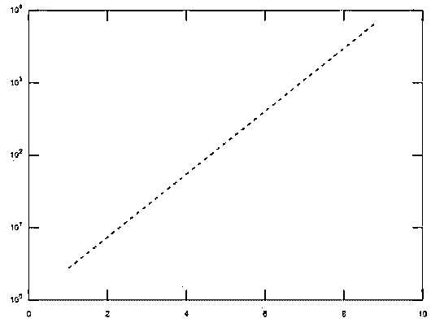
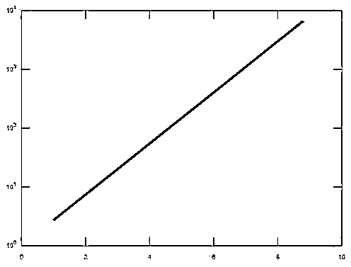

# 半对数 Matlab

> 原文：<https://www.educba.com/semilogy-matlab/>

## 半对数 Matlab 简介

对数图用于绘制和实现属于大范围的值，并且该图本质上是非线性的。在 Matlab 中，semilogy 函数用于创建以 10 为基数的对数图，x 轴上有一个线性刻度。这些图用于各种领域，如数据科学、人工智能等。如果纵轴或 y 轴包含实数，它将绘制图形。

### 在 Matlab 中使用 Semilogy 语法和示例

在 Matlab 中，半逻辑用于许多应用。它主要用于绘制 y 轴上的数值的对数刻度。

<small>Hadoop、数据科学、统计学&其他</small>

以下是 Matlab 中使用的语法:

`S=semilogy(y)`

此语法用于绘制图形，它对 Y 轴上的值使用以 10 为底的对数刻度，对 x 轴上的值使用线性刻度。它用于绘制 Y 列相对于其索引的值。如果 Y 的值有虚部，那么 semilogy(y)将等于 semi logy(Y 的实部，Y 的虚部)。

`S=semilogy (x1, y1,… xn, yn)`

该语法用于以 xn 和 yn 对的形式绘制图形。如果任何一个值是一个矩阵，那么它将绘制与矩阵的行和列中存在的各种值相关的向量自变量，以及矩阵中的维度值，其长度与向量的相应长度相匹配。xn 的值可以是日期时间、数字、持续时间或分类类型，而 yn 的值本质上应该总是数字。

`S=semilogy (x1, y1, Line specification…)`

此语法用于修改线条的变化，可以是图形中绘制的各种线条的线条样式、标记符号、标记颜色。

`S=semilogy (……, Property Name, Value of the respective property)`

这用于通过更改各种属性来修改绘制线的外观。属性的名称可以在“属性名称”规范中给出，而相应属性的值可以在“值”参数中指定。

`S=semilogy (axes of the line...)`

这用于绘制轴参数中提到的线，而不是当前轴。

`S=semilogy (…...)`

这是用来返回一个线对象的向量。

### 半对数 Matlab 示例

下面给出的例子描述了 Matlab 中半逻辑的使用。

#### 示例#1

创建一个图，Y 轴为对数刻度，x 轴为线性刻度。

**代码:**

`a = 1:1.3:10;
b = exp(a);
s=semilogy(a,b)`

**输出:**

在上面的例子中，y 轴上的刻度本质上是对数的，而 x 轴上的刻度本质上是线性的。

以下属性可在半对数绘图中使用，以更改绘制线条的外观，如线条样式、线条宽度、线条颜色等。

线条颜色是半对数图的主要属性之一，它改变了绘制线条的颜色。颜色可以是任何 RGB 三元组值、十六进制颜色代码等。RGB 三元组值是具有三个数值的向量，它描述了红色、绿色和蓝色的强度级别。强度值应该在 0 到 1 的范围内。线条的颜色可以是红色、绿色、蓝色、品红色、青色、白色、黑色、黄色。

以下示例显示了更改绘制线颜色的代码。

#### 实施例 2

将绘制线的颜色更改为红色。

**代码:**

`a = 1:1.3:10;
b = exp(a);
s=semilogy(a,b,"Color","Red")`

**输出:**

线条样式和线条宽度是绘制线条的另外两个属性，用于更改绘制线条的样式和宽度。线条样式可以有不同的形式，如实线、虚线、点线、点划线，其中实线是默认线条。类似地，线宽可以是任何正数值。

下面的例子显示了 Matlab 中关于半对数的线型和线宽属性。

#### 实施例 3

使用虚线显示线条样式的属性。

**代码:**

`a = 1:1.3:10;
b = exp(a);
s=semilogy(a,b,"LineStyle","--")`

**输出:**

#### 实施例 4

使用设定值显示线宽属性。

**代码:**

`a = 1:1.3:10;
b = exp(a);
s=semilogy(a,b,"LineWidth",4)`

**输出:**

颜色模式是用于控制绘制线的颜色属性的属性之一。它可以采用“自动”和“手动”值。如果属性的值设置为 auto，那么 Matlab 应该从 color 属性中选择一种颜色，而如果它设置为' manual '，那么我们可以控制 Color 属性的值并手动更改它。类似地，还有另一个属性叫做线条样式模式。它可以有两个值，自动和手动。如果属性的值设置为 auto，那么 Matlab 应该从 LineStyle 属性中选择一个线条样式，而如果它设置为“manual ”,那么我们可以控制 line style 属性的值并手动更改它。

为了锐化绘图的水平和垂直线条，还有一个名为“AlignVertexCenters”的属性。要消除图形的不均匀外观，我们可以使用该属性。如果相应属性的值为“关”，则不会锐化水平线和垂直线，并且这些线在绘图中可能会显得不均匀。如果相应属性的值为“ON ”,它将锐化水平线和垂直线，以使绘制的线条外观平滑。

### 结论

各种其他属性与 Matlab 中的半对数图相关，如标记大小、标记颜色等。，它控制绘制线的外观。半对数是 Matlab 中一个重要的学习函数，因为它有广泛的应用。

### 推荐文章

这是一个半逻辑 Matlab 指南。在这里，我们用语法和例子来讨论 Matlab 中半逻辑的介绍和使用。您也可以看看以下文章，了解更多信息–

1.  [Matlab 绘图图例](https://www.educba.com/matlab-plot-legend/)
2.  [Matlab 中的瓦拉金](https://www.educba.com/varargin-in-matlab/)
3.  [uigetfile Matlab](https://www.educba.com/uigetfile-matlab/)
4.  [MATLAB 工具箱](https://www.educba.com/matlab-toolbox/)

