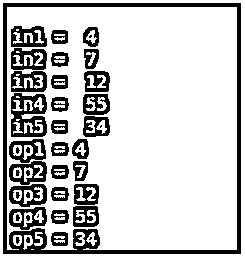
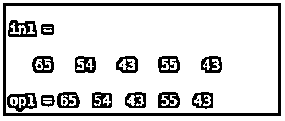
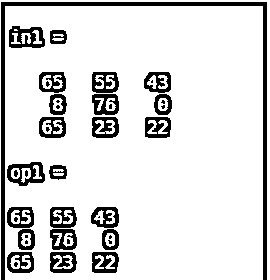
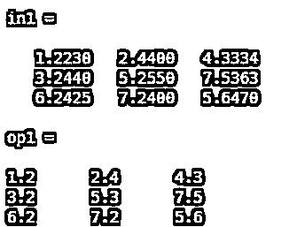
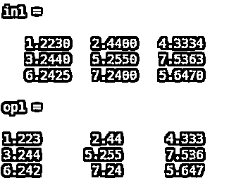
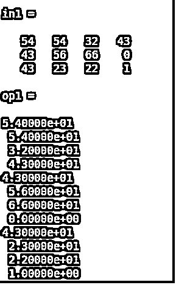

# Matlab 中的 num2str

> 原文：<https://www.educba.com/num2str-in-matlab/>

## Matlab 中 num2str 介绍

“num2str”函数用于将数字数据转换为字符数据。在这个函数中，没有数据的限制。数据可以是单个元素、数组、向量或多维矩阵的形式。所有类型的数据都可以在函数中使用。该函数的输出完全取决于输入数据的幅度。除了输入数据，我们还可以传递输出的精度和格式。

**语法:**

<small>Hadoop、数据科学、统计学&其他</small>

`Op = num2str ( in )
Output variable name = num2str ( input variable name )`

`Op = num2str ( in , 1 )
Output variable name = num2str (input variable name, precision value)`

`Op = num2str ( in , e )
Output variable name = num2str (input variable name, format of output )`

### num2str Matlab 示例

如果我们使用简单的函数 num2str，这个函数独立地转换输入数据。如果我们使用带精度的 num2str 函数，那么输出将根据精度显示最大位数。让我们假设一个数字 3.456，如果我们应用精度为 2 的 num 2 str 函数，那么它将忽略除前两位数字之外的所有其他数字，这意味着输出将是 3.4。如果精度是 3，那么输出将达到三位数 3.45。如果我们使用 num2str 函数和格式说明符，那么输出将根据用户给定的格式改变。

#### 示例#1

在这个例子 1 ( a)中，让我们假设五个不同的输入 in1、in2、in3、in4 和 in5，所有的输入分别是整数 4、7、12、55 和 34。所有输入的输出为 op1、op2、op3、op4 和 op5。在第二部分中，1 ( b)输入是数组的形式，或者我们可以说是 vector，所以输出也是数组的形式。并且在第三部分 1 ( c)中，输入是具有三行三列的多维矩阵的形式，因此输出也将是具有三行三列的多维矩阵的形式。

**实例 1 的 Matlab 程序(a )**

`clc ;
clear all ;
in1 = 4
in2 = 7
in3 = 12
in4 = 55
in5 = 34
op1 = num2str ( in1 )
op2 = num2str ( in2 )
op3 = num2str ( in3 )
op4 = num2str ( in4 )
op5 = num2str ( in5 )`

**输出:**

**实例 1 的 Matlab 程序(b)**

`clc ;
clear all ;
in1 = [ 65 54 43 55 43 ] op1 = num2str ( in1)`

**输出:**

**实例 1 的 Matlab 程序(c )**

`clc ;
clear all ;
in1 = [ 65 55 43 ; 8 76 0 ; 65 23 22 ] op1 = num2str (in1)`

**输出:**

#### 实施例 2

在本例中，num2str 函数与 precision 一起应用。在第一部分中，精度为 2，在第二部分中，精度为 4。对于示例 2(a)和示例 2(b ),输入数据是具有三行和三列的多维矩阵。我们可以用数字的形式观察到 2 (a)和 2 (b)两部分的区别。示例 2(a)将显示 2 位数的输出，示例 2(b)将显示 4 位数。

**实例 2 的 Matlab 程序(a )**

`clc ;
clear all ;
in1 = [ 1.223  2.44  4.3334 ; 3.244 5.255 7.5363 ; 6.2425 7.24 5.647 ] op1 = num2str ( in1 , 2 )`

**输出:**

**实例 2 的 Matlab 程序(b)**

`clc ;
clear all ;
in1 = [ 1.223 2.44 4.3334 ;    3.244 5.255 7.5363 ; 6.2425 7.24 5.647 ] op1 = num2str ( in1, 4 )`

**输出:**

#### 实施例 3

在这个例子中，让我们假设输入是具有三行四列的多维矩阵的形式。Num2str 函数与格式说明符一起应用。此格式说明符根据格式将整数数据转换为字符或字符串。在本例中，我们传递了一个格式说明符 9.5 e。该说明符适用于所有输入元素，与输入数据的类型无关。

**例 3 的 Matlab 程序**

`clc ;
clear all ;
in1 = [ 54 54 32 43 ; 43 56 66 0 ; 43 23 22 1 ] op1 = num2str ( in1 ,' %9.5e\n ' )`

**输出:**

### 结论

函数' num2str '是 Matlab 中非常有效和强大的函数。它不仅将整数转换成字符形式，还对精度和格式说明符进行操作。精度决定输出数字的最大范围，格式说明符决定输出元素的格式。

### 推荐文章

这是一个在 Matlab 中使用 num2str 的指南。在这里，我们还讨论了介绍和如何 num2str Matlab 做的例子及其代码实现。您也可以看看以下文章，了解更多信息–

1.  [xls 读取 Matlab](https://www.educba.com/xlsread-matlab/)
2.  [Matlab 绘图颜色](https://www.educba.com/matlab-plot-colors/)
3.  [亥维赛 MATLAB](https://www.educba.com/heaviside-matlab/)
4.  [Matlab 中的阶乘](https://www.educba.com/factorial-in-matlab/)

