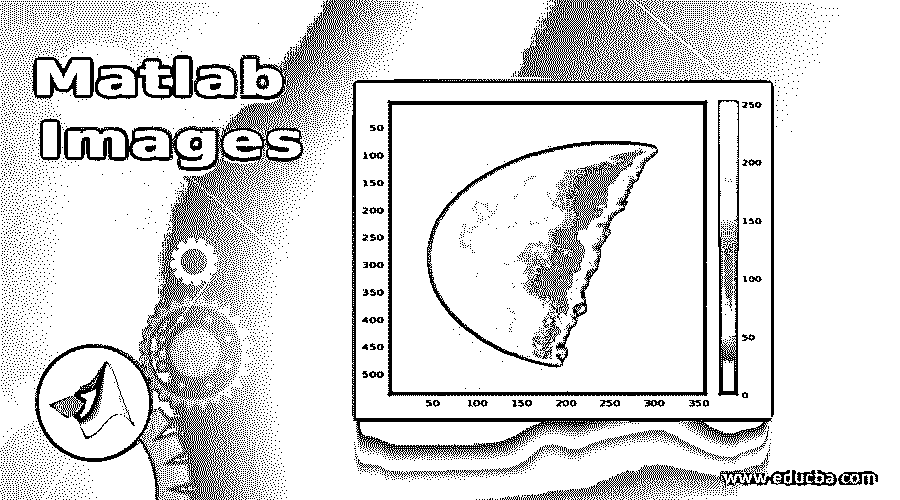
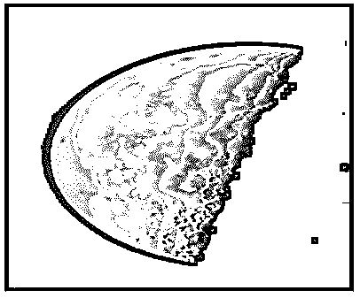
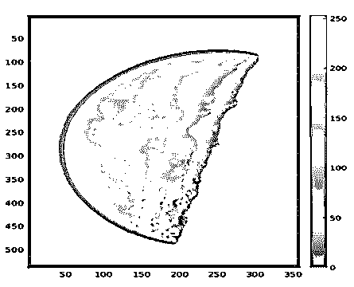
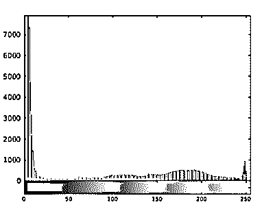
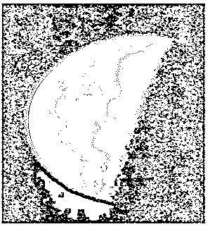
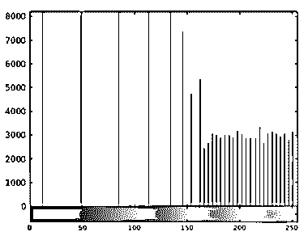
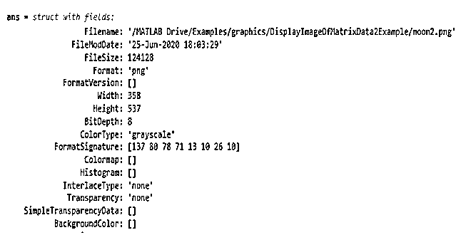

# matlab 图像 c

> 原文：<https://www.educba.com/matlab-images/>

## Matlab 图像介绍

MATLAB 以工具箱的形式提供图像处理应用程序，通过支持图像数据的交互式分割、图像配准方法的比较和大型数据集的批处理，帮助我们自动化常用的图像处理技术和工作流程。MATLAB 中的图像处理让我们可以探索任何图像或视频，并进行调整，如调整对比度、操纵 ROI(感兴趣区域)和创建直方图，以了解图像的定义。

以下是 MATLAB 中处理图像的一些最常用函数的列表:

<small>Hadoop、数据科学、统计学&其他</small>

*   **imread():** 该函数用于读取或加载我们想要处理的图像
*   **imshow():** 该函数用于显示我们已经加载的图像
*   **imagesc():** 该函数用于利用色图中的全套颜色来显示图像。调用此函数后，还可以使用色标来更好地了解当前的颜色
*   使用这个函数，我们可以检查图像的像素强度是如何分布的
*   **histeq():** 使用此功能，我们可以编辑图像的对比度
*   **imwrite():** 该函数用于将我们编辑过的图像插入到文件中
*   **iminfo():** 此功能用于确认我们编辑的文件是否加载到磁盘文件中

### Matlab 图像的函数

现在让我们来了解一下 MATLAB 中上述所有函数的用法。我们将使用存储在 MATLAB 图像处理应用程序中的图像，并对该图像逐步执行上述所有功能。

#### 第一步

第一步，我们将图像加载或读取到我们的工作空间中。

**代码:**

`imageInput = imread ('moon.tif');`

[‘imread’ will read the image and will store it in the array ‘imageInput’]

#### 第二步

在这一步中，我们将在工作区中显示我们的图像。

**代码:**

`imshow (imageInput)`

[‘imshow’ will display the image as output in the workspace]

正如我们在输出中看到的，图像被加载到我们的工作空间中。

#### 第三步

在这一步中，我们将使用色图中的颜色来显示我们的图像。我们还将使用颜色条来检查颜色的强度。

**代码:**

`imagesc (imageInput)`

[‘imagesc’ will display the image with a full range of colors from the colormap]

`colorbar`

[‘colorbar’ is used to display a scale next to the image to check the intensity of the colors]

正如我们在输出中看到的，图像显示出来，在色彩映射表中有全范围的颜色，旁边还有一个颜色条。

#### 第四步

在这一步中，我们将检查图像中像素的强度。我们将使用 figure 函数以直方图的形式显示强度。

**代码:**

`figure`

[Used to display the histogram for intensity]

`imhist (imageInput)`

[‘imhist’ will create distribution of the pixel intensities]

正如我们在输出中看到的，我们图像的像素强度范围非常窄，也就是说，这些值在开始时集中在一个很小的范围内。

#### 第五步

在这一步，我们将编辑图像的对比度。这样做是因为我们在上面的步骤中发现，我们的图像具有非常窄的像素强度。

**代码:**

`newImage = histeq (imageInput);`

[‘histeq function will improve the pixel intensity or we can say that it will improve the contrast of our image]

`figure
imshow (newImage)`

[Displaying our new image (with improved contrast]

正如我们在输出中看到的，我们图像的对比度发生了巨大的变化。

#### 第六步

在这一步中，让我们用“newImage”作为输入再次调用“imhist”函数。这将确认所创建的新图像的对比度或像素强度现在以更好的方式分布

**代码:**

`figure
imhist (newImage)`

正如我们在上面的直方图中看到的，新图像的像素强度现在以一种更好的方式分布。

#### 第七步

在这一步中，我们将把新图像插入到磁盘文件中。

**代码:**

`imwrite (newImage, 'moon2.png');`

[Using ‘imwrite’ to save the image in disk file]

#### 第八步

最后，我们将使用“iminfo”功能确认我们的图像是否保存在磁盘文件中。这也将为我们提供所有其他细节，如文件大小、格式、宽度、高度等。

**代码:**

`imfinfo ('moon2.png')`

[Getting the information of the saved file]

正如我们在输出中看到的，文件按照我们的预期保存。我们还拥有与图像相关的所有其他信息。

### 结论

MATLAB 中的图像处理应用程序可以对图像执行各种操作，从加载图像、编辑图像到保存在磁盘文件中。图像处理可用于处理 2D 和 3D 图像。

### 推荐文章

这是一个 Matlab 图像指南。在这里，我们还将讨论 matlab 中函数的介绍和使用，以及示例和代码实现。您也可以看看以下文章，了解更多信息–

1.  [Matlab 绘图颜色](https://www.educba.com/matlab-plot-colors/)
2.  [亥维赛 MATLAB](https://www.educba.com/heaviside-matlab/)
3.  [Matlab 中的阶乘](https://www.educba.com/factorial-in-matlab/)
4.  [傅立叶级数 Matlab](https://www.educba.com/fourier-series-matlab/)

