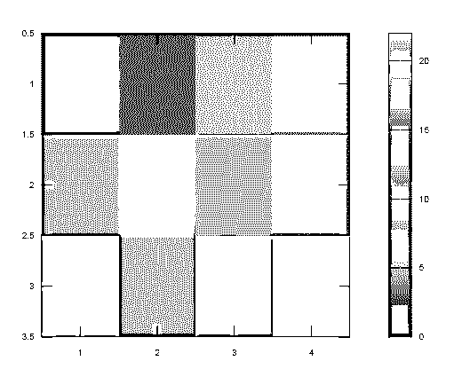
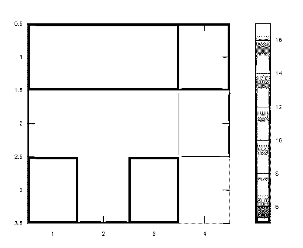
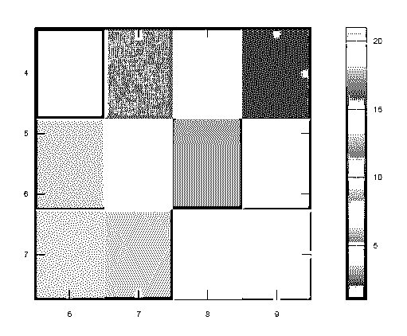

# Imagesc Matlab

> 原文：<https://www.educba.com/imagesc-matlab/>

## 图像 matlab 简介

该函数用于显示带有校准颜色的图形，称为“imagesc 函数”。为了在 Matlab 中实现 imagesc 函数，使用了“imagesc (D)”语法。d 是包含数组元素的数组的名称。Imagesc 函数用于通过使用色彩映射表中的全部色彩将数据显示为数组 D 中的图形。为图形的一个图像元素的阵列中的每个元素分配特定的颜色。生成的图形是像素 s 的 p 乘 q 格栅，其中 p 是数组 d 中的行数，q 是列数。

**语法**

<small>Hadoop、数据科学、统计学&其他</small>

“imagesc 函数”的语法如下

*   图像 c(C)
*   图像 c(x，y，C)
*   imagesc(**_ _ _ _ _ _**，clims)
*   im = imagesc(**_ _ _ _ _ _**)

### Imagesc 在 Matlab 中是如何工作的？

在 Matlab 中，“imagesc”函数使用“imagesc(D)”语句来显示带有校准颜色的图形。

实现“imagesc”功能的步骤:

**步骤 1:** 第一个输入参数是在变量中取的。

**第二步:**然后，我们使用“imagesc(D)”语句。

**第三步:**然后，我们用“colorbar”来显示颜色条。

### Imagesc Matlab 示例

以下是 Imagesc Matlab 的示例:

#### 示例#1

让我们看看“imagesc 函数”的例子。在本例中，创建矩阵 c。

我们将考虑 C 变量，它包含输入参数 C =[0 3 5 7；8 10 12 14;19 8 17 22];然后，为了显示 C 中数据的图像，我们使用了 imagesc 函数。语法 imagesc(C)为矩阵 C 的所有数据显示具有校准颜色的图像。为图像的一个图像元素的阵列中的每个元素分配特定的颜色。为了显示运行的颜色图，我们向图表添加了一个颜色条。默认情况下，该图像使用色彩映射表的全比例，因为 imagesc 缩放颜色限制，其中 C 中的最小值映射到色彩映射表中的第一种颜色，最高值映射到最后一种颜色。

**代码:**

`clc;
close all;
clear all;
C = [0 3 5 7; 8 10 12 14; 19 8 17 22];
imagesc(C)
colorbar`

**输出:**

#### 实施例 2

在“imagesc 函数”的下一个示例中，我们创建了一个 C 数组的图像，并设置了颜色限制。我们将颜色限制设置为 4 或更小的值映射到色图中的第一种颜色，17 或更大的值映射到色图中的最后一种颜色。因此，我们创建数组 C。我们接受 C 变量，它包含输入参数。c =[0 3 5 7；8 10 12 14;1 8 2 22];将输入元素分配到数组 c 中。然后，我们使用语法“clims = [5 17]”来设置颜色限制。然后，为了显示 C 中数据的图像，我们使用了 imagesc 函数。语法“imagesc(C，clims)”为矩阵 C 的所有数据显示具有校准颜色的图像。为图像的一个图像元素的阵列中的每个元素分配特定的颜色。为了显示运行的色彩映射表，我们在图表中添加了一个颜色条。默认情况下，该图像使用色彩映射表的全比例，因为 imagesc 缩放颜色限制，其中 C 中的最小值映射到色彩映射表中的第一种颜色，最高值映射到最后一种颜色。

**代码:**

`clc;
close all;
clear all;
C = [0 3 5 7; 8 10 12 14; 1 8 2 22];
clims = [5 17];
imagesc(C,clims)
colorbar`

**输出:**

#### 实施例 3

让我们看看“imagesc 函数”的另一个例子。在本例中，我们在 x 轴和 y 轴的有限刻度之间绘制图像。首先，我们选择图像的比例，使其位于 X 轴和 y 轴之间。当图像位于 x 轴上的 6 和 9 之间以及 y 轴上的 4 和 7 之间时，图像被放置在标尺上。然后我们创建矩阵 C。我们取 C 变量，它包含输入参数。c =[1 5 7 2；6 10 3 14;13 9 21 19];将输入元素分配到矩阵 C 中，然后使用 imagesc 函数显示 C 中数据的图像。语法“imagesc(x，y，C)”为矩阵 C 的所有数据显示带有校准颜色的图像。图像位于 x 轴和 y 轴之间。为图像的一个图像元素的阵列中的每个元素分配特定的颜色。为了显示运行的色彩映射表，我们在图表中添加了一个颜色条。默认情况下，该图像使用色彩映射表的全比例，因为 imagesc 缩放颜色限制，其中 C 中的最小值映射到色彩映射表中的第一种颜色，最高值映射到最后一种颜色。

**代码:**

`clc;
close all;
clear all;
x = [6 9];
y = [4 7];
C = [1 5 7 2; 6 10 3 14; 13 9 21 19];
imagesc(x,y,C)
colorbar`

**输出:**

### 结论

在本文中，我们已经看到了 imagesc Matlab 的概念。基本上，imagesc 函数与各种参数一起使用，如数据、坡度、数组、颜色变化等等。例如，我们可以使用 imagesc 函数通过校准的特征显示图形。

### 推荐文章

这是 Imagesc Matlab 的一个指南。在这里，我们讨论 Imagesc 如何在 Matlab 中工作，并举例说明代码和输出。您也可以看看以下文章，了解更多信息–

1.  [Matlab 对象](https://www.educba.com/matlab-object/)
2.  [Matlab 图片](https://www.educba.com/matlab-images/)
3.  [Matlab 标志](https://www.educba.com/matlab-flag/)
4.  [Strcmp Matlab](https://www.educba.com/strcmp-matlab/)

