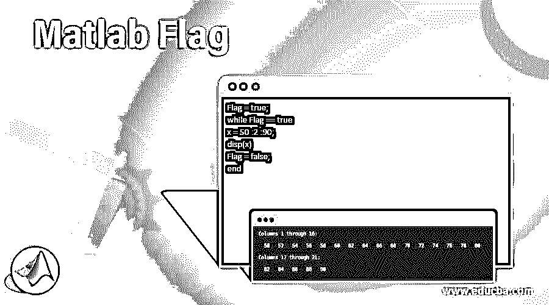
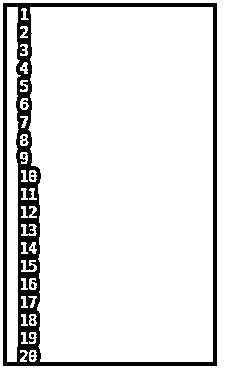
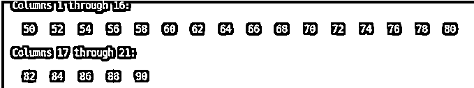

# Matlab 旗标

> 原文：<https://www.educba.com/matlab-flag/>

## Matlab 标志介绍

Flag 是一个变量，我们用它作为一个指示或信号来通知我们的程序一个特定的条件被满足；大多数情况下，它是一个布尔变量(取两个值:真或假)。例如，如果我们希望数组中的所有元素都是偶数，那么可以设置一个标志变量，只要输入数组中的任何值是奇数，它就会变为 False。

**语法:**

<small>Hadoop、数据科学、统计学&其他</small>

`Flag = True`

`Flag = True`

**描述:**

*   标志可以作为函数或方法的输出返回
*   它也可以用作执行特定任务的条件。如果标志为真，任务将持续执行，一旦标志变为假，任务将停止

### 用不同的例子在 Matlab 中设置标志

现在让我们使用不同的示例来理解在 MATLAB 中设置 Flag 的代码:

#### 示例#1

让我们从一个使用标志变量控制 while 循环的非常基本的例子开始。对于此示例，我们将遵循以下步骤:

1.  将标志变量设置为真
2.  以 Flag 应为 True 为条件开始 while 循环
3.  使用 While 循环显示消息
4.  将标志设置为 False，以确保循环不会无限期地工作

**语法:**

`flag = true`

[Initializing the Flag to True]

`while flag == true`

[This while loop will be executed only if flag is equal to True]

`flag=0;`

[Setting the Flag again to ‘0’ (logical False) so that the loop does not work indefinitely]

`disp(‘Let us learn Flag in MATLAB’);`

[Displaying the test output]

`end`

[Please note that, the while loop will get terminated here as we have set the Flag to False inside the while loop]

**代码:**

`flag = true
while flag == true
flag=0;
disp('Let us learn Flag in MATLAB');
end`

**输出:**

**T2】**

 **正如我们在输出中看到的，我们已经获得了我们所期望的显示一次的文本输出。

#### 实施例 2

在这个例子中，我们将为一个命令编写代码，该命令将在固定的时间间隔后连续执行。对于此示例，我们将遵循以下步骤:

*   调用计时器函数:我们的目标是创建一个计时器，它持续显示秒数，直到标志变量从 True 变为 False。
*   最初将标志设置为 True。
*   每当我们希望计时器停止时，在 while 循环中将标志设置为 False。
*   将标志设置为真，重新启动计时器。

**语法:**

`timerFunction = timer ('TimerFcn', 'Flag=false; disp(''1st Task'')',...
'StartDelay', 5);`

[Initializing the Timer and setting the FLAG as False. This timer will work only when the Flag is turned to True]

`start (timerFunction) `

[Calling the start function to execute the timer]

`Flag = true;`

[Setting the Flag variable to True]

`startingTime = 1;`

[Initializing the point from where timer will start]

`while (Flag = = true)`

[Using the while loop to check over the Flag every time a second is displayed] [Please note that this loop will be executed only if the Flag is True]

`disp (startingTime)
pause (1)`

[This will set the interval time between every output]

`startingTime = startingTime + 1;
end`

[1st task will end here]

`timerFunction = timer ('TimerFcn', 'Flag = false; disp(''2nd Task'')',...
'StartDelay', 7);`

[The Flag is again set to False inside the timer]

`start (timerFunction)
Flag=true;`

[The flag is turned back to True and the entire process will repeat itself]

`while (Flag = = true)
disp (startingTime)
pause (1)
startingTime = startingTime + 1;
end
timerFunction = timer('TimerFcn', 'Flag = false; disp(''3rd Task'')',...
'StartDelay', 5);
start (timerFunction)
Flag = true;
while (Flag = = true)
disp (startingTime)
pause (1)
startingTime = startingTime + 1;
end`

**代码:**

`timerFunction = timer ('TimerFcn', 'Flag=false; disp(''1st Task'')',...
'StartDelay', 5);
start (timerFunction)
Flag=true;
startingTime=1;
while (Flag==true)
disp (startingTime)
pause (1)
startingTime=startingTime + 1;
end
timerFunction=timer('TimerFcn', 'Flag=false; disp(''2nd Task'')',...
'StartDelay', 7);
start (timerFunction)
Flag=true;
while (Flag==true)
disp (startingTime)
pause (1)
startingTime=startingTime+1;
end
timerFunction=timer('TimerFcn', 'Flag=false; disp(''3rd Task'')',...
'StartDelay', 5);
start (timerFunction)
Flag=true;
while(Flag==true)
disp (startingTime)
pause (1)
startingTime=startingTime+1;
end`

**输出:**

正如我们在输出中看到的，我们已经获得了对应于 3 个任务的计时器输出。这里的输出是使用标志变量控制的。当在实时编辑器中实现时，每个输出数字将以 1 秒的间隔显示。

#### 实施例 3

在这个例子中，我们将创建一个 while 循环来输出 50 到 90 之间的交替数字。我们将使用 Flag 命令来控制 while 循环，防止它无限期运行。对于此示例，我们将遵循以下步骤:

*   将标志设置为真
*   运行 while 循环
*   一旦值达到 100，就将标志设置为 False

**语法:**

`Flag = true;`

[Initializing the Flag and setting it to True]

`while Flag == true`

[Setting the condition to ensure that the loop runs only as long as the Flag is True]

`x = 50 :2 :90;`

[Defining the range to be displayed]

`Flag = false;`

[Setting the Flag to False once all the numbers are displayed]

`end`

**代码:**

`Flag = true;
while Flag == true
x = 50 :2 :90;
disp(x)
Flag = false;
end`

**输出:**

正如我们在输出中看到的，我们已经使用由 Flag 变量控制的 while 循环获得了 50 到 90 之间的替代数字。

### 推荐文章

这是一个 Matlab 旗帜指南。在这里，我们还讨论了 matlab 中的介绍和设置标志，以及不同的例子和它的代码实现。您也可以看看以下文章，了解更多信息–

1.  [Matlab 绘图颜色](https://www.educba.com/matlab-plot-colors/)
2.  [亥维赛 MATLAB](https://www.educba.com/heaviside-matlab/)
3.  [Matlab 中的阶乘](https://www.educba.com/factorial-in-matlab/)
4.  [傅立叶级数 Matlab](https://www.educba.com/fourier-series-matlab/)

**