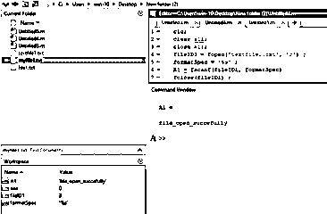
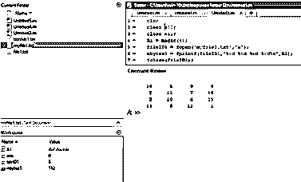

# Matlab fopen(消歧义)

> 原文：<https://www.educba.com/matlab-fopen/>

## Matlab fopen 简介

Matlab fopen 语句用于打开一个文件或获取关于打开文件的信息。文件处理操作，如从文件中读取或在文件中写入。对于这些操作，我们需要首先打开一个文件，因为使用了 fopen 语句。我们以二进制模式或文本模式打开文件，并指定访问类型，如 r、w、r+、a 等。默认访问类型是读取。fopen 语句返回存储在 fileID1 中的数据，fileID1 是打开文件的文件标识符。

**语法:**

<small>Hadoop、数据科学、统计学&其他</small>

Matlab open 的语法如下所示:

`fileID1 = fopen(filename)`

`fileID1 = fopen(filename,permission)`

`fileID1 = fopen(filename,permission,machinefmt,encodingIn)`

`[fileID1,errmsg] = fopen(___)`

`fIDs = fopen('all')`

`filename = fopen(fileID)`

`[filename,permission,machinefmt,encodingOut] = fopen(fileID)`

### Matlab fopen 怎么用？

我们使用 fopen 语句来打开文件，对于这些我们不需要指定任何东西，我们只需要一个 fopen 语句和我们想要打开的文件名。但在另一种情况下，如果我们想写或读文件，我们必须在 fopen 语句中指定访问类型。对于这些我们要指定权限，权限如下:

*   **'r':** 文件打开读取。这是默认条件。
*   **'r+':** 文件以读写方式打开。
*   它将删除一个现有文件的内容，或者简单地创建一个新文件并打开它进行写入。
*   它将删除一个现有文件的内容，或者简单地创建一个新文件，并打开它进行读写。
*   **'a':** 它将创建并打开一个新文件或打开一个现有文件进行写入，追加到文件的末尾。
*   **'a+':** 它将创建并打开一个新文件或打开一个现有文件进行读写，追加到文件的末尾。
*   **‘A’:**它将追加，不自动刷新；与磁带机一起使用

### 实现 Matlab fopen 的示例

下面是 Matlab fopen 的例子:

#### 示例#1

让我们看一个例子，在这个例子中，我们使用 fopen 打开文本文件并从该文件中读取数据。对于这些我们首先取一个 fopen 语句，在这个 fopen 中我们指定我们要打开哪个文件的文件名和那个文件的访问类型模式，对于那些我们取 fopen 用括号括起来的文本文件名。txt 扩展名 textfile1.txt，访问类型模式为 read 'r ',这两个参数由逗号分隔。这个 fopen 语句接受一个文件标识符 fileID1。然后我们只需使用 fscanf 语句读取该文件。最后，我们需要使用文件标识符和 close 语句关闭该文件；文件关闭语句是 fclose，打开文件的文件标识符是 fileID1。

**代码:**

`clc;
clear all;
close all;
fileID1 = fopen('textfile1.txt','r');formatSpec = '%s';A1 = fscanf(fileID1,formatSpec)fclose(fileID1);`

**输出:**

**

** 

#### 实施例 2

让我们看一个与 fopen 语句相关的例子，我们已经创建了一个带有扩展名的文本文件。txt 'file1.txt '在这个文本文件中我们写了一些信息。为了从那个文本文件中读取或显示一行，我们写一个 Matlab 代码，在 Matlab 代码中，我们使用一个 fopen 语句 fopen 语句用于打开一个文件或获取关于一个打开的文件的信息。在本例中，我们使用 fopen 语句打开一个文本文件，该文件是我们之前创建的，名为“file1”。然后我们给 fopen 语句分配一个文件标识符。然后我们使用一个“fgetl”函数，这是一个 Matlab 内置的函数，用于从文件中读取一行。这一行存储在行变量中，我们显示数据，然后关闭文件，关闭文件时，我们在文件标识符中加入 fclose。

**代码:**

`clc;
clear all;
close all;
fileID = fopen('file1.txt');
tline = fgetl(fileID)fclose(fileID);`

**输出:**

**

** 

#### 实施例 3

让我们看一个与 fopen 语句相关的例子，在这个例子中，我们使用一个神奇的函数创建一个矩阵，这个神奇的函数只是创建一个 n-n 数的矩阵。矩阵存储在变量 A1 内。我们想把这个矩阵写入一个文件，我们需要打开这个文件。要打开一个文件，我们使用一个 fopen 语句，fopen 在括号中是我们要在其中写入矩阵的文件名和一种写为“w”的访问模式，我们将这些赋值给 fileID1，fileID1 是一个打开文件的文件标识符。然后，我们使用 fprintf 语句将矩阵写入文本文件。然后，我们简单地通过使用文件关闭语句和打开文件的文件标识符来关闭打开的文件。为了验证矩阵是否写在文本文件中，我们使用了一个类型函数，在括号中输入我们写矩阵的文件名。

**代码:**

`Clc;
clear all;
close all;
A1 = magic(4);fileID1 = fopen ('myfile1.txt','w');nbytes1 = fprintf(fileID1,'%6d %6d %6d %6d\n',A1)fclose(fileID1);type('myfile1.txt')`

**输出:**

### 结论

在本文中我们看到了 fopen 语句的基本概念，基本上 fopen 无非是打开一个文件或获取关于打开文件的信息。我们还看到了 Matlab 代码中使用的 fopen 语句的不同语法。此外，我们还看到了一些与 fopen 相关的不同示例。

### 推荐文章

这是一个 Matlab fopen 的指南。这里我们讨论 Matlab fopen 及其语法的介绍，以及不同的例子和代码实现。您也可以浏览我们推荐的文章，了解更多信息——

1.  [Matlab 中的 Switch 语句是什么？](https://www.educba.com/switch-statement-in-matlab/)
2.  [绘图矢量 Matlab](https://www.educba.com/plot-vector-matlab/)
3.  [Matlab sphere() |语法和示例](https://www.educba.com/matlab-sphere/)
4.  [Matlab 图示例](https://www.educba.com/matlab-figure/)

