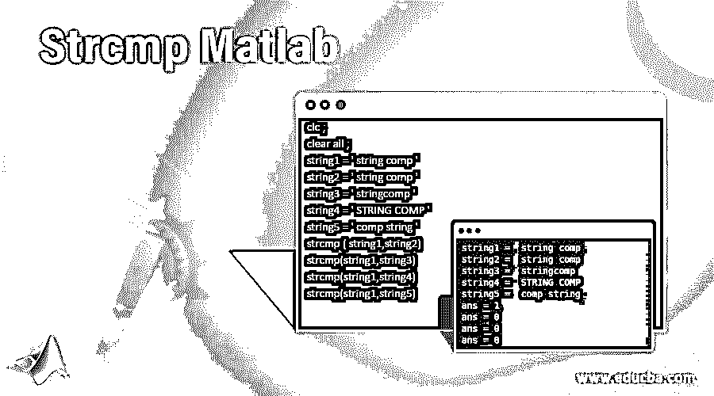
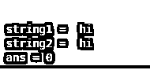
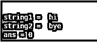
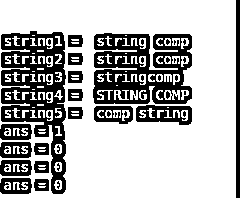
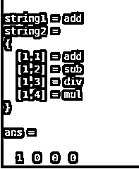
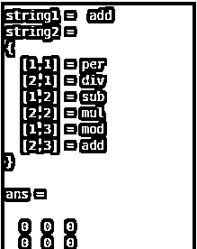

# Strcmp Matlab

> 原文：<https://www.educba.com/strcmp-matlab/>

## Strcmp Matlab 简介

“Strcmp”命令代表字符串比较。该命令用于比较两个或多个字符串。“strcmp”命令以“1”和“0”的形式给出结果。该命令适用于所有类型的数据格式，如单一数据、数组、向量或多维数据。因此，它以 1 和 0 的形式给出结果。Strcmp 函数区分大小写，因此大写字母和小写字母被视为不同的字母。为了解决这些问题，还有一个函数' strcmpi '。在 strcmpi 函数中，两个字母的大小写被认为是相同的。

**语法:**

<small>Hadoop、数据科学、统计学&其他</small>

`Strcmp(string1,string2)
Strcmp (name of first string, name of second string)`

`Strcmpi(string1,string2)
Strcmpi (name of first string, name of second string)`

### 如何在 Matlab 中使用 Strcmp？

为了使用命令或函数 strcmp 和 strcmpi，我们需要至少两个字符串形式的输入，以便进行比较。众所周知,“strcmp”命令以“1”和“0”的形式给出结果。如果输出为‘0’则意味着错误的结果，如果输出为‘1’则意味着正确的结果。真结果表示两个字符串完全匹配，假结果表示两个字符串不同。

#### 示例#1

让我们考虑两个带有变量字符串 1 和字符串 2 的字符串。字符串 1 是“hi ”,字符串 2 也是“hi ”,这样我们将在应用函数 strcmp 后得到真实的结果。因此，在示例 1(a)中，输出将为 1。例如 1(b)输入是不同的。第一串是“hi”，第二串是“bye”。因此 1(b)的输出将是 0。

**例 1 ( a ):**

`clc ;
clear all ;
string1 =' hi '
string2 = ' hi'
strcmp(string1,string2)`

**输出:**

**例 1 ( b ):**

`clc ;
clear all ;
string1 = ' hi '
string2 = ' bye '
strcmp(string1,string2)`

**输出:**

#### 实施例 2

在这个例子中，我们分配了五个不同的字符串。字符串 1 是“字符串 comp ”,字符串 2 与字符串 1 完全相同，因此结果将是为真的 1。字符串 3 是“stringcomp”，在这个字符串中，字母是相同的，但两个单词之间没有空格，这就是为什么当我们比较字符串 1 和字符串 3 时，它会给出错误的结果。然后字符串 4 是“字符串 COMP”，这个字符串和字符串 1 一样，但是所有的字母都是大写的。strcmp 是区分大小写的函数，所以它会认为两个字符串是不同的，尽管它们是相同的。字符串 5 是“comp string”，在这个字符串中，字母是相同的，大小写也是相同的，但是字母的排列是不同的，所以它将再次给出错误的结果。

`clc ;
clear all ;
string1 = ' string comp '
string2 = ' string comp '
string3 = ' stringcomp '
string4 = ' STRING COMP '
string5 = ' comp string '
strcmp ( string1,string2)
strcmp(string1,string3)
strcmp(string1,string4)
strcmp(string1,string5)`

**输出:**

#### 实施例 3

在示例 3(a)中，有两个字符串，第一个字符串是带有数据“add”的一维字符串，其中只存在一个元素。第二个字符串是字符串的数组或向量。字符串 2 是“add”、“sub”、“div”和“mul”。Strcmp 函数将第一个字符串与第二个数组中的所有元素分别进行比较，并且只产生向量形式的结果。在示例 3(b)中，字符串 1 是“add ”,第二个输入是字符串的多维矩阵。字符串 2 是{'per '，' sub '，' mod '；div '，' mul '，' add'}，它有两行三列。因此它将在一个两行三列的表单矩阵中产生一个结果。

**例 3(a):**

`clc ;
clear all ;
string1 = 'add'
string2 = {'add', 'sub', 'div', 'mul'}
strcmp(string1,string2)`

**输出:**

**例 3 (b):**

`clc ;
clear all ;
string1 = ' add '
string2 = {'per', 'sub', 'mod' ; 'div' ,'mul', 'add'}
strcmp(string1,string2)`

**输出:**

#### 实施例 4

在这个例子中，我们使用了 strcmp 函数和 strcmp 函数。有两个字符串，字符串 1 是' E '。而字符串 2 是一个多维矩阵，它具有带‘E’和‘E’的随机字母。如果我们使用 strcmp 函数比较两个字符串，那么我们将得到字母“E”的输出矩阵，而“E”是零，如果我们使用 strcmp 函数比较两个字符串，那么我们将得到结果 1。

`clc ;
clear all ;
string1 = 'E'
string2 = {'A', 'e', ' E' ; 'D' ,'e', 'E' ; 'e', 'E', 'V',}
strcmp(string1,string2)
strcmpi(string1,string2)`

**输出:**

### 结论

Strcmp 是 Matlab 中最强大的函数之一，因为它为程序提供了表达性。如果字符串的大小写不同，那么在 Matlab 中还有一个特性就是 strcmpi。Strcmpi 忽略字母的大小写，直接执行比较。Strcmpi 函数是 strcmp 函数的扩展。

### 推荐文章

这是一个 Strcmp 的 Matlab 指南。在这里，我们还讨论了 Matlab 的介绍和 strcmp 是如何完成的，以及它的不同例子和代码实现。您也可以看看以下文章，了解更多信息–

1.  [Matlab 中的 Switch 语句](https://www.educba.com/switch-statement-in-matlab/)
2.  [Matlab 命令](https://www.educba.com/matlab-commands/)
3.  [Matlab sym()](https://www.educba.com/matlab-sym/)
4.  [亥维赛 MATLAB](https://www.educba.com/heaviside-matlab/)

