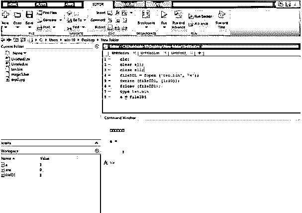
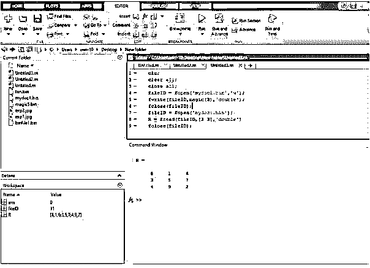

# Matlab fwrite

> 原文：<https://www.educba.com/matlab-fwrite/>

## Matlab fwrite 简介

在某些应用程序中，需要访问文本文件来执行一些操作，如从文本文件中读取数据，在文本文件中写入数据。为了将数据写入二进制文件，我们使用 fwrite 语句。fwrite 是 Matlab 提供的一个内置函数，用于在二进制文件中写入数据。bin 扩展)。要写入数据，首先我们必须使用 fopen 语句打开该文件，并指定写入“w”的访问模式类型。

**语法**

<small>Hadoop、数据科学、统计学&其他</small>

fwrite Matlab 的语法如下所示:

`fwrite(fileID1,A)
fwrite(fileID1,A,precision)
fwrite(fileID1,A,precision,skip)
fwrite(fileID1,A,precision,skip,machinefmt)
count = fwrite(**___**)`

### Matlab fwrite 怎么做？

为了在文本文件中写入数据，我们使用 fwrite 语句。为了将数据写入二进制文件，我们需要使用 fopen 语句打开该二进制文件。在 fopen 语句中，我们编写了一个想要打开的二进制文件名，并指定了一种访问模式。

使用 fwrite 语句在文本文件中写入数据的步骤:

**第一步:**首先用 fopen 语句打开一个文件，将访问模式的类型指定为‘w’。

**步骤 2:** 然后我们使用 fwrite 语句将数据写入二进制文件

**第三步:**使用 fclose 语句关闭文件。

**第四步:**为了验证，我们使用一个 type 函数，type 函数显示文件的内容。

### 实现 Matlab fwrite 的示例

下面是提到的例子:

#### 示例#1

让我们看一个 fwrite 语句的例子，基本上，fwrite 语句用于在二进制文件上写数据。

为了在二进制文件上写入数据，我们需要创建一个二进制文件，该二进制文件只是一个扩展名为. bin 的文件。我们创建一个名为 ten.bin 的二进制文件。为了在该 ten.bin 文件上写入数据，我们需要使用 fopen 语句打开该文件，并指定正在写入的访问模式的类型。我们在括号中取一个 fopen 语句，写一个名为 ten.bin 的二进制文件，并指定访问模式的类型为“w”。Fopen 语句向 fileID1 返回一个数据，fileID1 是一个打开的二进制文件的文件标识符。然后我们使用一个 fwrite 语句在二进制文件上写一个数据，这个数据只不过是写在那个二进制文件上的 1 到 10 个数字。然后我们使用 fclose 语句关闭一个文件。

**代码:**

`clc;
clear all;
close all;
fileID1 = fopen('ten.bin','w');
fwrite(fileID1, [1:10]);fclose(fileID1);`

**输出:**

#### 实施例 2

让我们看另一个 fwrite 语句的例子，为了在二进制文件上写入数据，我们需要创建一个二进制文件，该二进制文件只是一个扩展名为. bin 的文件。我们创建一个名为 mydoc1.bin 的二进制文件。为了在 mydoc1.bin 文件上写入数据，我们需要使用 fopen 语句打开该文件，我们还需要指定正在写入的访问模式的类型。

我们在括号中取一个 fopen 语句，我们写一个二进制文件名 mydoc1.bin，我们指定访问模式的类型为“w”。Fopen 语句向 fileID1 返回一个数据，fileID1 是一个打开的二进制文件的文件标识符。

然后我们用一个 fwrite 语句在二进制文件上写一个数据，w 先取一个文件标识符作为参数 fileID1，然后取 magic(3)它生成一个 3 乘 3 的幻方，我们取精度为 double。数据只不过是写在二进制文件上的一个 3x 3 的魔方。然后我们使用 fclose 语句关闭一个文件。

**代码:**

`clc;
clear all;
close all;
fileID1 = fopen('mydoc1.bin','w');
fwrite(fileID1,magic(3),'double');
fclose(fileID1);`

**输出:**

**解释:**正如我们在两个例子中看到的，我们不能在命令窗口中看到结果，但是数据被写入二进制文件。

#### 实施例 3

让我们看一个例子，通过使用 fwrite 语句，我们可以将数据写入二进制文件，但是我们无法在命令窗口中看到该数据，或者如果我们打开该文件，我们也无法读取该文件，因为它是以二进制格式写入的数据，所以我们需要使用 fread 语句打开该文件，fread 语句用于从二进制文件中读取数据。在本例中，我们使用 fwrite 语句将数据写入一个二进制文件，该文件是一个 3x 3 的幻方。我们使用 fopen 语句打开一个文件，然后使用 fwrite 语句将数据写入一个二进制文件，然后使用 fclose 语句关闭该文件。然后，为了验证写入二进制文件的数据是否正确，我们必须从二进制文件中读取数据，我们使用 fread 语句并验证数据。为此，我们使用 fopen 语句打开二进制文件，然后使用 fread 语句从二进制文件中读取数据，并在命令窗口中显示数据，然后使用 fopen 语句关闭文件。

**代码:**

`clc;
clear all;
close all;
fileID1 = fopen('mydoc1.bin','w');
fwrite(fileID1,magic(3),'double');
fclose(fileID1);
fileID1 = fopen('mydoc1.bin');
R1 = fread(fileID1,[3 3],'double')
fclose(fileID1);`

**输出:**

### 结论

在这篇文章中，我们看到了 fwrite 的概念；基本上，fwrite 用于将数据写入二进制文件。然后看到了与 fwrite 语句相关的语法，以及如何在 Matlab 代码中使用它将数据写入二进制文件。此外，我们还看到了一些与 fwrite 语句相关的示例。

### 推荐文章

这是一个 Matlab fwrite 的指南。这里我们讨论 Matlab fwrite 的介绍，包括适当的语法和相应的编程示例。您也可以浏览我们的其他相关文章，了解更多信息——

1.  [Ceil Matlab](https://www.educba.com/ceil-matlab/)
2.  [Matlab 绘图颜色](https://www.educba.com/matlab-plot-colors/)
3.  [亥维赛 MATLAB](https://www.educba.com/heaviside-matlab/)
4.  [Matlab 中的阶乘](https://www.educba.com/factorial-in-matlab/)

