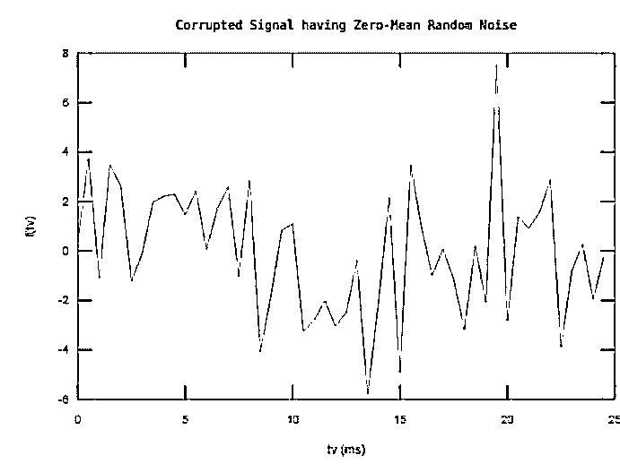
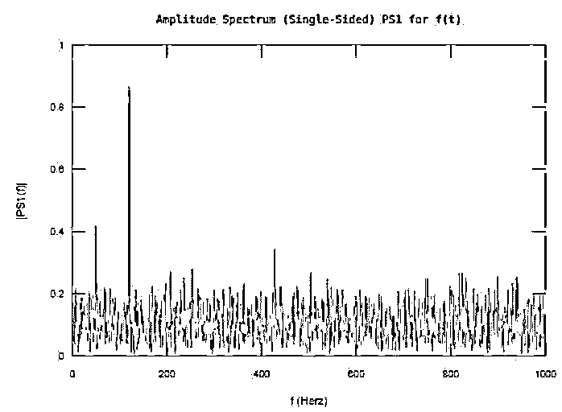
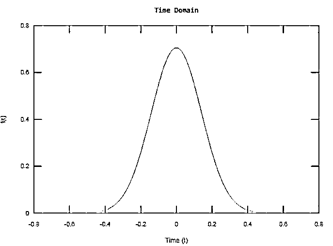
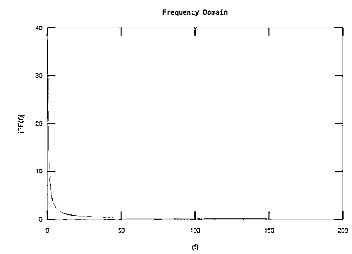
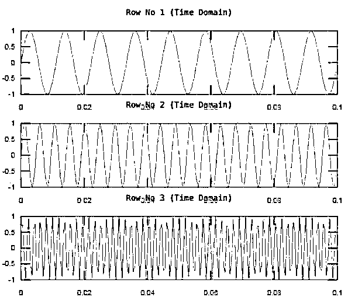
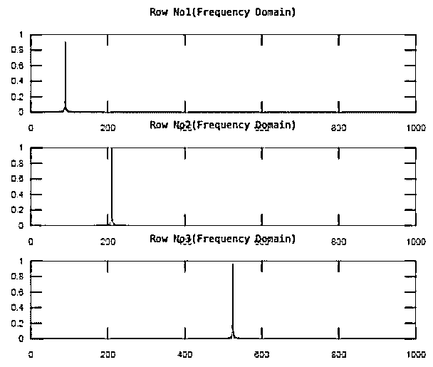
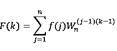
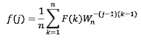
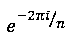

# Matlab fft()

> 原文：<https://www.educba.com/matlab-fft/>

## Matlab fft 简介()

Matlab 方法 fft()对任意序列或连续信号进行求快速傅立叶变换的运算。FFT(快速傅立叶变换)可以定义为一种算法，它可以计算信号或序列的 DFT(离散傅立叶变换)或计算 IDFT(逆 DFT)。对任何信号或序列的傅立叶分析操作将其从原始域(通常是空间或时间)映射到频域，而 IDDFT 执行相反的操作。

**语法:**

<small>Hadoop、数据科学、统计学&其他</small>

| **语法** | **描述** |
| **F = fft(f)** | 这种形式的命令是使用 FFT(快速傅立叶变换)算法计算‘f’的 DFT(离散傅立叶变换),并产生频域信号 f |
| **F = fft(f，n)** | 这种形式的命令是使用 FFT(快速傅立叶变换)算法计算‘F’的 DFT(离散傅立叶变换),并产生频域 n 点 DFT 信号‘F’。默认情况下，F 拥有与 F 相同的大小。 |
| **F = fft(f，n，dim)** | 这种形式的命令是使用 FFT(快速傅立叶变换)算法计算‘F’的 DFT(离散傅立叶变换),并沿着维度‘dim’产生频域 FT 信号‘F’。 |

### Matlab fft()示例

下面是提到的例子:

#### 示例#1

随机噪声信号的 FFT 推导。

**代码:**

`Ls = 2500;% Signal length
Fs = 2000;% Sampling frequency
Ts = 1/Fs;% Sampling period
tv = (0:Ls-1)*Ts;        % Time vector
f = 0.6*sin(2*pi*50*tv) + 3*randn(size(tv))+ sin(2*pi*120*tv);%Input signal
plot(1000*tv(1:50),f(1:50))
xlabel('tv (ms)')
ylabel('f(tv)')
title(' Corrupted Signal having Zero-Mean Random Noise')
F = fft(f);% Calling fft() function for signal ‘f’
PS2 = abs(F/Ls);% Double sampling plot
PS1 = PS2(1:Ls/2+1);% Single sampling plot
PS1(2:end-1) = 2*PS1(2:end-1);
f = Fs*(0:(Ls/2))/Ls;
plot(f,PS1)
title('Amplitude Spectrum (Single-Sided) PS1 for f(t)')
xlabel('f (Herz)')
ylabel('|PS1(f)|')`

**输出:**

输出窗口显示在时域中作为函数‘F’形成的噪声信号，并且使用 fft()计算单边振幅频谱，产生频域信号‘F’。

所得 FFT 信号的性质取决于输入信号或数据的类型，例如:

| **输入性质** | **输出性质** |
| f 是矢量 | f 是作为向量 f 的傅立叶变换产生的。 |
| f 是一个矩阵 | f 是作为矩阵‘f’的每一列的傅立叶变换产生的。 |
| f 是一个多维数组 | 函数 fft(f)将沿第一个非单位数组维的值视为向量，并返回每个向量的傅立叶变换。 |

#### 实施例 2

推导高斯信号的 np 点 FFT。

**代码:**

`Fs = 300;   % Sampling frequency
ts = -0.5:1/Fs:0.5;  % Time vector
Ls = length(ts);   % Signal length
f = 1/(4*sqrt(2*pi*0.02))*(exp(-ts.^2/(2*0.02)));
plot(ts,f)
xlabel('Time (t)')
ylabel('f(t)')
title('Time Domain')
np = 2^nextpow2(Ls);
f = Fs*(0:(np/2))/np;
F = fft(f,np);
PF = abs(F/np);
plot(f,PF(1:np/2+1))
xlabel('(f)')
ylabel('|PF(f)|')
title('Frequency Domain')`

**输出:**

输出窗口显示在时域中作为函数‘f’形成的高斯信号，并且使用 fft()计算 np 点 FFT，产生频域信号‘PF’。

所得 n 点 FFT 信号的性质取决于输入信号或数据的类型，例如:

| **输入性质** | **输出性质** |
| f 是长度小于“n”值的向量。 | f 产生为向量 f 的傅立叶变换，用尾随零填充以匹配“n”的长度。 |
| f 是长度大于“n”值的向量。 | f 是作为向量 f 的傅立叶变换被截断为长度“n”而产生的。 |
| f 是一个矩阵 | f 是作为矩阵‘f’的每一列的傅立叶变换产生的。 |
| f 是一个多维数组 | 函数 fft(f)将沿第一个非单位数组维的值视为向量，并返回每个向量的傅立叶变换。 |

#### 实施例 3

**代码:**

`Fs = 2000;   % Sampling frequency
Ts = 1/Fs;   % Sampling period
Ls = 3000;   % Length of signal
t = (0:Ls-1)*Ts;        % Time vector
r1 = sin(3*pi*60*t);   % waveformed in First row
r2 = sin(3*pi*140*t);   % waveformedin Second row
r3 = sin(3*pi*350*t);   % waveformedin Third row
% Display of all 3 waves in time domain
f = [r1; r2; r3];
for k = 1:3
subplot(3,1,k)
plot(t(1:200),f(k,1:200))
title(['Row No ',num2str(k),' (Time Domain)'])
end
np = 2^nextpow2(Ls);% Defining n value for DFT operation
d = 2;
F = fft(f,np,d);% Calling fft() for the matrix f  having each wave as one row
PS2 = abs(F/Ls);
PS1 = PS2(:,1:np/2+1);
PS1(:,2:end-1) = 2*PS1(:,2:end-1);
% Computing FFT of all 3 waves and displayed in frequency domain
for k=1:3
subplot(3,1,k)
plot(0:(Fs/np):(Fs/2-Fs/np),PS1(k,1:np/2))
title(['Row No',num2str(k),'(Frequency Domain)'])
end`

**输出:**

输出窗口显示时域中的三个正弦波 r1、r2 和 r3，并且使用 fft()以矩阵 f 的形式在波上计算它们各自的单边振幅谱，产生频域信号“PS1”。

### fft()如何工作？

F = fft(f)调用傅立叶变换的运算，而 f = ifft(F)调用傅立叶逆变换的运算。对于长度为 n 的 F 和 F，这些变换操作定义如下:

时域或空域信号 F 的傅立叶变换 F(频域信号):

信号 F(频域信号)的傅里叶逆变换 F(空间或时域信号):

其中 W n 是单位的第 n 个根，即

**补充说明:**

*   fft()函数的执行时间取决于为要执行的转换定义的长度。具有小质因数的变换长度比具有大质因数的变换长度快得多。
*   对于 n 的大多数值，实数输入 DFT 的执行时间大约是复数输入 DFT 的一半。
*   在 n 的值具有大的质因数的情况下，差异是速度为零或不显著。
*   fft()函数的速度可以通过实现实用函数 fftw 来提高。该函数 fftw 可以控制在以特定大小和维度执行的 FFT 运算的计算中使用的算法的优化。

### 推荐文章

这是一个 Matlab fft()的指南。这里我们讨论 Matlab fft()的介绍，fft()是如何工作的，以及相应的例子。您也可以看看以下文章，了解更多信息–

1.  [低通滤波器 Matlab](https://www.educba.com/low-pass-filter-matlab/)
2.  [Matlab 正弦波](https://www.educba.com/matlab-sine-wave/)
3.  [简化 Matlab](https://www.educba.com/simplify-matlab/)
4.  [Matlab loglog()](https://www.educba.com/matlab-loglog/)

