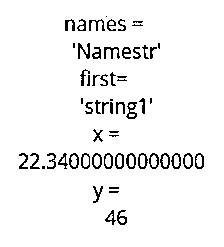
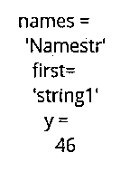
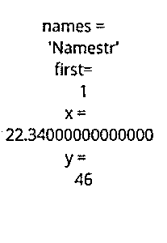

# Matlab 文本读取

> 原文：<https://www.educba.com/matlab-textread/>

## Matlab textread 简介

Matlab textread()函数被设计用来从文本文件或任何数据集中读取数据，并产生多个输出。它是为用户处理与文件输入相关的各种类型的问题或任务的功能。在 textread()的函数调用中，输出变量是数组类型，它接收在字符串数据类型中定义的文件内容。可以从文件中读取单个值，用户可以使用 textread()通过传递另一个参数来修改该文件，该参数给出了要读取的值的数量。

### Matlab textread 的语法

以字符串标量或字符向量的形式指定的输入格式决定了返回参数的类型和数量。这种格式支持转换说明符的子集以及 C 语言 fscanf()例程约定的子集。返回参数的总数等于格式内容中指示的参数数。

<small>Hadoop、数据科学、统计学&其他</small>

| **语法** | **描述** |
| **【P，Q，R，…】= textread(数据，格式)** | 

*   The syntax for realizing textread(filename, format) is to read data from the file filename or dataset' data', and put variables P, Q, R, etc. in the specified format until the reading operation of the whole file is not completed.
*   And file name format attributes are specified as character vectors or string scalars.

 |
| **[P，Q，R，…] = textread(data，format，N)** | 

*   This syntax for realizing textread(filename, format) is to read data from file filename or dataset 'data', put variables P, Q, R, etc., follow the specified format, and reuse the format n times, where n can be defined as a positive integer.
*   When n is defined as a negative integer, this function is executed until the read operation of the whole file is not completed.

 |
| **[…] = textread(…，param，value，…)** |  |

**属性:**

下面给出了属性:

| **属性** | **可能值** | **描述** |
| **缓冲区大小** | 

*   Positive integer.
*   The default is 4095.

 | 

*   It defines the maximum length of a character vector, in bytes.

 |
| **评论风格** | 

*   Matlab .

*   Shell.

 | 

*   Characters after% are ignored.
*   Characters after # are ignored.

*   The characters after//are ignored.

 |
| **分隔符** | 

*   One or more characters.
*   The default is none.

 | 

*   Acts as a separator between elements.

 |
| **emptyvalue** | 

*   Scalar double precision.
*   The default is 0.

 | 

*   The value assigned to an empty cell when reading a delimited file.

 |
| 内皮素 | 

*   Single character or' \r\n'.
*   The default is determined from the file.

 | 

*   A character that indicates the end of a line.

 |
| **expchars** | 

*   Exponential character
*   The default value is eEdD.

 | 

*   Used for power supply function.

 |
| **头线** | 

*   Positive integer.

 | 

*   Ignore the specified number of lines at the beginning of the input file.

 |
| **空格** | 

*   \b- Backspace key
*   \n- newline character
*   \r- carriage return
*   \ t- horizontal tab
*   The default is' \b\t'.

 | 

*   Characters in the vector are treated as blanks.

 |

支持作为格式值的各种值，例如:

*   **%d:** 读取有符号整数值。
*   **%c:** 读取字符，包括空格。
*   **%u:** 读取整数值。
*   **%s:** 读取空白或分隔符分隔的文本。

**Note:** In format, White-space characters are ignored.

### Matlab textread 示例

下面是提到的例子:

#### 示例#1

对所有字段使用%的自由格式文件的读取操作。

考虑到用户定义文件 myfile.dat 中的第一行是:

**代码:**

`NameStrstring1 22.34 46`

使用 textread()调用文件第一行的读取操作，如下所示:

**代码:**

`[names, first, x, y] = textread(myfile.dat',’%s %s %f %d', 1)`

**输出:**

名称和第一个元素以字符串格式表示，x 的值表示为浮点数，y 的值表示为整数。

#### 实施例 2

使用%对固定格式文件进行读取操作，浮点值被忽略。

考虑到用户定义文件 myfile.dat 中的第一行是:

**代码:**

`NameStr  string1 22.34 46`

使用 textread()调用文件第一行的读取操作，如下所示:

**代码:**

`[names, first, y] = textread(myfile.dat','%c %s %*f %d', 1)`

**输出:**

名称和第一个元素以字符串格式表示，y 的值以整数表示。用浮点数格式定义的 x 值被忽略。

#### 实施例 3

使用%对自由格式文件进行读取操作，通过文字忽略匹配字符。

考虑到用户定义文件 myfile.dat 中的第一行是:

**代码:**

`NameStr    string1 22.34 46`

使用 textread()调用文件第一行的读取操作，如下所示:

**代码:**

`[names, strval, x, y] = textread(myfile.dat','%s string%d %f %d', 1) `

**输出:**

names 元素以字符串格式表示，y 值以整数表示。用查找匹配字符向量的格式定义的“strval”的值被忽略。

#### 实施例 4

使用 textread()在循环中读取 100 个值。

**代码:**

`textread('file_str', '%d', 100); ); %reads 100 values from  given file at once
%Beginning of loop
for i=1:100
% This reads a single integer from file_str.
textread('file_str, '%d', 1); %reads 100 values from  given file one by one
end %End of the loop`

**补充说明:**

*   textread()对于遵循定义格式的文本文件的读取操作非常有用。textread()既处理固定格式文件，也处理自由格式文件。
*   当 textread()读取一系列连续的空白值时，它将一系列空白视为一个空白。同样，当它到达一系列连续的分隔符值时，它会将每个元素分别视为一个单独的分隔符。
*   为了保留文本中的前导和尾随空格，whitespace 参数的用法如下所示:

**textread('mydata.txt '，' %s '，' whitespace '，")**

**年=**

**‘白色空间白色空间’**

*   textread()函数在当前的 Matlab 版本中已经过时。这个方法现在被 textscan()所取代。
*   textread()方法的实现试图从文件中读取完整的信息。它可以被认为是“一击即中”类型的功能。

### 推荐文章

这是一个 Matlab textread 的指南。在这里，我们讨论 Matlab textread 的介绍，以及适当的语法、属性和相应的例子。您也可以看看以下文章，了解更多信息–

1.  [MATLAB 独有的](https://www.educba.com/matlab-unique/)
2.  [Matlab 绘图图例](https://www.educba.com/matlab-plot-legend/)
3.  [MATLAB 归一化](https://www.educba.com/matlab-normalize/)
4.  [低通滤波器 Matlab](https://www.educba.com/low-pass-filter-matlab/)

