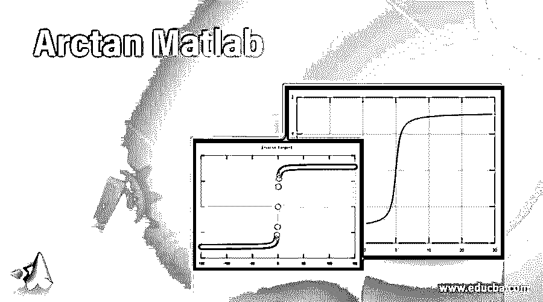
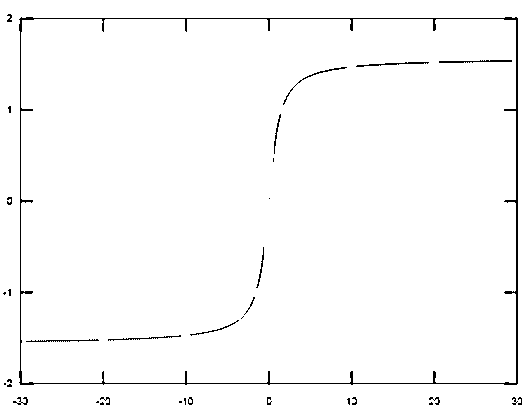
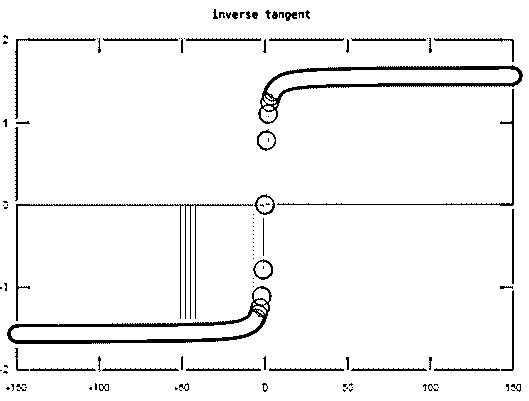

# Arctan Matlab

> 原文：<https://www.educba.com/arctan-matlab/>

## Arctan Matlab 简介

反正切在 Matlab 中是三角函数之一。Y 的反正切函数定义为 Y 的反正切。反正切函数对数组的元素起作用。该函数的域和范围包括实值和复值。对于 Y 的实数值，arctan 函数返回-π/2，π/2 范围内的值。对于 Y 的复数值，反正切函数返回复数值。Arctan 用于在 Matlab 中获得 Y 的反正切值。

**语法**

<small>Hadoop、数据科学、统计学&其他</small>

Arctanin Matlab 的语法如下所示:-

`X = atan(Y)`

### Arctanwork 在 Matlab 中是如何工作的？

对于数据的反正切绘图，我们使用反正切和绘图语句。

使用反正切和 plot 语句绘制数据的反正切图的步骤

**步骤 1:** 我们取变量，赋值。

**第二步:**然后我们用 atan 来获取变量的 arctan Matlab 值。

**步骤 3:** 然后，我们使用具有适当语法的 plot 语句来绘制反正切

显示反正切数据的图形。

### Arctan Matlab 示例

下面举几个例子:

#### 示例#1

让我们看一个与 arctanmatlab 相关的例子，对于 arctanmatlab，我们使用 matlab 语法“atan ”,在括号中我们取变量名，或者我们直接取指数方程。在本例中，我们显示反正切值。首先我们取一个变量 A，然后我们给变量 A 赋值，然后我们用反正切函数写出方程，我们在括号 A 中取一个 atan，方程是 atan(A)。我们用反正切语句得到给定信号的反正切值。

**代码:**

`clc ;
close all ;
clear all ;
A=1.8
atan(A)`

**输出:**

#### 实施例 2

让我们看看 arctanmatlab 的另一个例子，arctanmatlab 信号定义为 X 元素的反正切(tan-1)，单位为弧度。这里我们取一个变量，即 A。我们赋值，它有实数和复数输入。0.6i 4+3i -7.5+i 这是分配给变量 A 的输入。然后我们用 atan 函数写方程，我们在括号 A 中取一个 atan，方程是 atan(A)。我们用反正切语句得到给定信号的反正切值。

**代码:**

`clc ;
close all ;
clear all ;
A = [0.6i 4+3i -7.5+i];
B= atan(A)`

**输出:**

#### 实施例 3

让我们看一个与 arctanmatlab 相关的例子，对于 arctan，我们使用 matlab 语法“atan ”, atan 是括号，我们取变量名，或者我们直接取反正切的方程。首先，我们取-30 轴到 30 轴的范围，差值为 0.02，这个范围是一个变量。然后，我们用“atan”函数写出反正切方程，我们在括号 A 中取一个 atan，A 的值从-30 到 30 不等，根据这个不同的值。然后，我们使用变量和绘图函数绘制信号，该图是 Matlab 中的内置函数，它绘制了 A 中数据的信号与 A 中对应的反正切值的关系，x 轴是 A，在-30 至 30 之间变化，y 轴是 A 的函数，这是与给定方程相关的反正切信号。

**代码:**

`clc ;
close all ;
clear all ;
A = -30:0.02:30;
plot(A,atan(A))
grid on`

**输出:**

图 1

#### 实施例 4

让我们看一个 arctanmatlab 的例子，对应的反正切信号定义为 x1。其中，α，即 x1，是正切信号 l 增加或减少的速率，n1 是一个独立变量，从负无穷大变化到正无穷大，因此这里有两个参数，一个是α，另一个是独立变量 n1，让我定义这两个参数，n1 通常从负无穷大变化到正无穷大，但因为我们无法达到无穷大，所以从-150 到 150 开始，步长为 1。现在定义 x1 为 n1 的反正切等于α，然后是 stem，stem 为离散信号，x 轴是 n1，它在-150 到 150 逗号之间变化，y 轴是 n1 的函数。

**代码:**

`clc;
clear all;
close all;
n1 = -150 : 1 : 150 ;
x1 = atan(n1);
stem (n1 , x1);
title ( ' inverse tangent  ' );`

**输出:**

图 2

### 结论

在本文中，我们看到了什么是 arctanmatlab。基本上，arctan 用于获取数据的反正切值。然后看到了与 arctanmatlab 相关的语法以及如何在 matlab 代码中使用。此外，我们还看到了一些与 arctanmatlab 及其在 matlab 上的输出相关的示例。

### 推荐文章

这是一个 Arctan Matlab 的指南。为了更好地理解，我们在这里讨论了 Arctanwork 在 Matlab 中是如何工作的，并给出了相应的例子。您也可以看看以下文章，了解更多信息–

1.  [MATLAB 归一化](https://www.educba.com/matlab-normalize/)
2.  [Matlab 正弦波](https://www.educba.com/matlab-sine-wave/)
3.  [xls 读取 Matlab](https://www.educba.com/xlsread-matlab/)
4.  [MATLAB 导数](https://www.educba.com/matlab-derivative/)

