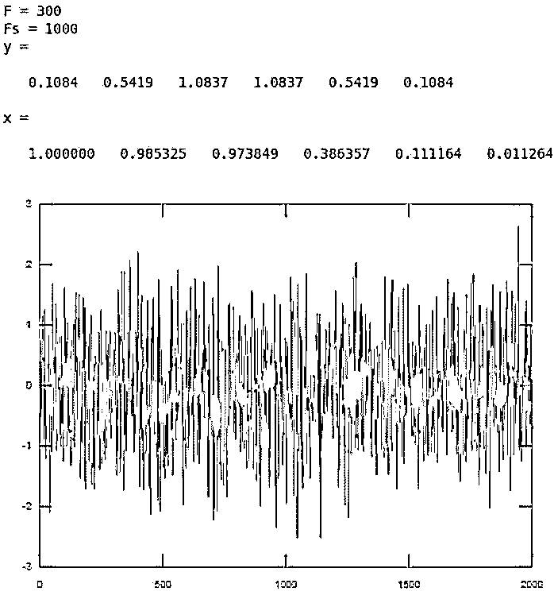
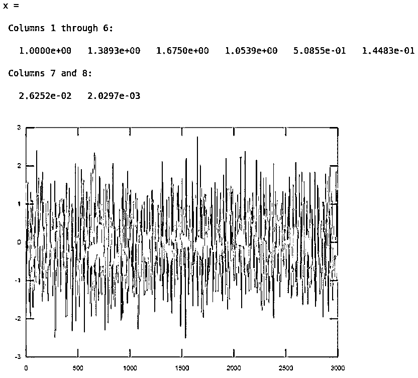
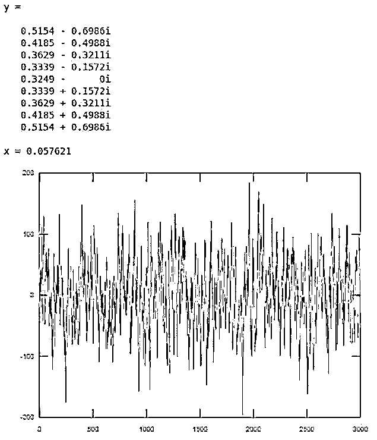

# 巴特沃斯滤波器 Matlab

> 原文：<https://www.educba.com/butterworth-filter-matlab/>

## 巴特沃兹滤波器 Matlab 介绍

以下文章提供了巴特沃兹滤波器 Matlab 的概述。巴特沃兹滤波器广泛用于各种 RF 和通用滤波器应用，以在规定的通带内获得最大的平坦输出。巴特沃兹滤波器被认为是一种全方位的滤波器，对各种应用都非常有用，尽管它不能提供最清晰的输出或截止。与切比雪夫等其它滤波器相比，巴特沃兹滤波器达到最终滚降速率的速度往往非常慢，这也是巴特沃兹滤波器的基础，表明截止频率以下的特性比其它任何频率都更重要。

在 Matlab 中，我们使用“butter”命令来实现“butterworth”滤波器。

<small>Hadoop、数据科学、统计学&其他</small>

**语法:**

`[y, x] = butter(n, F)`

`[y, x] = butter(n, F, Ftype)`

**描述:**

*   **【y，x】:**butter(n，F)用于返回 n 阶数字巴特沃兹滤波器的传递函数系数。这是一个低通滤波器，归一化截止频率为 f。
*   **【y，x】:**butter(n，F，Ftype)用于设计任何高通、低通、带通、带阻巴特沃兹滤波器。设计的滤波器类型取决于截止频率和 Ftype 参数。

### 巴特沃兹滤波器 Matlab 实例

以下是巴特沃兹滤波器的 Matlab 示例:

#### 示例#1

本例中，我们将创建一个低通巴特沃兹滤波器:

对于我们的第一个示例，我们将遵循以下步骤:

*   初始化截止频率。
*   初始化采样频率。
*   对于本例，我们将创建 5 阶低通巴特沃兹滤波器。
*   接下来，我们将使用上述步骤中创建的滤波器来过滤 2000 个样本的随机信号。

**代码:**

F = 300

[Initializing the cut off frequency to 300]

Fs = 1000

[Initializing the sampling frequency to 1000] [y, x] = butter(5, F/(Fs/2)) [Creating the butterworth filter of order 5]

输入信号= rann(2000，1)；

[Creating a random signal of 2000 samples]

outSignal = filter(y，x，input signal)；

[Passing the input signal as an input to the butterworth filter created]

绘图(外部信号)

[Plotting the output of the butterworth filter]

**输入:**

`F = 300
Fs = 1000
[y, x] = butter(5, F/(Fs/2))
inputSignal = randn(2000, 1);
outSignal = filter(y, x, inputSignal);
plot(outSignal)`

**输出:**

正如我们在输出中看到的，使用低通巴特沃兹滤波器，我们能够过滤 2000 个随机样本的信号。

#### 实施例 2

本例中，我们将创建另一个低通巴特沃兹滤波器:

对于本例，我们将遵循以下 4 个步骤:

*   初始化截止频率。
*   初始化采样频率。
*   对于本例，我们将创建 7 阶低通巴特沃兹滤波器。
*   接下来，我们将使用上述步骤中创建的滤波器来过滤 3000 个样本的随机信号。

**代码:**

F = 600

[Initializing the cut off frequency to 600]

Fs = 1000

[Initializing the sampling frequency to 1000] [y, x] = butter(7, F/(Fs/1)) [Creating the butterworth filter of order 7]

输入信号= rann(3000.1)；

[Creating a random signal of 3000 samples]

outSignal = filter(y，x，input signal)；

[Passing the input signal as an input to the butterworth filter created]

绘图(外部信号)

[Plotting the output of the butterworth filter]

**输入:**

`F = 600
Fs = 1000
[y, x] = butter(7, F/(Fs/1))
inputSignal = randn(3000, 1);
outSignal = filter(y, x, inputSignal);
plot(outSignal)`

**输出:**

正如我们在输出中看到的，使用低通巴特沃兹滤波器，我们能够过滤 3000 个随机样本的信号。

在上面的两个例子中，我们创建了低通巴特沃兹滤波器。接下来，我们将了解如何创建高通巴特沃兹滤波器。

#### 实施例 3

在本例中，我们将创建一个高通巴特沃兹滤波器:

对于本例，我们将遵循以下 4 个步骤:

*   初始化截止频率。
*   初始化采样频率。
*   对于本例，我们将创建 9 阶高通巴特沃兹滤波器。
*   接下来，我们将使用上述步骤中创建的滤波器来过滤 3000 个样本的随机信号。

**代码:**

F = 300

[Initializing the cut off frequency to 300]

Fs = 1000

[Initializing the sampling frequency to 1000] [z, y, x] = butter(9, F/Fs, ‘high’) [Creating the butterworth filter of order 9\. Please note that we have passed another argument ‘high’, which is used to create a high pass butterworth filter]

输入信号= rann(3000.1)；

[Creating a random signal of 3000 samples]

outSignal = filter(z，x，input signal)；

[Passing the input signal as an input to the butterworth filter created]

绘图(外部信号)

[Plotting the output of the butterworth filter]

**输入:**

`F = 300
Fs = 1000
[z, y, x] = butter(9, F/Fs, 'high')
inputSignal = randn(3000, 1);
outSignal = filter(z, x, inputSignal);
plot(outSignal)`

**输出:**

正如我们在输出中看到的，使用高通巴特沃兹滤波器，我们能够过滤 3000 个随机样本的信号。

### 结论

巴特沃兹滤波器用于在规定的通带内获得最大的平坦输出。在 Matlab 中，我们使用‘butter’命令来设计巴特沃兹滤波器。根据传递的参数，我们可以创建各种滤波器类型，如低通、高通等。

### 推荐文章

这是巴特沃斯滤波器的 Matlab 指南。这里我们分别讨论巴特沃兹滤波器的 Matlab 介绍和例子。您也可以看看以下文章，了解更多信息–

1.  [和 MATLAB](https://www.educba.com/cumsum-matlab/) 之和
2.  [Matlab 标志](https://www.educba.com/matlab-flag/)
3.  [Matlab 求根](https://www.educba.com/matlab-root-finding/)
4.  [xls 读取 Matlab](https://www.educba.com/xlsread-matlab/)

