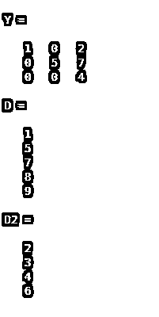
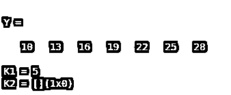
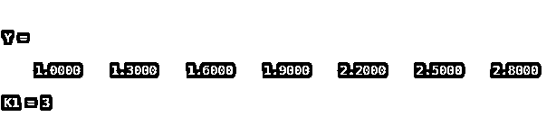

# Matlab 查找索引

> 原文：<https://www.educba.com/matlab-find-index/>

## Matlab 查找索引简介

Matlab 找到索引函数，用于传递包含数组中每个非零元素的线性索引的向量。对于 Matlab find，使用索引“find”语句。例如，D = find(Y)将返回一个包含数组 Y 中每个非零元素的线性索引的向量。如果 Y 是一个向量，那么 find 将返回一个与 Y 方向相同的向量。如果 Y 是一个多维数组，那么 find 将返回结果的线性索引的列向量。如果 Y 不包含非零元素或者为空，那么 find 返回一个空数组。

**语法**

<small>Hadoop、数据科学、统计学&其他</small>

*   D =查找(Y)
*   D =查找(Y，n)
*   D =查找(Y，n，方向)
*   [行，列] =查找(**_ _ _ _ _ _**)
*   [row，col，v]= find(**_ _ _ _ _ _**)

### Matlab Fscanf 怎么做？

查找用于查找非零值的索引和数值的函数。为了找到非零元素的索引和值，我们需要将所有元素放入一个变量中，并使用适当的语法。

使用 find 语句查找索引和非零值的步骤:-

第一步:我们需要将所有元素放入一个变量中

**步骤 2:** 然后，我们使用带有适当语法的 find 语句来查找非零元素的索引和值。

### Matlab 查找索引的例子

下面给出了 Matlab 查找索引的例子:

#### 示例#1

让我们看一个与查找函数相关的例子，查找函数用于查找非零值的索引和值。在这个例子中，我们取一个 3 乘 3 的矩阵，这个矩阵包含一个变量‘Y’。所以索引 1 从第 1 行和第 1 列开始，下一个索引值是 2，对应于第 2 行和第 1 列，那么相同的序列将继续，直到最后一个索引值；在我们的例子中，最后一个索引值是 9，因为我们采用 3 乘 3 矩阵。所以现在我们使用一个 find 函数；我们取寻找(Y)；该命令显示非零值的索引，例如在我们的示例中，非零值是 1、2、5、7 和 find 显示这些数字的索引值，然后我们取第一个命令的补码，该命令用于显示矩阵中出现的零值的索引值，以便索引存储在 d2 变量中。

**代码:**

`clc;
close all;
Y = [1 0 2; 0 5 7; 0 0 4] D = find(Y)
D2 = find(~Y)`

**输出:**

正如我们看到的结果，Y 变量显示 3x 3 矩阵，然后 D 存储 Y 矩阵中非零值的索引值，D2 存储矩阵中零的索引值。D 和 D2 的结果以 n*1 格式显示，其中 n 是行数。

#### 实施例 2

在这个例子中，我们用一个神奇的函数得到一个 5 乘 5 的矩阵；魔法创造矩阵；如果我们取 magic(n)，它创建一个乘 n 的矩阵；矩阵编号是 1 到 n^2，具有相等的行和列。所以在我们的例子中，我们采用 magic(5 ),这意味着它创建了一个 5x 5 的矩阵；数字是 1 到 25，因为 5^2.这个矩阵我们赋给了 Y 变量。那么现在，我们用一个 find 函数，find(Y<15，10)；它用于查找 5 乘 5 幻方矩阵中小于 15 的前 10 个元素，这 10 个数字的索引值存储在 D 变量中并显示出来。

**代码:**

`clc;
clear all;
close  all;
Y = magic(5)
D = find(Y<15,10)`

**输出:**

#### 实施例 3

让我们看另一个与 find 函数有关的例子，我们知道 find 函数用于寻找非零值的索引和值。所以在这个例子中，我们取 10 到 30 之间的一个数，差为 3，这些元素取变量“Y”。这些数是 13，16，19，22 和 25。现在我们找到了一个特定的整数值，我们使用了一个==操作符，所以我们将命令写成 find(Y==22 ),然后它在 22 出现的地方显示索引值。如果该数字不在该行中，则它返回一个空的。

**代码:**

`clc;
clear all;
close all;
Y = 10:3:30
K1 = find(Y==22)
K2 = find(Y==20)`

**输出:**

#### 实施例 4

让我们看一个查找函数的例子，我们知道查找函数用于查找非零值的索引和值。在这个例子中，我们取 1 到 3 范围内的一个数字，差值为 0.3，这些元素放入变量“Y”中，这些数字是 1.3、1.6、1.9、2.2、2.5 和 28。现在我们找到了一个特定的值，我们使用了一个==操作符，所以我们将命令写成 find(Y==1.6)，然后它显示索引值，其中 1.6 出现。如果该数字不在该行中，则它返回一个空的。

**代码:**

`clc;
clear all;
close all;
Y = 1:0.3:3
K1 = find(Y== 1.6)`

**输出:**

### 结论

在本文中，我们看到了 Matlab 查找索引的概念。基本上，Matlab 发现 index 用于指示非零元素的值。然后看到了与 Matlab find index 语句相关的语法，以及如何在 Matlab 代码中使用它。另外，我们看到了一些与 Matlab 的 find index 语句相关的例子。

### 推荐文章

这是一个 Matlab 查找索引的指南。这里我们讨论如何做 Matlab 的 Fscanf，以及 Matlab 查找索引的例子以及代码和输出。您也可以看看以下文章，了解更多信息–

1.  [MATLAB 工具箱](https://www.educba.com/matlab-toolbox/)
2.  [MATLAB 归一化](https://www.educba.com/matlab-normalize/)
3.  [Matlab 正弦波](https://www.educba.com/matlab-sine-wave/)
4.  [Matlab 梯形()](https://www.educba.com/matlab-trapz/)

