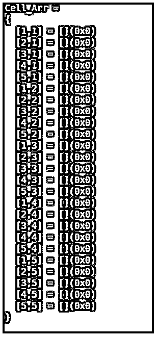
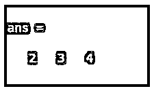
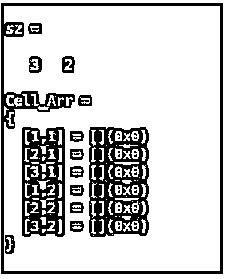

# Matlab 单元格

> 原文：<https://www.educba.com/matlab-cell/>

## Matlab 单元简介

Cell()是 Matlab 中的一个内置函数，用于构造一个单元格数组，该数组是一种数据类型，具有被索引的数据容器。这些数据容器被称为单元。单元阵列中的每个单元可以具有不同类型的数据。文本可以以各种格式包含在单元格数组中，例如包含文本的列表、包含数值的不同大小的数组或同时包含文本和数字的数组。单元格集合可以用光滑圆括号索引来引用。单元格的内容是用大括号{}索引来访问的。

### Matlab 单元格的语法

下面给出了 Matlab Cell 的语法:

<small>Hadoop、数据科学、统计学&其他</small>

| **语法** | **描述** |
| **CA =细胞(n)** | 该语法用于返回 n 乘 n 大小的单元数组 CA，创建具有空值的矩阵。 |
| **CA = cell(sz1，…，szN)** | 该语法用于返回大小为 sz1 乘 sz2 乘…的单元格数组。-szN 创建具有空值的矩阵，其中 Sz i 表示 N 维中第 i 维维的大小。 |
| **CA = cell(sz)** | 该语法用于返回大小为“sz”，CA 的单元数组，创建具有空值的矩阵。 |
| **Conv =细胞(obj)** | 此语法用于转换。NET 系统。字符串，系统。对象数组、Java 数组或 Python 序列转换为 Matlab 单元格数组类型的对象。 |

单元阵列可用于将具有不同数据类型的相关数据点一起保存在单个单元阵列中。一条数据包含在一个单元格中。为了引用单元数组中的元素，可以使用数组索引。数组索引应用于使用()(光滑圆括号)索引单元格数组，单元格的内容可以使用花括号{}表示。

**输入参数:**

*   **单元格数组的大小-‘n’:**任何方形单元格数组的大小都可以用整型值来指定。正整数值定义单元数组的实际大小，而值为 0 的 n 给出一个空的单元数组。在 n 为负值的情况下，被函数视为 0。
*   **dimensions ' Size(SZI):**单元数组的任意维的大小可以用整型值指定。正整数值定义了单元数组的第 i 维的实际大小，而值为 0 的 sz i 给出了在相应的第 i 维维中没有元素的单元数组。在 sz i 为负值的情况下，被函数视为 0。对于第二维度之外的任何维，单元数组都将忽略大小为 1 的尾部维。
*   **Size(sz):** 单元数组的任何维度的大小可以以整数的行向量的形式来指定，该行向量指示对应于数组索引的维度的大小。正整数值定义了单元数组的第 I 个维维的实际大小，而值为 0 的 sz 给出了具有空值的单元数组。在 sz 为负值的情况下，被函数视为 0。对于第二维度之外的任何维，单元数组都将忽略大小为 1 的尾部维。
*   **输入数组(obj):** 输入数组是提供给函数的对象，要转换成单元格数组对象。输入数组可以是 Java 类型的数组。网，系统。对象、Python 序列类型或 System.String。
*   **输出数组(CA):** 输出数组是函数的返回值，导致单元格数组的类型在每个单元格中具有 double 类型的 0 乘 0 数组(空)。
*   **D —转换后的数组:**转换后的数组是导致单元格数组类型的函数的返回值。每个单元格都被任何支持最接近相应输入对象类型的 Matlab 对象占据。

### Matlab 单元格示例

下面是提到的例子:

#### 示例#1

下面的命令通过 cell()函数的实现创建了一个 5×5 大小的正方形单元格数组。

**代码:**

`Cell_Arr = cell(5)`

**输出**:

#### 实施例 2

下面的命令创建了一个 3 维的单元格数组，大小分别为 2×3×4，分别用于第一、第二和第三维，并实现了 cell()函数。

**代码:**

`Cell_Arr = cell(2,3,4);
size(Cell_Arr)`

**输出:**

#### 实施例 3

编写下面的示例来创建一个空的单元格数组，其大小与给定的输入数组相同。

**代码:**

`M = [7 9; 2 1; 8 3];
sz = size(M)
Cell_Arr = cell(size(M))`

**输出:**

具有单元的单元阵列的输出结果排列如下:

结果单元数组 Cell_Arr 是一个空单元数组，其大小等于非空输入数组 m

它也称为现有阵列的克隆大小。

**补充说明:**

*   使用 Cell()方法创建一个空矩阵的单元格数组，这与将一个空矩阵作为最后一个索引分配给任何新的单元格数组是一样的。

示例:

以下两个命令产生相同的行为:

**CA = cell(2，3，2)；**

**CA{2，3，2 } =[]；**

*   如果在程序执行过程中，需要向单元数组中插入数据，可以先创建单元数组，使用{}作为单元数组构造运算符。

示例:

**CA = {1，3，2；**

**‘尝试’，兰德(4，9，3)，{ 11；22;33}}**

**CA=3×2 单元阵列**

**{[ 1]} {[ 2]} {[ 3]}**

**{ ' try ' } { 4x9x 3 double } { 3×1 cell }**

*   花括号{}也用于创建空值，即 0 乘 0 单元数组。
*   一个单元可用于为将来的数据分配操作预分配单元数组。Cell()方法还扩展了它的功能，以转换某些类型的对象，如 Java、.NET 或 Python 数据结构转换为包含最接近给定数据类型的 Matlab 对象的单元格数组。

### 推荐文章

这是一个 Matlab 细胞指南。这里我们分别讨论 Matlab 单元的介绍和例子。您也可以看看以下文章，了解更多信息–

1.  [MATLAB 冒号](https://www.educba.com/matlab-colon/)
2.  [Matlab 图片](https://www.educba.com/matlab-images/)
3.  [MATLAB 工具箱](https://www.educba.com/matlab-toolbox/)
4.  [MATLAB 独有的](https://www.educba.com/matlab-unique/)

