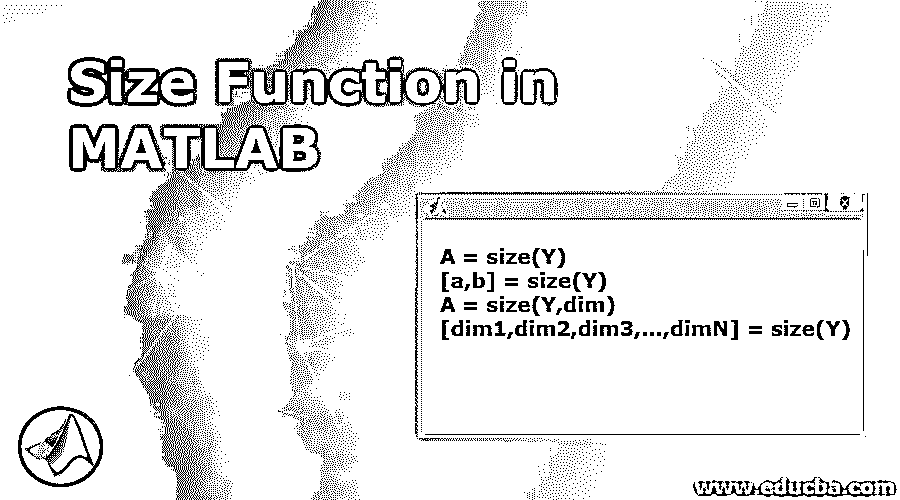
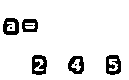
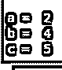
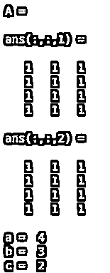
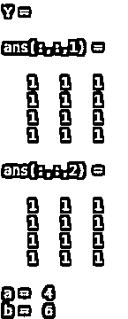

# MATLAB 中的尺寸函数

> 原文：<https://www.educba.com/size-function-in-matlab/>

## MATLAB 中尺寸函数的介绍

MATLAB 为我们提供了大量的功能，在各种计算问题中非常有用。在本文中，我们将研究一个强大的 MATLAB 函数，称为“MATLAB size”。在我们了解如何在 MATLAB 中计算数组的大小之前，让我们先了解一下 size 函数到底是做什么的。MATLAB 中的 Size 函数将返回一个行向量，其元素将是输入中传递的数组的各个维度的大小。

**MATLAB 中 Size 函数的语法:**

<small>Hadoop、数据科学、统计学&其他</small>

`A = size(Y)`

`[a,b] = size(Y)`

`A = size(Y,dim)`

`[dim1,dim2,dim3,...,dimN] = size(Y)`

### MATLAB 中尺寸函数的描述

1.  A = size(Y)，该函数将返回作为输入传递的数组的每个维度的大小。
2.  [a，b] = size(Y)，此函数将以两个独立的变量“a”和“b”返回输入矩阵的大小
3.  A = size(Y，dim)，此函数将返回 Y 维度的大小，由输入标量 dim 指定。
4.  [dim1，dim2，dim3，…，dimN] = size(Y)，这个函数将在单独的变量中返回输入数组 X 的“n”维的大小。

如果输出中参数“n”的数量不等于 ndims(Y ),那么如果:

| **n > ndims(Y)** | 该函数将返回额外变量中的值 |
| **n < ndims(Y)** | “dn”将包含 Y 的剩余维度的大小的乘积 |

现在让我们通过各种示例来理解 MATLAB 中的大小计算:

### 在 MATLAB 中实现尺寸函数的实例

以下是 MATLAB 中的大小函数示例:

#### 示例#1

让我们首先将输入数组定义为:rand(2，4，5)

正如我们在输入中看到的，rand(2，4，5)中第三维度的大小是 5。让我们借助“大小”函数来寻找相同的答案。

*   为了找出第三维的大小，这是我们在 MATLAB 中的输入:

a =大小(rand(2，4，5)，3)

**代码:**

`a = size(rand(2, 4, 5), 3)
a`

**输出:**

*   正如我们在输出中看到的，我们得到了第三维的大小，即 5。

对于相同的输入数组，我们也可以将大小作为一个向量。让我们了解如何实现这一目标:

a =大小(rand(2，4，5))

这是我们的输入和输出在 MATLAB 控制台中的样子:

**代码:**

`a = size(rand(2, 4, 5))
a`

**输出:**

*   正如我们在输出中看到的，我们已经得到了单个向量中所有维度的大小。

要将维度的大小分配给不同的变量，我们可以使用下面的代码:

[a,b, c] = size(rand(2, 4, 5))
a = 2
b =4
c =5

这是我们的输入和输出在 MATLAB 控制台中的样子:

**代码:**

`[a,b, c] = size(rand(2, 4, 5));
a,b,c`

**输出:**

正如我们在输出中可以观察到的，我们得到了各个变量中所有维度的大小。

#### 实施例 2

让我们首先定义一个不同的输入数组。

A =一(4，3，2)

这里，我们创建了 2 个大小为 4 x 3 的数组，所有元素都是“unity”。

为了获得维度的大小，下面是我们的代码:

[a, b, c] = size(A)

这是我们的输入和输出在 MATLAB 控制台中的样子:

**代码:**

`A = ones(4, 3, 2)
[a, b, c] = size(A)`

**输出:**

#### 实施例 3

接下来，让我们以输出变量小于 ndims (Y)为例。这里，我们也将使用与上面示例中相同的数组

[a, b] = size(Y)

正如我们所看到的，输入有 3 个维度，但是我们的输出变量只有 2 个。在这种情况下，最后一个变量将是所有剩余维度的乘积。因此，在我们的例子中，最后两个维度的乘积折叠成最后一个变量。

这是我们的输入和输出在 MATLAB 控制台中的样子:

**代码:**

`Y = ones (4,3,2)
[a,b] = size(Y)`

**输出:**

正如我们在输出中看到的，最后一个变量包含 3 和 2 的乘积，这是最后两个维度的大小。

### 结论

因此，在这篇文章中，我们了解到，在 MATLAB 中，大小函数可以用来计算任何数组的大小。此外，我们可以根据需要传递参数的数量。MATLAB 为我们提供了大小的乘积，以防我们传递的参数比要求的少。

### 推荐文章

这是一个 MATLAB 中大小函数的指南。在这里，我们讨论了 MATLAB 中的大小函数的介绍及其示例和代码实现。您也可以浏览我们推荐的文章，了解更多信息——

1.  [MATLAB 函数介绍](https://www.educba.com/matlab-functions/)
2.  [Matlab 的十大优势](https://www.educba.com/advantages-of-matlab/)
3.  [Matlab 中均值函数概述](https://www.educba.com/mean-function-in-matlab/)
4.  [如何使用 Matlab？|使用的运算符](https://www.educba.com/how-to-use-matlab/)

