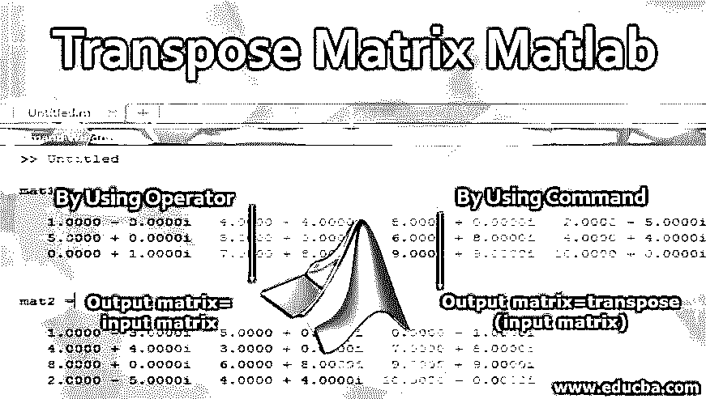
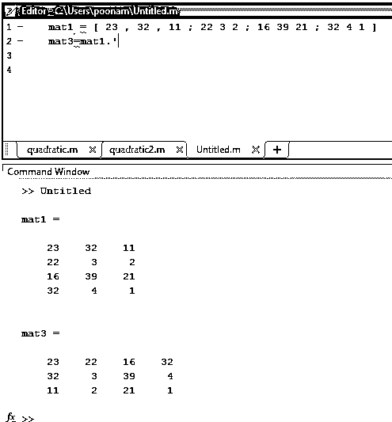
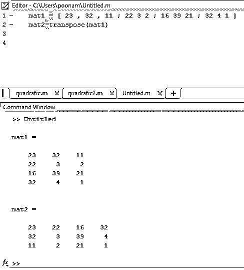
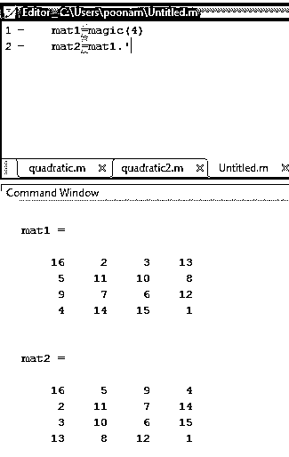
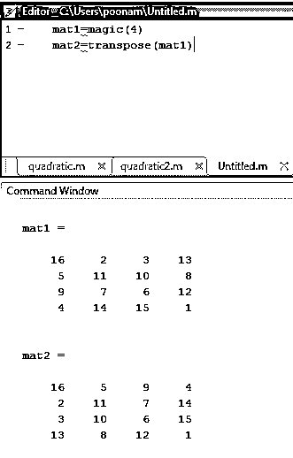
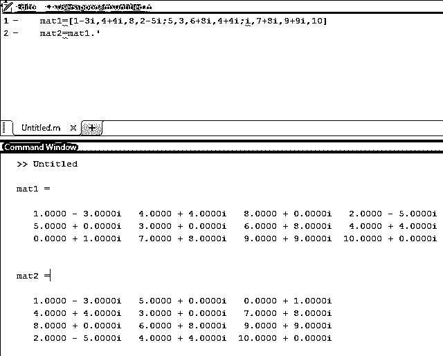
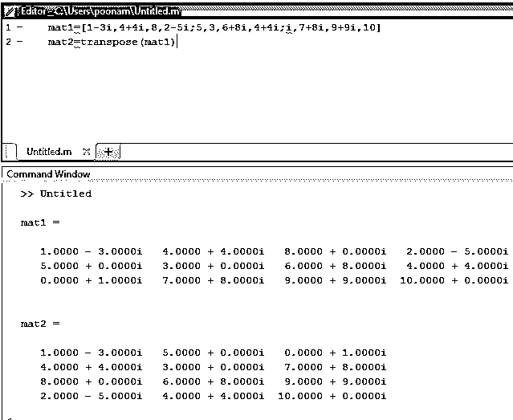

# 转置矩阵 Matlab

> 原文：<https://www.educba.com/transpose-matrix-matlab/>

## 转置矩阵 Matlab 简介

在这篇文章中，我们将学习转置矩阵 Matlab。如果输出矩阵的行等于输入矩阵的列，并且输出矩阵的列等于输入矩阵的行，则输出矩阵被称为“矩阵的转置”。这个“T”代表矩阵的转置。让我们考虑有两个矩阵，一个是输入矩阵‘I’，第二个是输出矩阵‘O’。输入矩阵的许多行是“Irow”。输入矩阵中的列数是“Idol”，输出矩阵中的行数是“Orow”。输出矩阵中的列数是“Ocol ”,那么矩阵的转置满足两个条件，即 Icol=Orow 和 Irow=Ocol。(输入矩阵的行=输出矩阵的列，输入矩阵的列=输出矩阵的行)

### 如何在 Matlab 中做转置矩阵？

在 Matlab 中求矩阵的转置有两种方法:

<small>Hadoop、数据科学、统计学&其他</small>

1.  通过使用运算符
2.  通过使用命令

#### 1.通过使用运算符

在这种方法中，点算子用于寻找矩阵的转置。').这是移调最简单的方法之一。这种方法的唯一限制是，由于操作符的原因，出现语法错误的可能性很高。

**语法:**

`Output matrix=input matrix . ’`

**步骤:**

*   使用方阵接受输入矩阵(Input = [ 23，32，11；22 3 2 ;16 39 21 ;32 4 1 ]
*   对输入矩阵应用运算符(输出矩阵=输入矩阵。')
*   显示输出矩阵。

#### 2.通过使用命令

在这种方法中，“转置”命令用于找出矩阵的转置。与前一种方法相比，这种方法不太复杂且易于实现。并且在实现时出错的机会更少。

**语法:**

`Output matrix=transpose (input matrix)`

**步骤:**

*   使用方阵接受输入矩阵(Input = [ 23，32，11；22 3 2 ;16 39 21 ;32 4 1 ]
*   对输入矩阵应用命令(输出矩阵=转置(输入矩阵))
*   显示输出矩阵。

### 转置矩阵 Matlab 示例

下面是 Matlab 实现矩阵的例子:

#### 示例#1

让我们考虑输入矩阵为 mat1
**代码:**
`mat1 =
23 32  11
22   3   2
16  39  21
32   4   1`
下表通过使用运算符举例说明了 Matlab 代码 1。

| **Matlab 编辑器** | **命令窗口(输出)** |
| mat1 = [ 23，32，11；22 3 2 ;16 39 21 ;32 4 1 ] mat3 = mat1。' | mat1 =23    32    1122     3     216    39    2132     4     1mat3 =23    22    16    3232     3    39     411     2    21     1 |

**输出:**

下表通过使用转置命令说明了示例 1 的 Matlab 代码:

| **Matlab 编辑器** | **命令窗口(输出)** |
| mat1 = [ 23 , 32 , 11 ; 22 3 2 ; 16 39 21 ; 32 4 1 ]mat2 =转置(mat1) | mat1 =23    32    1122     3     216    39    2132     4     1mat2 =23    22    16    3232     3    39     411     2    21     1 |

#### 实施例 2

让我们假设输入矩阵是魔术命令形式的 mat1。

`mat1 =
16     2     3    13
5    11    10     8
9     7     6    12
4    14    15     1`

下表通过使用转置运算符说明了示例 1 的 Matlab 代码。

| **Matlab 编辑器** | **命令窗口(输出)** |
| mat1 =魔法(4)mat2 = mat1' | mat1 =16     2     3    13

5    11    10     8

9     7     6    12

4    14    15     1

mat2 =

16     5     9     4

2    11     7    14

3    10     6    15

13     8    12     1

 |

下表说明了使用 transpose 命令的示例 2 的 Matlab 代码。

| **Matlab 编辑器** | **命令窗口(输出)** |
| mat1 = magic ( 4 )%no 4 represents no of rows and columns%mat2 =转置(mat1) | mat1 =16     2     3    135    11    10     89     7     6    124    14    15     1mat2 =16     5     9     42    11     7    143    10     6    1513     8    12     1 |

#### 实施例 3

现在考虑一个具有复数的输入矩阵。

`mat1 =
1.0000 - 3.0000 i     4.0000 + 4.0000 i     8.0000 + 0.0000 i     2.0000 - 5.0000 i
5.0000 + 0.0000 i     3.0000 + 0.0000 i     6.0000 + 8.0000 i     4.0000 + 4.0000 i
0.0000 + 1.0000 i     7.0000 + 8.0000 i     9.0000 + 9.0000 i     10.0000 + 0.0000 i`

| **Matlab 编辑器** | **命令窗口(输出)** |
| mat1 = [ 1 – 3 i , 4  + 4 i , 8 , 2 – 5 i ; 5  , 3 , 6 + 8 i , 4 + 4 i ; i , 7 + 8 i , 9 + 9 i , 10]mat2=mat1' | mat1 =1.0000–3.0000 I 4.0000+4.0000 I 8.0000+0.0000 I 2.0000–5.0000 I5.0000+0.0000 I 3.0000+0.0000 I 6.0000+8.0000 I 4.0000+4.0000 I0.0000+1.0000 I 7.0000+8.0000 I 9.0000+9.0000 I 10.0000+0.0000 Imat2 =1.0000–3.0000 I 5.0000+0.0000 I 0.0000+1.0000 I4.0000+4.0000 I 3.0000+0.0000 I 7.0000+8.0000 I8.0000 + 0.0000i2.0000–5.0000 I 4.0000+4.0000 I 10.0000+0.0000 I |

| **Matlab 编辑器** | **命令窗口(输出)** |
| mat1=[1-3i,4+4i,8,2-5i;5,3,6+8i,4+4i;i,7+8i,9+9i,10]mat2 =转置(mat1) | mat1 =1.0000–3.0000 I 4.0000+4.0000 I 8.0000+0.0000 I 2.0000–5.0000 I5.0000+0.0000 I 3.0000+0.0000 I 6.0000+8.0000 I 4.0000+4.0000 I0.0000+1.0000 I 7.0000+8.0000 I 9.0000+9.0000 I 10.0000+0.0000 Imat2 =1.0000–3.0000 I 5.0000+0.0000 I 0.0000+1.0000 I4.0000+4.0000 I 3.0000+0.0000 I 7.0000+8.0000 I8.0000 + 0.0000i2.0000–5.0000 I 4.0000+4.0000 I 10.0000+0.0000 I |

### 结论

矩阵的转置是矩阵操作中使用的重要术语之一。在这一节中，我们已经看到了如何使用两种方法找出一个矩阵的转置，一种是使用运算符，另一种是使用转置命令。除了不同的方法，我们还看到了不同的矩阵作为检查系统的输入(实数、随机数和复数)。

### 推荐文章

这是一个转置矩阵的 Matlab 指南。在这里，我们讨论的例子，以实现转置矩阵 Matlab 使用运营商和命令。您也可以浏览我们的其他相关文章，了解更多信息——

1.  [Matlab 中的颜色](https://www.educba.com/colors-in-matlab/)
2.  [Matlab 中的散点图](https://www.educba.com/scatter-plots-in-matlab/)
3.  [MATLAB 中的 3D 矩阵](https://www.educba.com/3d-matrix-in-matlab/)
4.  [Matlab 特性](https://www.educba.com/matlab-features/)
5.  [Matlab 中梯度运算指南](https://www.educba.com/matlab-gradient/)
6.  [Matlab 反函数各种例子指南](https://www.educba.com/matlab-inverse-function/)

