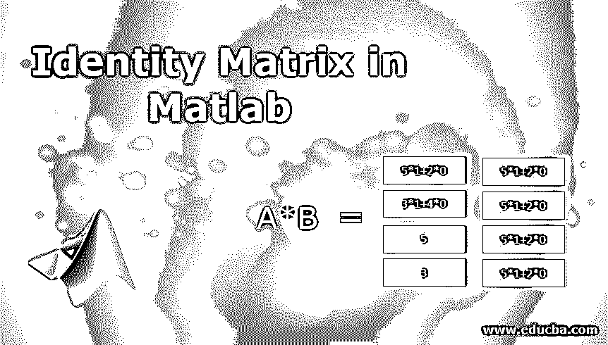
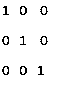
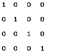
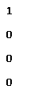

# Matlab 中的单位矩阵

> 原文：<https://www.educba.com/identity-matrix-in-matlab/>

## Matlab 中的单位矩阵介绍

矩阵被定义为行和列中数字的排列。可以借助行号和列号来访问它们。如果一个矩阵有 3 行 5 列，那么它被称为 3*5 矩阵。有不同类型的矩阵，其中之一是单位矩阵。单位矩阵被定义为这样的矩阵，其中所有对角元素为 1，其余元素为 0。它也被称为初等矩阵或单位矩阵。可以用单位矩阵执行不同的运算，如乘法、加法、减法等。

### Matlab 中单位矩阵的运算

在 Matlab 中，单位矩阵有多种用途。单位矩阵最重要的性质是，如果一个正规矩阵乘以单位矩阵，那么结果将总是原始矩阵。单位矩阵可以是任意维数，即它可以有任意数量的行和列。借助 Matlab 中的单位矩阵，可以进行不同的运算。在 Matlab 中，可以使用“eye”关键字创建单位矩阵。我们可以通过在括号中提及来定义单位矩阵的维数。

<small>Hadoop、数据科学、统计学&其他</small>

以下是 Matlab 中用来表示单位矩阵的语法:

*   **U = eye:** 该语法返回标量类型的 1。
*   **U= eye(a):** 该语法返回具有若干行和若干列的单位矩阵，其中所有对角元素为 1，其余元素为零。
*   **U= eye (a，b):** 该语法返回具有若干行和 b 列的单位矩阵，其中所有对角元素为 1，其余元素为零。
*   **U = eye(数组的大小):**这个语法被定义为返回一个数组，其中对角线元素为 1，其他地方为 0。数组的大小被定义为单位矩阵的大小。例如，eye ([1，2])将创建一个 1 乘 2 的数组，其中所有对角元素都是 1。
*   **U = eye (__，类型名称):**返回单位矩阵的数据类型。例如 eye(2，' int4 '):这将返回一个 2 乘 2 的矩阵，其中的元素具有 4 位整数。
*   **U = eye (__，' like '，a):** 该语法表示单位矩阵具有相同的类型，包含对角元素为 1，其余元素为 0，与 a 具有相同的类型。

### Matlab 中实现单位矩阵的实例

下面是 Matlab 中单位矩阵的例子:

#### 示例#1

下面的例子总是返回标量类型值。

**代码:**

`U = eye (3)`

**输出:**

**解释:**在上面的例子中，我们刚刚在 Matlab 中创建了一个简单的单位矩阵，通过定义括号内的维数。这里的维数是 3，这意味着用 3 行和 3 列创建身份，其中所有对角元素是 1，其余元素是 0。在上面的例子中，对角线元素是(1，1)，(2，2)，(3，3)。如果维度在上面的例子中被提到为 0，那么它将创建一个空矩阵，如果维度被给定为任何负值，那么它将产生 0。可以接受的数据类型有 int8、int32、int16、single、double 等。

#### 实施例 2

创建一个有若干行和若干列的单位矩阵。

**代码:**

`U = eye (4,4)`

**输出:**

**解释:**在上面的例子中，我们给出了两个维度来创建一个单位矩阵，这意味着它将创建一个行数为 4、列数为 4 的单位矩阵，其中所有对角元素为 1，其余元素为 0。对角线元素可以通过其行号和列号(1，1)，(2，2)，(3，3)，(4，4)来访问。如果维度的第二部分被给定为 0，那么它将创建一个空矩阵，如果维度的第二部分为负，那么它总是被视为 0。可以接受的数据类型有 int8、int32、int16、single、double 等。

#### 实施例 3

通过提及数组的大小来创建单位矩阵。

**代码:**

`sze = [4,1];
U = eye(sze)`

**输出:**

**解释:**在上面的例子中，定义了大小，这将有助于在 Matlab 中创建单位矩阵。因为大小给定为 4x 1 数组，这意味着它将创建一个具有 4 个行数和 1 个列数的单位矩阵。Size 只能有两个值，不能超过两个。如果给定元素的大小被指定为 0，那么它将创建一个空矩阵，如果给定元素的大小被指定或声明为负整数，那么它总是被视为 0。如果大小为[4，5]，那么它将创建一个 4 乘 5 的矩阵，其行数为 4，列数为 5。

可以接受的数据类型有 int8、int32、int16、single、double 等。类或类型名可以是 int8、int32、int16、logical、single、double 等。如果我们提到某个原型的输出类，那么它也支持复数。单位矩阵最重要的性质之一是，如果我们将一个标准矩阵与一个具有相同维数的单位矩阵相乘，那么得到的矩阵将始终是原始矩阵，元素没有任何变化。请找到下面的例子，它会让你更好地理解背后的概念。

#### 实施例 4

这是另一个展示如何使用语法执行矩阵乘法的例子。

| **A=** | Five | Two |
| Three | Four |
| **B=** | One | Zero |
| Zero | One |

**输出:**

| **A*B=** | 5*1+2*0 | 5*0+2*1 |
| 3*1+4*0 | 3*0+4*1 |
| Five | Two |
| Three | Four |

**解释:**在上面的例子中，如果一个正规矩阵乘以单位矩阵，那么结果就是具有相同维数的值没有变化的正规矩阵。

### 结论

Matlab 中有各种不同用途的矩阵。单位矩阵也有广泛的应用，如在工程、统计等领域。

### 推荐文章

这是一个 Matlab 中的单位矩阵指南。在这里，我们讨论了在 Matlab 中的单位矩阵的工作，以及例子和代码实现。您也可以浏览我们推荐的文章，了解更多信息——

1.  [Matlab 和运算符](https://www.educba.com/matlab-and-operator/)
2.  [Matlab 中的 Simulink 是什么？](https://www.educba.com/what-is-simulink-in-matlab/)
3.  [Matlab 中的颜色](https://www.educba.com/colors-in-matlab/)
4.  [Matlab 中的矩阵介绍](https://www.educba.com/matrix-in-matlab/)

