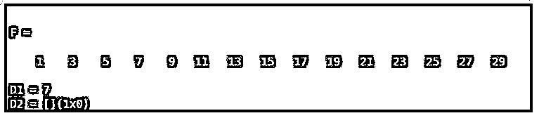
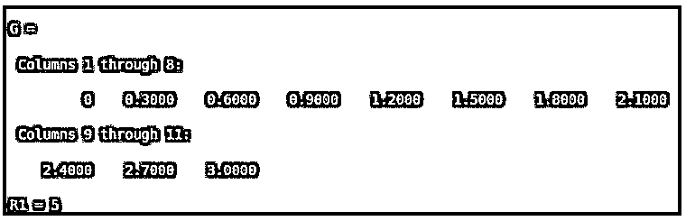

# Matlab 在数组中查找值

> 原文：<https://www.educba.com/matlab-find-value-in-array/>

## Matlab 简介在数组中查找值

下面的文章提供了 Matlab 在数组中查找值的概要。在 matlab 中，有一个函数用于查找数组中的索引值和非零元素的值，称为“查找数组中的值”数组中的查找值将有助于查找给定数组中是否存在元素或数字。

**语法:**

<small>Hadoop、数据科学、统计学&其他</small>

`A = find(Z)`

`A = find(Z,n)`

### 如何在数组中求值？

Matlab 查找数组中的值，用于查找给定数组中非零元素的索引和值。要找到数组中非零元素的值，我们需要获取数组中的所有元素并使用正确的语法。

使用在数组中查找值查找非零值的步骤:

*   **步骤 1:** 我们需要将所有输入收集到一个集合或一个数组中。
*   **第二步:**然后，我们使用一个具有适当语法的 find value in array 来查找非零元素值。

### Matlab 在数组中求值的例子

下面是 Matlab 在数组中查找值的例子:

#### 示例#1

让我们看一个与 matlab 在数组中查找值相关的例子，因为我们知道在数组中查找值用于查找给定数组中非零元素的索引和值。在这个例子中，我们取 1 到 30 之间的一个数，差为 2，这些元素取变量 F，这些数是 1，3，5，7，9，11，13，15，17，19，21，23，25，27 和 29。现在我们想在数组“F”中找到一个特定的元素；我们使用==运算符。现在，我们使用查找数组中的值来查找数组' f '中的特定元素。现在，我们发现 13 和 12 是否出现在数组中。为此，我们可以使用数组中的查找值作为“D1 =查找(F==13)”和“D2 =查找(F==12)”。这一行将查找一个 13 的数字是否出现在给定的数组中，如果该数字出现在数组中，函数将把该数字的位置返回到数组中。并且该数字不存在，则它显示一条消息“空矩阵”

**代码:**

`clc;
clear all;
close all;
F = 1:2:30
D1 = find(F==13)
D2 = find(F==12)`

**输出:**

**

** 

在执行了上面的 Matlab 代码 1 st，之后，我们创建了数组 f。我们在数组 f 的第 7 位找到了数字 13。但是，数字 12 并没有出现在数组中；因此 matlab 查找数组中的值函数返回空值。

#### 实施例 2

让我们再看一个 matlab 在数组函数中查找值的例子。在这个例子中，我们创建了一个矩阵，然后我们看到 matlab 如何在数组中查找值。首先，我们开始创建一个 2 乘 2 的矩阵，其中包含 1 到 4 之间的随机整数。接下来，我们使用魔法函数创建一个 2 乘 2 的矩阵。然后我们用 matlab 来寻找数组函数中的值。例如，Z= magic(2)返回一个 2 乘 2 的矩阵，其中包含 1 到 4 之间的随机整数。之后，我们使用“A = find(Z)”语法，返回数组中非零元素的值。

**代码:**

`clc;
clear all;
close all;
Z= magic(2)
A = find(Z)`

**输出:**

在执行了上面的代码魔术函数之后，创建了一个 2 乘 2 的矩阵，其中包含 1 到 4 的随机整数。之后，matlab 的 find values 数组函数将矩阵 Z 的所有元素返回到变量 a 中。

#### 实施例 3

让我们看另一个例子；我们知道，在数组中查找值是用来在给定的数组中查找索引和非零元素的。所以在这个例子中，我们将看到在数组中查找值可以有效地找到无理数或小数。为此，我们取 0 到 3 范围内的十进制数，差值为 0.3，这些元素取一个变量“G”。这些数字是 0、0.3000、0.6000、0.9000、1.2000、1.5000、1.8000、2.1000、2.4000、2.7000 和 3.0000。现在我们想在数组‘G’中找到一个 1.2 的十进制数；我们使用==运算符。因此，现在我们使用查找数组中的值来查找数组“G”中的 1.2 个十进制数。R1 = find(G== 1.2)返回十进制数 1.2 在数组 G 中的位置。该位置存储在变量 R1 中。

**代码:**

`clc;
clear all;
close all;
G = 0:0.3:3
R1 = find(G== 1.2)`

**输出:**

在执行了上面的 matlab 代码之后，我们创建了一个十进制数的数组 G。我们在数组 g 的第 5 个第位置找到了 1.2 这个数字。

### 结论

在本文中，我们看到了 Matlab 在数组中查找值的概念。基本上，matlab 在数组中查找值，用于指示数组中某个元素的值。Matlab 查找数组中的值对于查找数组中元素的位置起着重要的作用。如果数组中没有元素，则返回空。

### 推荐文章

这是一个 Matlab 查找数组中值的指南。这里我们讨论一下入门，如何在数组中求值？和示例。您也可以看看以下文章，了解更多信息–

1.  [震级 Matlab](https://www.educba.com/magnitude-matlab/)
2.  [Matlab 2 cell Matlab](https://www.educba.com/mat2cell-matlab/)
3.  [Matlab 图片](https://www.educba.com/matlab-images/)
4.  [格式长 Matlab](https://www.educba.com/format-long-matlab/)

