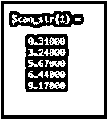
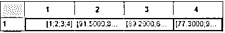
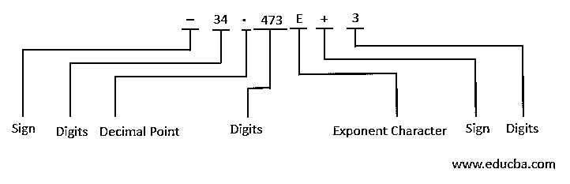
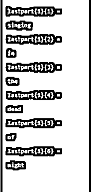
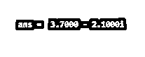

# Matlab 文本扫描

> 原文：<https://www.educba.com/matlab-textscan/>

## Matlab 文本扫描简介

来自 MATLAB 的内置函数 textscan()执行从文本文件或字符串中读取格式化数据、转换数据和将数据写入单元格数组的操作。Textscan()支持从文件中的任意点初始化读取。一旦用户打开文件，textscan()可以从用户指示的任何点开始读取。当最后一个 textscan()操作停止时，后续的 textscan()继续读取文件。

### 句法

| **语法** | **描述** |
| C = textscan(fileID，formatSpec) | 命令 textscan()的这种形式用于将数据从 fileID 指示的打开文本文件读入单元数组 *C* 。 |
| C = textscan(fileID，formatSpec，N) | 命令 textscan()的这种形式用于将数据从由 fileID 指示的打开文本文件读入单元格数组，*C*for form tspec，N 次。为了读取附加的，可以使用原始的 fileIDagain 调用 textscan()。 |
| C =文本扫描(chr，formatspec) | This form of the command textscan() is used to read data from the character vector ‘chr’ and store it in the cell array ‘C.’ While reading data from character vector, each time, recurring calls to textscan()re-initiate the scan from the beginning. A scan can be resumed from the last position on request for a position output.

<small>Hadoop、数据科学、统计学&其他</small>

Textscan()尝试将“chr”中的数据与以 formatSpec 形式给出的格式进行匹配。 |
| C =文本扫描(chr、formatspec、f) | 这种形式的命令 textscan()用于读取 dataforformatSpecf 次，其中 f 是正整数。 |
| C = textscan(___，Name，Value) | 命令 textscan()的这种形式用于以一个或多个名称、值对参数的形式读取指定选项的数据。 |
| [C，position] = textscan(___) | This form of the command textscan() is used to read data returning the position pointed in the file or in the character vector at the end of the process of scanning as the second output argument.返回值

对于文件- value 等于 ftell(fileID)的返回值

表示 textscan 读取的字符数的字符向量位置。

 |

### Matlab 文本扫描示例

下面提到了不同的例子:

#### 示例#1

**代码:**

`chr_str = '0.31 3.24 5.67 6.44 9.17';Scan_str = textscan(chr_str,'%f'); celldisp(Scan_str)`

**输出:**

#### 实施例 2

**代码:**

`filestr = 'grades.txt';
ID_file = fopen(filestr);
File_formatSpec = '%s';
Cy = 4;
Result_text = textscan(ID_file,File_formatSpec,Cy,'Delimiter','|');
C_data0 = textscan(ID_file,'%d %f %f %f')`

**输出**:

#### 实施例 3

**代码:**

`chr_str = 'It is;my code';Scan_str = textscan(chr_str,'%s','Delimiter',';','EmptyValue',-Inf); celldisp(Scan_str)`

**输出:**

### 使用 TextScan()

Textscan()设计用于将数值字段转换为特定的输出类型，遵循与溢出、截断以及 NaN、Inf 和-Inf 应用程序相关的 MATLAB 规则。

例如，整数 NaNis 在 MATLAB 中表示为零。因此，如果 textscan()遇到与整数格式说明符相关联的空字段，它将空值返回为零，而不是 NaN。

在根据文本转换说明符匹配数据时，textscan()会一直读取，直到找到分隔符或行尾字符；而在将数据与数值转换说明符匹配时，textscan()会一直读取，直到找到非数值字符。因此，在 casetextscan()中，它不能将数据匹配到任何特定的转换说明符；它尝试将数据与 formatSpec 中的下一个转换说明符进行匹配。如下图所示，符号(+或-)、小数点和指数字符等字符被视为数字字符。

#### 恢复文本扫描

如果 textscan()转换数据字段失败，它不会继续读取操作，而是返回失败前读取的字段。当从一个文件中读取时，可以通过再次调用 textscan()来恢复对同一文件的读取操作，使用相同的文件标识符 filed 作为第一个输入参数。对于由 textscan()方法执行的字符串读取操作，双输出参数的语法使用户能够从上一次读取操作终止的位置恢复读取操作。下面的代码讲述了这个操作的实现。

`textscan(str(position+1:end), ...)
lyric = 'Blackbird singing in the dead of night';
[firstword,pos] = textscan(lyric,'%9c',1);
lastpart = textscan(lyric(pos+1:end),'%s');
celldisp(lastpart)`

**输出**:

textscan()和 textread()函数展示了相似的功能，但它们在许多方面有所不同，例如:

1.  textscan()函数确保了比 oftextread()方法更好的性能。因此，在读取大文件时，这是一个更好的选择。
2.  使用 textscan()函数，可以从文件中的任何一点开始读取操作。一旦文件被用户打开，因为 textscan()的先决条件是它要求用户首先打开文件，然后用户可以访问文件中的任何位置以在期望的点开始 textscan()，而 textread()函数具有仅支持从任何文件的开头开始读取操作的有限特征。
3.  后续的 textscan()操作从先前的 textscan()操作停止的地方开始读取给定的文件。但是在 textread()函数的情况下，它总是从输入文件的开头开始，而不管任何先前的 textread()函数调用所执行的读取操作的状态。
4.  Textscan()以单个单元格数组的形式返回一个值，与用户读取的字段数量无关。使用 textscan()，不需要将输出参数的数量与正在读取的字段的数量相匹配。
5.  Textscan()支持更多关于正在读取的数据转换的选项。
6.  Textscan()提供了比 textread()操作更多的用户可配置选项。

#### 附加说明

Textscan()支持将任何复数作为一个整体导入到一个复数字段中，对实数和虚数部分执行转换操作，转换为已定义的数值类型。bytextscan()方法支持复数的两种有效形式，分别是:

##### 1. <real><imag>i|j</imag></real>

**举例:**

`3.7-2.1i`

**输出:**

##### 2.<imag>我|j</imag>

**举例:**

`-4j`

**输出:**

3.不建议在复数中包含嵌入的空格。Textscan()将嵌入的空白理解为字段分隔符。

### 推荐文章

这是一个 Matlab 文本扫描的指南。这里我们讨论 TextScan()的工作原理和例子，以及代码和输出。您也可以看看以下文章，了解更多信息–

1.  [Matlab 正弦波](https://www.educba.com/matlab-sine-wave/)
2.  [Matlab 绘图颜色](https://www.educba.com/matlab-plot-colors/)
3.  [Matlab mesh()](https://www.educba.com/matlab-mesh/)
4.  [Matlab 图](https://www.educba.com/matlab-figure/)

