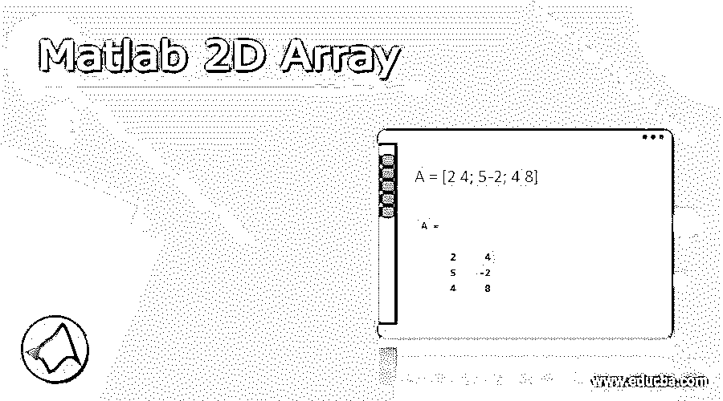
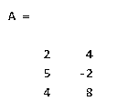
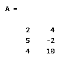
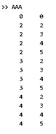
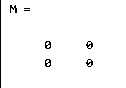

# Matlab 2D 阵列

> 原文：<https://www.educba.com/matlab-2d-array/>

## Matlab 2D 数组的定义

Matlab 提供了实现数组的功能，其中我们可以实现多维数组，如 2D 数组。借助 2D 数组，我们可以操纵矩阵，矩阵的结构包含行和列，矩阵中的每个值包含行索引和列索引。通过使用 2D 阵列，当我们根据用户需求拥有多维矩阵时，我们能够对矩阵执行不同的操作，例如加、减、乘、除。我们还可以使用行索引和列索引通过 2D 数组访问不同的元素或值。

**语法:**

<small>Hadoop、数据科学、统计学&其他</small>

`variable name = size(Array)
variable_name=size(A,size of array)`

**解释:**在上面的语法中，我们使用不同的参数如下。

*   **变量名称:**这是一个用户定义的名称，我们可以指定任何我们想要的名称。
*   **size:** size 是一个函数，借助 Size 我们可以返回长度对应于数组大小的行向量。
*   与第二个语法中使用的变量相同，如下所示。这里我们只是增加了数组的大小。它帮助我们用正整数标量返回数组的长度。所以通过使用这个语法，我们创建了一维数组，二维数组，三维数组，等等。

### 如何在 Matlab 中声明 2D 数组？

现在让我们看看如何在 Matlab 中声明 2D 数组，如下所示。在 Matlab 中数组的声明非常简单。我们可以很容易地在 Matlab 中声明 2D 数组如下。

`m_array = zeros (value 1, value 2)`

**解释:**这是在 Matlab 中声明 2D 数组的第一种方式，这里我们使用 zeros()函数，在 zeros()函数内部我们需要传递值 1 和值 2，如上面的语句所示。声明 2D 数组的另一种方法是在 zeros()函数中传递单个值，如下面的语句所示。

`m_array = zeros (value)`

为了更好地理解 2D 数组的声明，我们来看一个例子，如下所示。

`m_array = zeros (3);`

**说明:**看这里我们用 zeros()函数在 Matlab 中画出 2D 数组。这里，我们将值 3 传递给 zeros()函数。这意味着我们需要画一个 3x 3 的数组。同样，我们可以根据需要在 zeros()函数中传递不同的值。

### 如何在 Matlab 中初始化 2D 数组？

现在让我们看看 Matlab 中 2D 数组的初始化，如下所示。对于 2D 数组的初始化，我们可以使用 zeros()函数。

`A = matrix (value1, value2)`

这是一个非常简单的 Matlab 中数组初始化的语法。这里矩阵意味着 zeros()函数，在这个函数中，我们需要按照要求传递值。

现在让我们来看看下面的例子。

`M = [1 2; 4 -8; 5 8]`

通过使用上述语句，我们创建了一个 2 乘 2 的 2D 数组。这样我们就可以初始化数组了。

### 2D 数组在 Matlab 中是如何工作的？

现在让我们看看 2D 数组是如何在 Matlab 中工作的，如下所示。

基本上，在 Matlab 中，我们有不同的方法来创建 2D 数组，因此，我们需要向 Matlab 传递不同的输入参数，如下所示。

*   第一个 2D 数组大小或者我们可以说是矩阵的大小:2D 数组的大小总是一个整数值，假设数组的大小小于或等于零，那么我们可以说该矩阵是空的，如果数组的大小是负的，那么它被认为是零。
*   **之后，我们需要指定每个维度的大小:**维度的大小应该是整数，如果值为 0，则矩阵为空，如果值为负，则视为 0。
*   **行向量的大小:**它也使用相同的属性，如果值小于零，则矩阵为空，如果值为负，则被视为零。

**现在让我们看看输出参数**

2D 数组的输出自变量是那个矩阵，或者我们可以说是那个矩阵。基本上，输出参数取决于输入参数。换句话说，我们说输出参数显示了我们想要的实际结果。

### Matlab 2D 阵列示例

现在让我们看看 Matlab 中 2D 数组的不同例子，以便更好地理解如下。

让我们来看一个非常基本的 2D 数组的例子，如下所示。

`A = [2 4; 5 -2; 4 8]`

**解释:**假设我们需要创建一个大小为 2 乘 2 的 2D 数组。那时我们可以用上面的语句来创建 2D 数组。在上面的例子中，我们使用 A 作为变量名，用于以行和列的形式存储矩阵值，实际上该数组就是上面语句中显示的数组值。在数组内部，我们可以声明正值和负值。在本例中，我们需要创建 3 行 2 列，其中分号用于指示下一行。上面语句的最终输出我们用下面的截图来说明。

现在让我们看看实现 2D 数组的另一种方法，如下所示。

`A = [2 4
5 -2
4  10]`

**解释:**在上面的例子中，我们避免使用分号，看看如何在命令行窗口中写下这些行。上面语句的最终输出我们用下面的截图来说明。

让我们看看另一个使用循环的 2D 数组的例子，如下所示。

`M =[0 0];
for j=2:4
for k=2:5
M=[M;j k];
end
end
disp(M)`

**解释:**通过使用 for 循环，我们尝试实现 2D 数组。这里我们使用了两个 for 循环:如上例所示的内部和外部 for 循环。上面语句的最终输出我们用下面的截图来说明。

现在让我们看看如何使用 zeros()函数创建 2D 数组，如下所示。

`M = zeros(2)`

**解释:**在上面的例子中我们使用 zeros()函数来创建一个 2D 数组，通过使用上面的语句我们可以创建一个 2 乘 2 的空数组。上面语句的最终输出我们用下面的截图来说明。

### 结论

我们希望从这篇文章中你学习 Matlab 2D 数组。从上面的文章中，我们已经了解了 2D 数组的基本语法，我们也看到了 2D 数组的不同例子。从这篇文章中，我们了解了如何以及何时使用 Matlab 2D 数组。

### 推荐文章

这是一个 Matlab 2D 阵列指南。这里我们还讨论了定义以及如何在 Matlab 中声明 2D 数组？并附有示例。您也可以看看以下文章，了解更多信息–

1.  [Matlab 布尔型](https://www.educba.com/matlab-boolean/)
2.  [Matlab 对](https://www.educba.com/matlab-mod/)的影响
3.  [Matlab 反斜杠](https://www.educba.com/matlab-backslash/)
4.  [奈奎斯特 Matlab](https://www.educba.com/nyquist-matlab/)

