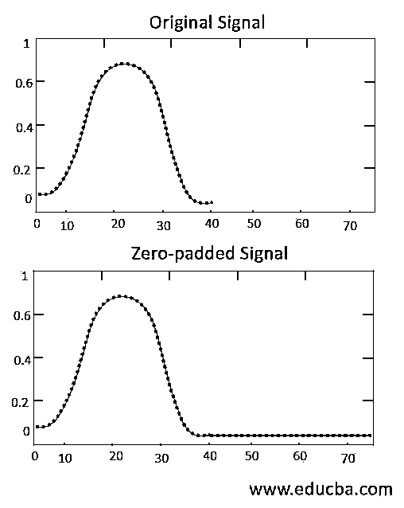
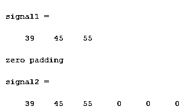
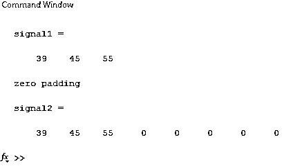
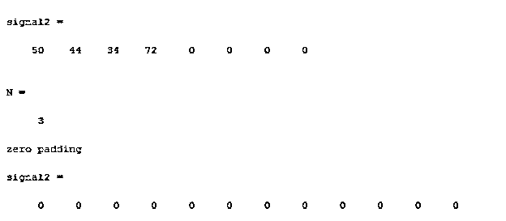
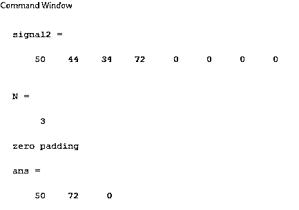
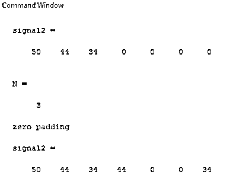

# Matlab 补零

> 原文：<https://www.educba.com/matlab-zero-padding/>

## Matlab 补零介绍

在时间序列域中，频率分辨率取决于信号中存在的点数；所以，我们总是需要在信号中加点；如果信号在同一个域中，那么添加新点很容易，但是如果我们正在处理实时数据，那么添加新点就很困难。大多数情况下，如果数据已经存储在系统中，而我们正在离线工作，那么我们就无法处理新的数据点。因此，为了提高频率分辨率，使用零填充。零填充意味着在输入信号的末尾简单地添加零。在本主题中，我们将学习 Matlab 零填充。

**语法**

<small>Hadoop、数据科学、统计学&其他</small>

`Signal 2 = [signal1 zeros (1,3)] Output signal name = [ input signal name zeros (no of rows ,no of columns)]`

### 如何在 Matlab 中进行零填充？

补零意味着在输入信号的末尾添加零。当我们向任何信号添加额外的信息时，信号的特征和响应可能会改变。但是我们在信号中加了零，这意味着:理想情况下，我们不会添加任何额外的信息；因此，信号的特性和响应将保持不变。它只会增加傅立叶变换中信号的频率分辨率。在图 1 中，有两个信号第一个信号是原始输入信号，第二个信号是零填充信号。在第一个信号中，频率响应仅从 0 到 40。在第二信号中，频率响应从 0 到 80 点，几乎是输入信号的两倍。在图中，黑色表示原始输入点，红色表示新的零填充点。

### 例子

下面举几个例子

#### 示例#1

让我们考虑一个简单的例子；在这个例子中，两个变量用于表示输入信号和输出信号。输入信号由信号 1 表示，输出信号由信号 2 表示。输入信号是由三个元素组成的一维数组。初始化输入信号后，零命令应用于带有参数(1，3)的输入信号。这里(1，3)表示一行三列，这意味着将在输入信号的末尾添加三个零，如示例 1(a)所示。类似地，在示例 1(b)中，相同的信号被用作输入信号，并且零命令被应用于该信号。尽管如此，参数还是不同于前面的例子。这里传递了参数。然而，函数 is (1，5)，(1，5)表示一行五列，这意味着将在信号末尾添加五个零。最初，在第一信号中有三个数据点，在零填充之后，将有总共八个数据点呈现输出信号，如示例 1 (b)所示。

**Matlab 程序示例 1(a)–**

`clc ;
clear all ;
signal1 = [ 39 45 55] disp ('zero padding')
signal2 = [ signal1 zeros (1, 3)]`

**输出(命令窗口)–**

**Matlab 程序示例 1(b)–**

`clc ;
clear all ;
signal1 = [ 39 45 55] disp ('zero padding')
signal2 = [ signal1 zeros(1, 5)]`

**输出(命令窗口)–**

#### 实施例 2

在这个例子中，两个变量用于表示输入信号和输出信号。输入信号由信号 1 表示，输出信号由信号 2 表示。输入信号是一个由四个元素组成的一维数组[50 44 34 72]。在初始化输入信号之后，我们已经对具有参数(1，4)的信号应用了零点函数；就像前面的例子一样，它只是在输入信号的末尾添加四个零。这种零填充概念主要用于保持傅立叶变换中信号的长度。因此，我们指定了一个变量‘N’，它代表信号的长度。在示例 2(a)中，通过零命令传递一个函数，而不是直接值，该函数是输入信号的 N *长度。它将输出为 4 * 3，即 12，因此在输入中将添加 12 个零。这个例子在实施例 2(a)中说明。

**Matlab 程序示例 2(a)–**

`clc ;
clear all ;
close all ;
signal1 = [50 44 34 72] signal2 = [signal1 zeros(1, 4)] N = 3
disp ('zero padding')
signal2 = zeros(1, N*length(signal1))`

**输出(命令窗口)–**

**例 2(b)**

在本例中，我们使用了相同的输入信号[50 44 34 72]，它有四个数据点。信号 1 是输入信号，信号 2 是输出信号。零点函数应用于带有参数(1，4)的输入信号，这意味着将向信号添加四个零点。但是，如果我们只希望选择的部分作为输出，那么我们可以做切片。因此，我们将通过命令信号 N: end 获得从第一个数据点到最后一个数据点的输出，如示例 2(b)所示。

**Matlab 程序示例 2(b)–**

`clc ;
clear all ;
close all ;
signal1 = [50 44 34 72] signal2 = [signal1 zeros(1, 4)] N = 3
disp ('zero padding')
signal 2 ([1:N:end])`

**输出(命令窗口)–**

**例 2**

在这里，我们使用了相同的输入信号，它有四个数据点。通过首先使用零函数，我们将输入信号从一维填充到八维(一行八列)。创建输出信号后，我们匹配输入和输出信号的维度；因此，我们在输出端得到一些数据。

**示例 2 的 Matlab 程序—**

`clc ;
clear all ;
close all ;
signal1 = [50 44 34 ] signal2 = [signal1 zeros(1,4)] N = 3
disp('zero padding')
signal2([1:N:end]) = signal1`

**输出(命令窗口)–**

### 结论

在本文中，我们看到了向任何信号添加零的各种方法。零点命令用于将数据填充到任何信号中。通过使用该功能，我们可以提高频率分辨率。该功能可提高频率分辨率，但不会改变任何其他特性。

### 推荐文章

这是一个 Matlab 零填充的指南。这里，我们讨论在任何信号中添加零的各种方法，以及如何使用零命令将数据填充到任何信号中。您也可以看看以下文章，了解更多信息–

1.  [uigetfile Matlab](https://www.educba.com/uigetfile-matlab/)
2.  [Matlab gca](https://www.educba.com/matlab-gca/)
3.  [二分法 Matlab](https://www.educba.com/bisection-method-matlab/)
4.  [Matlab 全局变量](https://www.educba.com/matlab-global-variables/)

