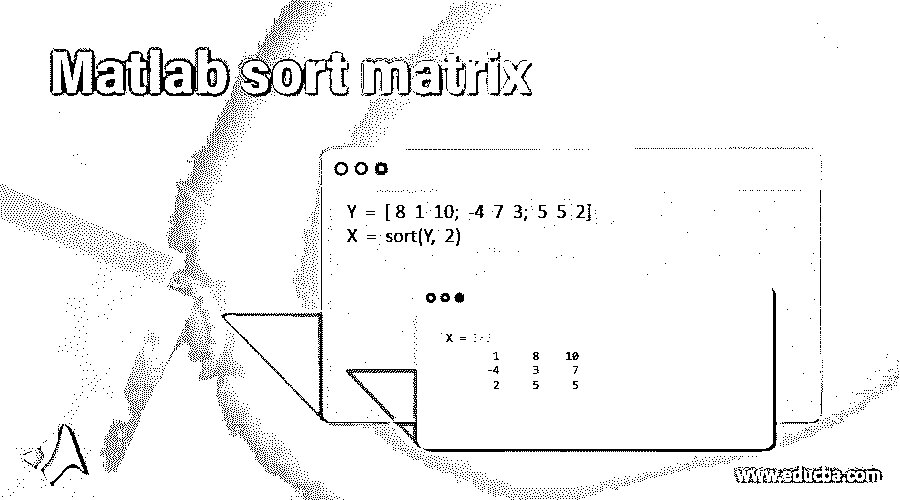
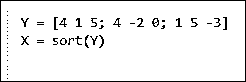
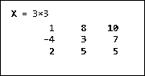
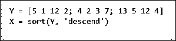
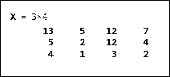
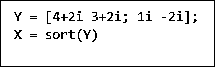
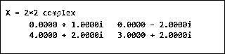

# Matlab 排序矩阵

> 原文：<https://www.educba.com/matlab-sort-matrix/>

## Matlab 排序矩阵介绍

在 MATLAB 中，排序可以用来按照要求的方向排列数组的元素，即升序或降序。我们可以在 MATLAB 中使用带有各种参数的排序函数，按照我们的要求对列或行进行排序。从 MATLAB 的“R2017a”版本开始，我们还可以使用 sort 函数对以字符串形式存储的元素进行排序，该函数按照 Unicode 字典对字符串进行排序。在这个主题中，我们将学习 Matlab 排序矩阵。

**Matlab 中排序矩阵的语法**

<small>Hadoop、数据科学、统计学&其他</small>

1.  X =排序(Y)
2.  X =排序(Y，维度)
3.  X =排序(Y，方向)

**描述:**

1.  X = sort (Y)用于按升序对 Y 的元素进行排序。如果输入 Y 是一个向量，函数 sort (Y)将对向量 Y 的元素进行排序。如果输入 Y 是一个矩阵，函数 sort (Y)将把列视为向量&将对每一列进行排序。
2.  X = sort(Y，dimension)用于我们需要对矩阵 Y 的元素按行排序的情况。在这里，我们可以将“2”作为参数传递，它表示行。
3.  X = sort (Y，direction)用于决定排序顺序的方向。默认情况下，方向为“升序”，可以更改为“降序”，绕过参数“降序”。同样，可以传递' ascend '来获得升序的排序顺序。

### Matlab 排序矩阵示例

现在让我们理解在 MATLAB 中执行排序的代码。

#### 示例#1

在第一个例子中，我们将采用一个 3 x 3 的矩阵，并使用 sort 函数的默认属性(升序和列)对其进行排序。

对于我们的第一个示例，我们将遵循以下步骤:

1.  初始化输入矩阵
2.  将输入矩阵作为参数传递给排序函数

**代码:**

`Y = [4 1 5; 4 -2 0; 1 5 -3]`

[Initializing the elements of the 3 x 3 matrix]

`X = sort(Y)`

[Passing the input matrix to the sort function]

因为除了输入矩阵之外，我们没有传递任何参数，所以将按照 sort 函数的默认属性对元素进行排序，即按照列和升序排序。

这是我们的输入和输出在 MATLAB 命令窗口中的样子:

**输入:**

**输出:**

正如我们在输出中看到的，输入矩阵的元素按照列和升序排序。

#### 实施例 2

在这个例子中，我们将采用一个 3 x 3 的矩阵，并按行进行排序。为此，我们将传递“2”作为附加参数，它表示“行”。

对于此示例，我们将遵循以下步骤:

1.  初始化输入矩阵
2.  将输入矩阵作为参数传递给排序函数
3.  将“2”作为第二个参数传递给排序函数

**代码:**

`Y = [8 1 10; -4 7 3; 5 5 2]`

[Initializing the elements of the 3 x 3 matrix]

`X = sort(Y, 2)`

[Passing the input matrix to the sort function. Also, the second argument ‘2’ is passed for sorting the rows]

这是我们的输入和输出在 MATLAB 命令窗口中的样子:

**输入:**

**输出:**

正如我们在输出中看到的，输入矩阵的元素按照行和升序排序。请注意，根据 sort 函数的默认属性，顺序是升序的。

#### 实施例 3

在这个例子中，我们将取一个 4 x 4 的矩阵，并按降序排列。为此，我们将传递“descend”作为附加参数，它表示降序。

对于此示例，我们将遵循以下步骤:

1.  初始化输入矩阵
2.  将输入矩阵作为参数传递给排序函数
3.  将“descend”作为第二个参数传递给排序函数

**代码:**

`Y = [5 1 12 2; 4 2 3 7; 13 5 12 4]`

[Initializing the elements of the 4 x 4 matrix]

`X = sort(Y, ‘descend’)`

[Passing the input matrix to the sort function. Also, the second argument ‘descend’ is passed for sorting the elements in descending order]

这是我们的输入和输出在 MATLAB 命令窗口中的样子:

**输入:**

**输出:**

正如我们在输出中看到的，输入矩阵的元素按照列和降序排序。

#### 实施例 4

在这个例子中，我们将学习如何对一个复杂的矩阵进行排序。排序函数将使用实数部分对元素进行排序。如果元素具有相等的实部，排序函数将使用虚部来决定排序顺序。

对于此示例，我们将遵循以下步骤:

1.  用复杂元素初始化输入矩阵
2.  将输入矩阵作为参数传递给排序函数

**代码:**

`Y = [4+2i 3+2i; 1i -2i];`

[Initializing the elements of the complex matrix]

`X = sort(Y)`

[Passing the input complex matrix to the sort function]

这是我们的输入和输出在 MATLAB 命令窗口中的样子:

**输入:**

**输出:**

正如我们在输出中看到的，复杂矩阵的元素按照列和升序排序。此外，排序是基于元素的实部进行的。

### 结论

1.可以在 MATLAB 中使用排序函数进行排序

2.默认情况下，sort 函数按升序对矩阵及其列进行排序

3.我们可以使用不同类型的参数来更改 sort 函数的默认属性，以根据我们的要求获得排序顺序

### 推荐文章

这是一个 Matlab 排序矩阵的指南。这里我们讨论 Matlab 排序矩阵的例子以及代码、输入和输出。您也可以看看以下文章，了解更多信息–

1.  [雅可比 Matlab](https://www.educba.com/jacobian-matlab/)
2.  [聚 val MATLAB](https://www.educba.com/polyval-matlab/)
3.  [单元格到字符串 MATLAB](https://www.educba.com/cell-to-string-matlab/)
4.  [Strcmp Matlab](https://www.educba.com/strcmp-matlab/)

