# Matlab 中的 2D 图

> 原文：<https://www.educba.com/2d-plots-in-matlab/>

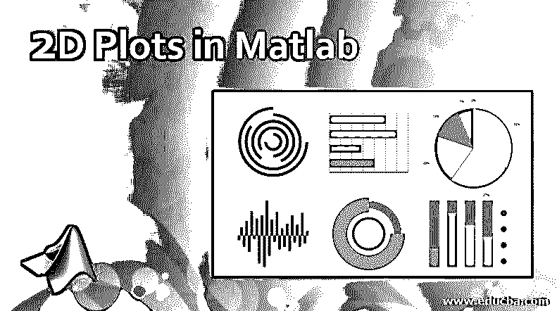

## Matlab 中的 2D 图介绍

Matlab 中的 2D 图是一种功能，它使用户能够为任何因变量创建二维图形，作为因变量的函数。绘图可以以连续、离散、表面或体积的形式呈现数据。2D 图形绘制的默认标准函数是 plot()函数。它为数据“Y”相对于其在“X”轴上的相应数据创建了一个线形图。

**例如:**

<small>Hadoop、数据科学、统计学&其他</small>

让我们为 y=sin(x)创建 2D 线图，其中 x 的范围从 0 到 2*pi:

`x=0:pi/100:2*pi
y=sin(x)
plot(x,y)`

**输出:**

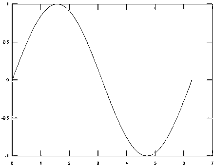

### Matlab 中 2D 图的属性

MATLAB 支持定制任何图形的外观和细节。用户可以通过编辑任何 2D 绘图函数的以下属性来自定义图形。

**1。xlabel:** 沿着 x 轴生成标签。

**2。Ylabel:** 沿 y 轴生成标签。

**3。标题:**给图表添加一个标题

**4。网格打开:**启用图形的网格线

**5。轴相等:**使用户能够为两个轴创建具有相同比例因子和空间的图

**6。轴正方形:**用于生成正方形图

让我们考虑下面的例子，其中通过修改上面讨论的属性来定制图形的表示:

`x=0:pi/100:2*pi;
y=sin(x);
%Create the graph with labeling x axis as ‘x-axis’, ‘y’ axis as ‘y-axis’
%with title 'Graph customization' and makes the grid for both the axis
%visible
plot(x, y), xlabel('x-axis'), ylabel('y-axis'), title('Graph
customisation'),
grid on`

**输出:**

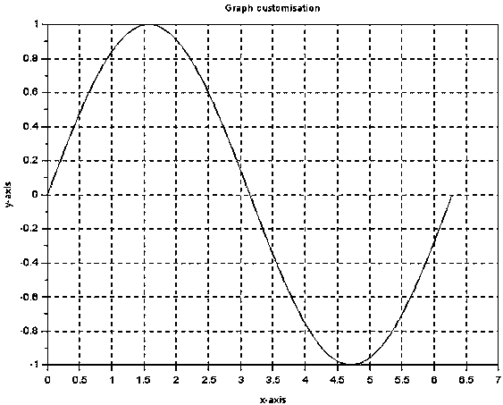

**7。轴缩放:**轴缩放正在配置轴的极限值。“轴”命令用于设置图形的最小和最大极限。

**语法:**

`axis ( [xmin xmax ymin ymax] )`

示例:

**案例#1**

*   % x 轴的最大值设置为 15
*   % x 轴的最小值设置为 0
*   % y 轴的最小值设置为-1
*   % y 轴的最大值设置为 1

`x = [0 : 0.1: 20];
y = exp(-x).*cos(2*x);
plot(x, y), axis([0 15 -1 1])`

**输出:**

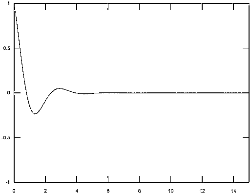

**案例#2**

*   % y 轴的最小值更改为-0.1

`x = [0 : 0.1: 20];
y = exp(-x).*cos(2*x);
plot(x, y), axis([0 15 -0.1 1])`

**输出:**

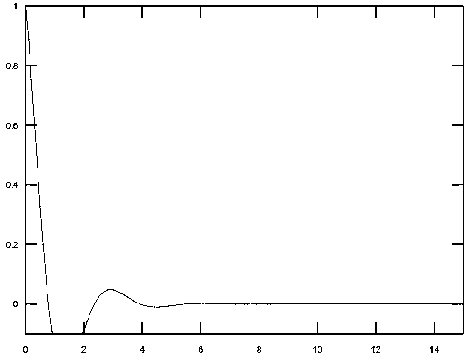

**8。使用子图的 2D 图:**函数子图提供了在同一图形中生成一系列图的功能，这些图被放置在指定或默认的坐标中。

**代码:**代码被编写为在一个窗口中表示两个功能

`x = [0:0.01:5];
y = exp(-1.5*x).*cos(20*x);
% The first plot will be places first place where the complete figure space is divided into 2 parts as 1 row and 2 columns
subplot(1,2,1)
plot(x,y), xlabel('x'),ylabel('subplot 1'),axis([0 5 -1 1])
y = exp(-3*x).*sin(10*x);
% The first plot will be places first place where the complete figure space is divided into 2 parts as 1 row and 2 columns
subplot(1,2,2)
plot(x,y),xlabel('x'),ylabel('subplot 2'),axis([0 5 -1 1])`

**输出:**

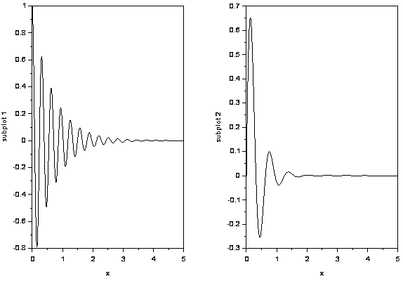

**9。在同一图形上呈现多种功能:**

MATLAB 具有扩展功能，可以在一个图形中绘制多个函数。

**代码:**编写代码是为了在一个图形中表示函数 y1 和 y2

`x = [0 :pi/10: 10];
y1 = sin(x);
y2 = cos(x);
plot(x, y1, x, y2, '.-'), legend('Sin(x)', 'Cos(x)')`

**输出:**

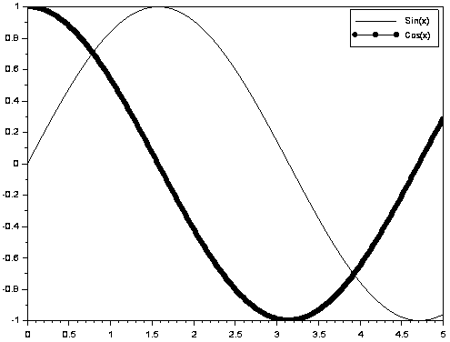

### MATLAB 中二维图形的类型

基于用户选择的表示类型，MATLAB 支持各种类型的二维图形绘制。在各种类型的绘图功能中，这里讨论的是在行业中广泛使用的主要功能。

#### 1\. Bar Plot

这用于以条形形式沿 x 轴分布“y”值。通常，这对于表示一段时间内的结果很有用。

**代码:**

`Y = [15,22,10     18,27,38     39,38,63     15,25,35     45,63,20];
figure
bar(Y)`

**输出:**

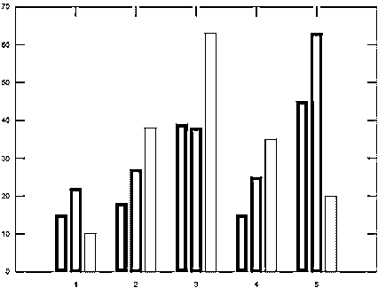

元素根据行索引组合在一起。x 轴值是相对于“y”矩阵的行索引创建的，而“y”轴代表这些值。

#### 2.面积图

该函数用于将“y”值表示为填充曲线下区域的一条或多条曲线。曲线显示了每个行元素相对于在“x”轴的第 n 个间隔处的曲线的总高度的相对贡献。

`t=[0:0.2:20];
a=[sin(2.*t).*cos(t)];
area(a)`

**输出:**

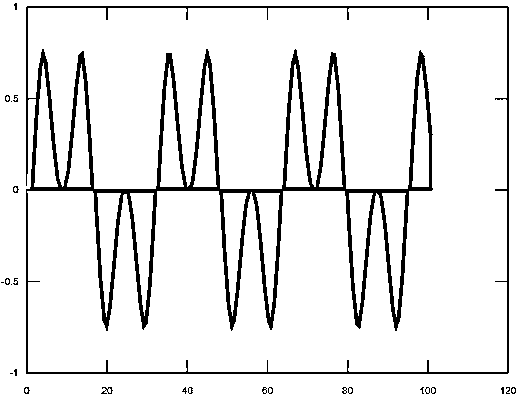

#### 3\. Errorbar Plot

这种类型的 2D 绘图用于在 2D 线图上的每个数据点绘制垂直误差线。

**代码:**

`x=[10 20 30 40 50 60 70 80 90 100];
y=[0.1 2.3 4 3.5 5 6.6 7 8 9.5 10];
errorbar(x,y)`

**输出:**

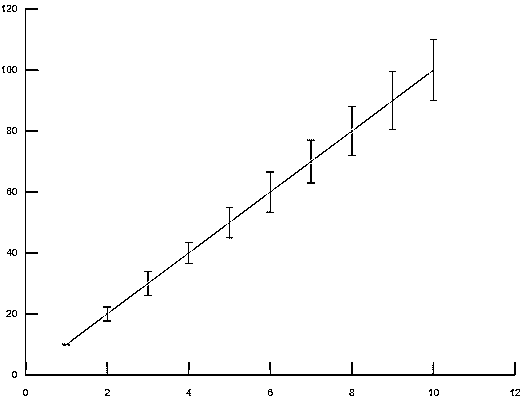

#### 4.楼梯图

在这个 2D 绘图函数中，图形是以阶梯的形式生成的。

**代码:**

`x=0:pi/4:2*pi;
y=cos(x);
stairs(x,y)`

**输出:**

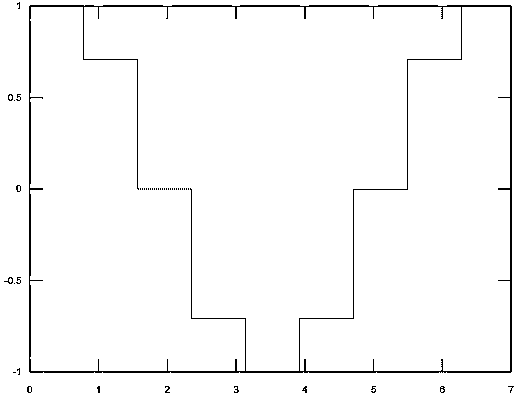

#### 5.饼图

这种格式用于为匹配的元素创建饼图形式的图形。

**代码:**

`x=0:5:25;
pie(x)`

**输出:**

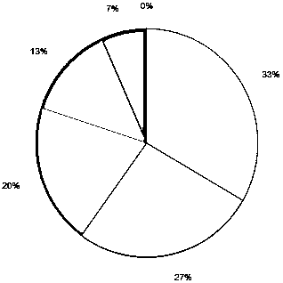

#### 6.罗盘图

该图用于以矢量格式表示从其原点发出的元素。

**代码:**

`m=rand(10,10);
e=eig(m);
compass(e)`

**输出:**

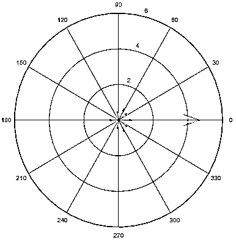

#### 7.巴布的情节，巴布的情节，巴布的情节，巴布的情节，巴布的情节，巴布的情节，巴布的情节，巴布的情节，巴布的情节，巴布的情节

这种格式用于通过水平分布条形来表示因变量的值。

**代码:**

`Y = [15,22,10
18,27,38
39,38,63
15,25,35
45,63,20];
barh(Y)`

**输出:**

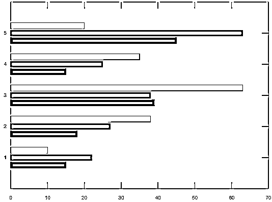

#### 8.茎图

这种格式用于以词干的形式表示数据点，从基线开始沿着“x”轴。

**代码:**

`x=0:pi/4:2*pi;
y=cos(x);
stem(x,y)`

**输出:**

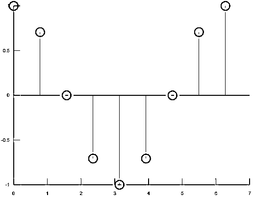

#### 9\. Polar Plot

这种格式创建的图形具有极坐标，其值为θ(即弧度角度)和ρ(即每个数据点的半径)。

**代码:**

`theta = 0:pi/100:2*pi;
rho=(sin(theta)).*(cos(theta));
polar(theta,rho)`

**输出:**

#### 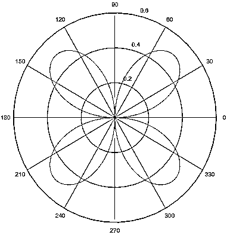

#### 10。散点图

在这种格式中，数据点以小圆圈的形式表示，对应于“x”轴上的值。

**代码:**

`x=0:pi/10:2*pi;
y=sin(x);
scatter(x,y)`

**输出:**

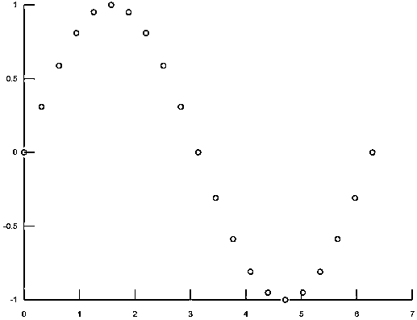

### 结论

MATLAB 中的 2D 图使用户能够可视化数据，这有助于进一步的数据处理。它有助于以编程方式生成图表。因此，它使比较数据点、跟踪数据随时间的变化、数据分布模式的过程变得快速而简单。

### 推荐文章

这是一个在 Matlab 中绘制 2D 图的指南。为了更好地理解，我们在这里讨论 2D 图中图形的属性和类型，以及适当的代码和输出。您也可以浏览我们的其他相关文章，了解更多信息——

1.  [Matlab 中的极坐标图](https://www.educba.com/polar-plot-in-matlab/)
2.  [Matlab 中的 3D 绘图](https://www.educba.com/3d-plots-in-matlab/)
3.  [MATLAB 绘图函数](https://www.educba.com/matlab-plot-function/)
4.  [Matlab 中的散点图](https://www.educba.com/scatter-plots-in-matlab/)
5.  [Matlab 误差栏完全指南](https://www.educba.com/matlab-errorbar/)
6.  [Matlab 中 fminsearch 的例子](https://www.educba.com/fminsearch-in-matlab/)

