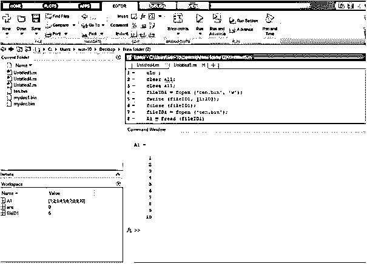
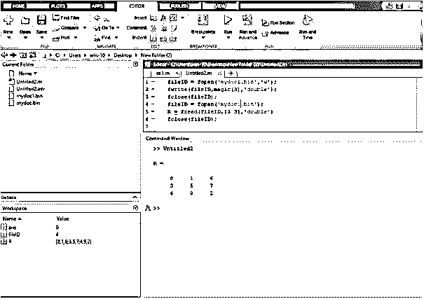
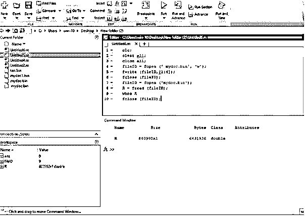

# Matlab Fread

> 原文：<https://www.educba.com/matlab-fread/>

## Matlab Fread 介绍

fread 语句用于读取二进制文件，二进制文件的扩展名为. bin。要使用 fread 语句读取二进制文件，我们首先需要使用 fopen 语句打开该二进制文件，读取文件后，我们只需使用 fclose 语句关闭该文件。如果我们需要从二进制文件中读取一个数组，我们需要提到大小和精度。

**语法**

<small>Hadoop、数据科学、统计学&其他</small>

fread 语句的语法如下:

`r1= fread(fileID1)
r1 = fread(fileID1,sizer)
r1 = fread(fileID1,sizer,precision)
r1 = fread(fileID1,sizer,precision,skip)
r1 = fread(fileID1,sizer,precision,skip,machinefmt)
[r1,count] = fread(___)`

### Matlab Fread 是如何工作的？

从二进制文件中读取数据的步骤:

1.使用 fopen Matlab 函数打开二进制文件

2.通过使用文件标识符，文件是可访问的

3.使用适当的语法(fread)来读取文件

### 实现 Matlab Fread 的示例

下面是 Matlab Fread 的例子:

#### 示例#1

让我们考虑一个例子，在这个例子中，首先，我们打开一个二进制文件进行写操作，为此我们使用 fopen 语句。Fopen 语句用于打开一个文件或获取关于打开文件的信息。在 fopen 语句中，我们在单个反逗号中取一个文件名，并在另一个单个反逗号中指定写入的访问模式的类型(“w”)，这两个参数由逗号分隔，并将此 fopen 语句指定为打开文件(fileID1)的文件标识符。然后我们用一个 fwrite 语句在二进制文件中写 10 个数字。然后使用 fclose 语句关闭打开文件。简单地说，我们再次使用 fopen 语句打开一个二进制文件，而不指定访问模式的类型，因为默认模式是读取模式。然后我们使用一个 fread 语句，基本上，一个 fread 语句用于读取一个二进制文件，我们读取那个二进制文件，把它存储在变量 A1 里，并显示它。

**代码:**

`clc ;
clear all;
close all;
fileID1 = fopen('ten.bin','w');
fwrite(fileID1,[1:10]);
fclose(fileID1);
fileID1 = fopen('ten.bin');
A1 = fread(fileID1)`

**输出:**

**说明:**在图 1 中我们可以看到使用 fread Matlab 函数读取二进制文件(ten.bin)中的数据。读取后，数据被赋给变量 A1。运行代码后，我们将获得分配给命令窗口的数据。

#### 实施例 2

让我们看另一个与 fread 语句相关的例子，在这个例子中，我们取一个扩展名为. bin 的二进制文件。首先，我们创建一个矩阵，它在这个二进制文件上写入数据。这个二进制文件的名字是 mydoc1.bin，我们用 fopen 语句打开那个文件，并指定一个访问模式来写它将分配给这个文件。然后，我们使用 fwrite 语句写入该二进制文件，然后使用打开文件的文件标识符和 fclose 语句关闭该文件。然后，我们再次需要使用 fopen 语句打开该文件。然后我们使用一个 fread 语句，fread 用于读取一个二进制文件。我们在括号中取一个 fread 文件标识符，矩阵大小，并指定数据源的大小是 double。然后显示二进制文件中写入的内容。我们使用 fclose 语句关闭打开二进制文件。

**代码:**

`clc;
clear all;
close all;
fileID = fopen('mydoc1.bin','w');
fwrite(fileID,magic(3),'double');
fclose(fileID);
fileID = fopen('mydoc1.bin');
R = fread(fileID,[3 3],'double')
fclose(fileID);`

**输出:**

**说明:**在图 2 中我们可以看到使用 fread Matlab 函数读取二进制文件(mydoc.bin)中的数据。

#### 实施例 3

让我们考虑另一个例子，在这个例子中，我们取一个扩展名为. bin 的二进制文件。首先，我们创建一个矩阵，它在这个二进制文件上写入。二进制文件的名字是 mydoc1.bin，我们用 fopen 语句打开那个文件，并指定一个访问模式来写它，将它赋给 fileID。然后，我们使用 fwrite 语句写入该二进制文件，然后使用打开文件的文件标识符和 fclose 语句关闭该文件。然后，我们再次需要使用 fopen 语句打开该文件。然后我们使用一个 fread 语句，fread 用于读取一个二进制文件。我们在括号中只取一个 fread 一个打开的二进制文件上的二进制文件标识符，然后返回存储在变量 r 中的数据。然后我们使用一个 whos 函数，它的函数是一个有关该车间的变量及其大小和类型的列表。然后，我们只需使用 fclose 语句关闭打开的二进制文件。

**代码:**

`clc;
clear all;
close all;
fileID = fopen('mydoc.bin','w');
fwrite(fileID,[1:4]);
fclose(fileID);
fileID = fopen('mydoc.bin');
R = fread(fileID);
whos R
fclose(fileID);`

**输出:**

### 结论

在这篇文章中，我们看到了 fread 语句的基本概念，基本上 fread 就是读取文件或获取文件中的信息。我们还看到了 Matlab 代码中使用的 fread 语句的不同语法。此外，我们还看到了与 fread 相关的不同示例。

### 推荐文章

这是一个 Matlab Fread 指南。这里我们讨论 Matlab Fread 的介绍、语法、工作原理、代码示例和输出。您也可以浏览我们的其他相关文章，了解更多信息——

1.  [Matlab 绘图颜色](https://www.educba.com/matlab-plot-colors/)
2.  [亥维赛 MATLAB](https://www.educba.com/heaviside-matlab/)
3.  [MATLAB 导数](https://www.educba.com/matlab-derivative/)
4.  [Matlab 中的阶乘](https://www.educba.com/factorial-in-matlab/)

