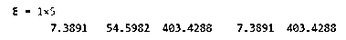
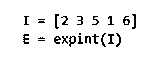
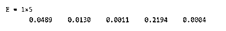
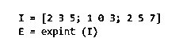
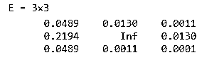
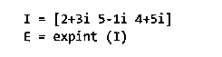
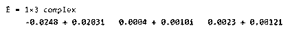

# Matlab 指数

> 原文：<https://www.educba.com/matlab-exponent/>

## MATLAB 指数简介

MATLAB 为我们提供了不同类型的指数函数，可以计算数组或矩阵的指数。根据我们的要求，这些函数可用于计算基本指数、矩阵指数或指数积分。在本文中，我们将学习 MATLAB 提供的 3 个指数函数:exp、expint 和 expm。在这些函数的帮助下，当我们的输入是一个数组、矩阵或一个复数，并且‘e’被提升到这个幂时，我们可以计算出解。

**指数函数语法:**

<small>Hadoop、数据科学、统计学&其他</small>

1.  E = exp (I)
2.  E = expint (I)
3.  E =支出(一)

**语法描述:**

1.  E = exp (I)用于返回指数“e”的幂(I)。对于一个数组，它将计算每个元素的指数
2.  E = expint (I)用于返回输入“I”中每个元素的指数积分
3.  E = expm (I)用于计算输入矩阵‘I’的矩阵指数。请注意，矩阵指数由以下公式给出:

`expm(I) = EVec * diag (exp (diag (EVal))) / EVec, where EVec represents Eigen Vectors and Eval represents Eigen Values`

### Matlab 指数示例

现在让我们理解 MATLAB 中这些指数函数的代码

#### 实施例#1(实验(I))

在这个例子中，我们将通过使用 exp (I)函数在 MATLAB 中找到一个数组的指数。以下是需要遵循的步骤:

1.  初始化我们需要计算其指数的数组
2.  将输入数组作为参数传递给 exp 函数

**代码:**

`I = [2 4 6 2 6] [Initializing the array whose exponent we need to compute] E = exp (I)
[Passing the input array as an argument to the exp function]`

这是我们的输入和输出在 MATLAB 中的样子:

**输入:**

**输出:**

正如我们在输出中看到的，exp 函数已经计算了输入数组“I”中每个元素的指数。

接下来，我们将学习 expint 函数的用法

**例#2(过期(I))**

在这个例子中，我们将使用 expint (I)函数在 MATLAB 中找到一个数组的整数指数。以下是需要遵循的步骤:

1.  初始化需要计算其整数指数的数组
2.  将输入数组作为参数传递给 expint 函数

**代码:**

`I = [2 3 5 1 6] [Initializing the array whose integral exponent we need to compute] E = expint (I)
[Passing the input array as an argument to the expm function]`

这是我们的输入和输出在 MATLAB 中的样子:

**输入:**

**输出:**

正如我们在输出中看到的，expint 函数已经计算了输入数组“I”中每个元素的整数指数。

接下来，我们将学习 expm 函数的用法

#### 实施例#3 (expm (I))

在这个例子中，我们将通过使用 expm (I)函数在 MATLAB 中找到矩阵的矩阵指数。以下是需要遵循的步骤:

1.  初始化需要计算矩阵指数的矩阵
2.  将输入矩阵作为参数传递给 expm 函数

**代码:**

`I = [2 3 5; 1 0 3; 2 5 7] [Initializing the 3 x 3 matrix whose matrix exponent we need to compute]
E = expint (I)
[Passing the input matrix as an argument to the expm function]`

这是我们的输入和输出在 MATLAB 中的样子:

**输入:**

**输出:**

正如我们在输出中看到的，expm 函数已经计算了输入矩阵‘I’的矩阵指数。

上面讨论的指数函数也可以用来计算复数的指数。让我们用一个例子来理解这一点。

#### 实施例#4(实验(I))

在这个例子中，我们将通过使用 exp (I)函数在 MATLAB 中找到一个复数数组的指数。以下是需要遵循的步骤:

1.  初始化需要计算其指数的复数数组
2.  将输入数组作为参数传递给 exp 函数

**代码:**

`I = [2 + 3i   5 - 1i   4 + 5i] [Initializing the array of complex numbers whose exponent we need to compute] E = exp (I)
[Passing the input array as an argument to the exp function]`

这是我们的输入和输出在 MATLAB 中的样子:

**输入:**

**输出:**

正如我们在输出中看到的，exp 函数已经计算了输入数组“I”中每个复杂元素的指数。

### 结论

1.  根据我们的要求，可以使用不同形式的指数函数来计算指数。
2.  基本指数、整数指数、矩阵指数是我们可以使用指数函数计算的指数类型。
3.  复数的指数也可以使用指数函数来计算。

### 推荐文章

这是一个 Matlab 指数指南。这里我们讨论 MATLAB 提供的 3 个指数函数:exp，expint 和 expm，并给出例子。您也可以看看以下文章，了解更多信息–

1.  [Matlab 反斜杠](https://www.educba.com/matlab-backslash/)
2.  [Matlab 极限](https://www.educba.com/matlab-limit/)
3.  [阶跃函数 Matlab](https://www.educba.com/step-function-matlab/)
4.  [Matlab 绘图图](https://www.educba.com/plot-graph-matlab/)

