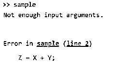
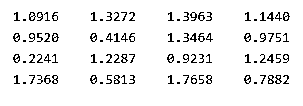
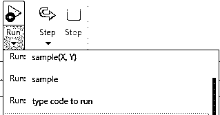
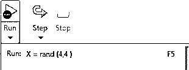
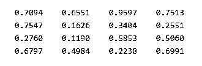

# Matlab 没有足够的输入参数

> 原文：<https://www.educba.com/matlab-not-enough-input-arguments/>

## Matlab 简介没有足够的输入参数

Matlab 为用户提供了不同的功能，用户可以根据自己的需要进行不同的操作。我们在 Matlab 中编写没有输入参数的脚本或函数，并尝试运行该脚本或函数。当时，Matlab 显示了一个错误消息，没有足够的输入参数，因为函数需要我们编写脚本或函数的输入参数，在该函数内部，我们一起传递了两个矩阵。所以这不是编写脚本或函数的有效方法；在这种情况下，我们需要编写一个单独的函数或脚本。在这个主题中，我们将学习 Matlab，没有足够的输入参数。

**语法**

<small>Hadoop、数据科学、统计学&其他</small>

`specified function name sample = add (argument name 1, argument name 2)
sample = argument name 1+ argument name 2;
end`

**解释**

在上面的语法中，我们使用如下不同的参数。

**指定函数名:**用于指定带参数的函数名。

**add:** add 是一个函数，用来对我们在函数内部传递的两个参数进行加法运算。

在上面的语法中，我们创建了一个名为 sample 的函数，并添加了两个矩阵，即参数名 1 和参数名 2，如上面的语法所示。

### 如何解决 Matlab 输入参数不够的问题？

现在让我们看看如何在 Matlab 中解决输入参数不足的问题，如下所示。

基本上，有两种方法可以解决这个问题，如下。

#### 1 通过使用命令提示符:

这是解决输入参数不足错误的一个非常简单的方法。在这种方法中，我们只需在命令提示符下创建我们需要的输入，然后，我们需要使用我们已经编写的函数或脚本来执行该输入。

#### 2 通过使用 Matlab 编辑器:

在运行按钮下，有一个黑色箭头。如果您单击那个箭头按钮，您可以通过组合您需要精确调用容量的方式来确定您可能想要从 MATLAB 工作区获得的变量，就像您在技巧 1 中发现的那样。但是，首先要确定你在函数中指出的变量必须存在于 MATLAB 工作空间中。

### Matlab 的例子没有足够的输入参数

现在，让我们看看 Matlab 中输入参数不足的不同示例，以便更好地理解这个问题，如下所示。

首先，使用下面的例子来看看输入参数不足的错误是如何发生的。

`function Z = add(X, Y)
Z = X + Y;
end`

**解释**

在上面的例子中，我们创建了一个简单的函数，其中我们编写了加法的函数定义。在这里，我们传递两个参数 X 和 Y，如上面的函数所示，但是它显示了错误消息，如没有足够的输入参数错误，因为这里我们试图将两个矩阵相加，而这通过使用上面的语法是不可能的。这个程序的最终输出用下面的截图来说明。

现在让我们看看如何通过使用如下不同的方法来避免这个错误。

最简单的方法是在命令提示符下传递输入参数，之后，我们需要用新值运行一个函数。那么让我们来看看下面这个类型的例子。

在命令提示符中编写以下代码，如下所示。

`X = rand (4, 4)
Y = rand (4, 4)
Z = add (4, 4)`

**解释**

在上面的代码中，我们使用 rand()打印 4x 4 的数组，之后，我们添加 X 和 Y 数组，如上面的代码所示。这样，我们就可以避免输入参数不够的错误。这个程序的最终输出用下面的截图来说明。

现在让我们看看避免这种错误的另一种方法，如下所示。

在第二种方法中，我们需要单击 Run 按钮，打开下拉菜单，并记下我们需要运行的输入参数名，但要确保参数名必须出现在函数中。下面我们来看一些这个方法的截图。

在上面的屏幕中，我们显示了下拉菜单，并在这里写下了我们需要执行的输入参数。在这个例子中，我们传递 X = rand (4，4 ),如下图所示。

执行后，最终结果如下截图所示。

### 如何避免 Matlab 输入参数不够的问题？

现在让我们来看看如何在 Matlab 中避免输入参数不足的问题，如下所示。

当我们在编辑器中打开一个 Matlab 文件时，首先要做的是尝试运行该文件，或者我们可以使用 run 按钮来调用该函数。那时，Matlab 运行那个函数，没有任何参数；然后，我们会得到一个错误消息，没有足够的输入参数。同时，通过运行按钮打开下拉菜单，并输入该函数缺少的参数值。因此，根据我们的要求添加不同的值，使用函数点击输入现在输入的值映射，然后单击运行按钮。这样，我们就可以避免输入参数不足的问题。

另一种避免输入参数不足问题的方法是，假设我们创建了一个 fun()函数，我们在其中传递两个参数 A 和 b，同时，如果我们需要在那时提供更多的输入参数，我们需要使用匿名函数。

现在我们又有了一种方法来避免输入参数不足的问题。当我们同时执行函数时，我们使用命令行选项；我们需要为该函数传递输入参数。通过使用这种方法，我们可以很容易地避免这个问题。

### 结论

我们希望你从这篇文章中学习 Matlab，而不是输入足够的参数。从上面的文章中，我们已经了解了不够输入论元的基本语法，我们也看到了不够输入论元的不同例子。从这篇文章中，我们了解了如何以及何时使用 Matlab 没有足够的输入参数。

### 推荐文章

这是一个 Matlab 的指南，没有足够的输入参数。这里我们讨论基本语法和输入参数不足的不同例子。您也可以看看以下文章，了解更多信息–

1.  [Matlab 对](https://www.educba.com/matlab-mod/)的影响
2.  [Matlab 反斜杠](https://www.educba.com/matlab-backslash/)
3.  [Matlab 极限](https://www.educba.com/matlab-limit/)
4.  [Matlab 块注释](https://www.educba.com/matlab-block-comment/)

