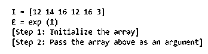
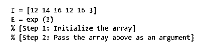
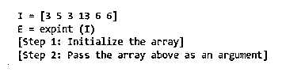
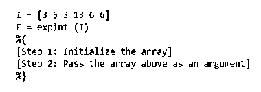
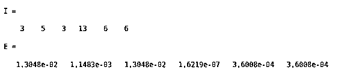
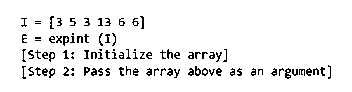
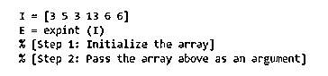
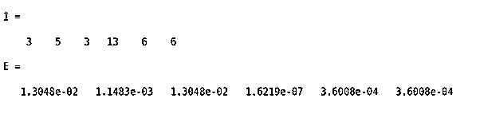

# Matlab 注释

> 原文：<https://www.educba.com/matlab-comment/>

## Matlab 注释介绍

我们在编码语言中使用“注释”来为我们的代码提供叙述，或者阻止某些代码行被执行。在 MATLAB 中，我们可以根据需要提供从几行到几百行的叙述。向代码中添加叙述或注释是一个很好的编码实践，可以确保代码流畅且易于理解。但是为了防止编译器执行这些行，我们必须对这些行进行“注释”。“注释”这些注释或叙述行可以防止编译器执行它们并引发运行时错误。在本主题中，我们将学习 Matlab 注释。

**在 MATLAB 中提供注释的语法:**

<small>Hadoop、数据科学、统计学&其他</small>

有三种方法可以在 MATLAB 中提供注释，并防止它们被编译器执行:

1.  利用 MATLAB 编辑器中的“注释”按钮(标记为“%”)
2.  利用键盘上的“%”符号
3.  利用“Ctrl + R”快捷键

### Matlab 注释示例

现在让我们了解如何在 MATLAB 中提供注释。

#### 示例#1

在第一个例子中，我们将利用 MATLAB 的“评论”按钮。但是，首先，让我们编写一个虚拟代码，并提供一个叙述来解释我们的代码。我们的目的是防止我们的叙述行被编译器执行，为此我们将“注释”叙述行。以下是需要遵循的步骤:

1.  编写代码和叙述来描述它
2.  选择我们要注释的叙述行(为解释代码而写的行)
3.  单击 MATLAB“实时编辑器”选项卡中的“注释”按钮(标记为“%”符号)，如下图所示

**代码:**

`I = [12 14 16 12 16 3] E = exp (I)
[Step 1: Initialize the array] [Step 2: Pass the array above as an argument]`

这是我们的输入和输出在 MATLAB 中的样子:

**输入:**

**输出 1(评论完旁白台词后):**

如果我们试图直接执行我们的代码，我们将在第 3 & 4 行得到一个运行时错误，因为这些行不被 MATLAB 的编译器理解。因此，我们必须使用这些行作为注释，即“注释”这些叙述行，以避免任何错误。在这个例子中，我们使用了 Live 编辑器中的“Comment”按钮。

**输出 2**

#### 实施例 2

在第二个例子中，我们将使用键盘上的“%”键来注释我们的叙述行。在这个例子中，我们也将编写一个虚拟代码，用一些叙述来解释代码。我们的目的是防止这些叙述行被编译器执行。以下是需要遵循的步骤:

1.  编写代码和叙述来描述它
2.  选择我们要注释的叙述行(为解释代码而写的行)
3.  在我们需要注释的叙述行前加上前缀“%{”
4.  叙述行末尾的后缀“%}”

**代码:**

`I = [3 5 3 13 6 6] E = expint (I)
[Step 1: Initialize the array] [Step 2: Pass the array above as an argument]`

这是我们的输入和输出在 MATLAB 中的样子:

**输入:**

**输出 1(评论完旁白台词后):**

如果我们试图直接执行我们的代码，我们将在第 3 & 4 行得到一个运行时错误，因为这些行不被 MATLAB 的编译器理解。因此，我们必须使用这些行作为注释，即“注释”这些叙述行，以避免任何错误。在本例中，我们使用了键盘上的“%”键。

**输出 2**

#### 实施例 3

在第三个例子中，我们将使用键盘的快捷键来评论我们的叙述行。为此，使用了“Ctrl”加“R”的组合。对于这个例子，我们将使用与上面例子中相同的代码。以下是需要遵循的步骤:

1.  编写代码和叙述来描述它
2.  选择我们要注释的叙述行(为解释代码而写的行)
3.  同时按下“Ctrl”和“R”键

**代码:**

`I = [3 5 3 13 6 6] E = expint (I)
[Step 1: Initialize the array] [Step 2: Pass the array above as an argument]`

这是我们的输入和输出在 MATLAB 中的样子:

**输入:**

**输出 1(在注释叙述行之后):**

正如我们在输出中看到的，叙述行现在被注释了。这是通过同时按下键盘上的“Ctrl”和“R”来实现的

**输出 2**

[Please note that the outputs shown in all the above examples are not the actual outputs of the functions, but the outcomes of using comments in MATLAB]

### 结论

1.  MATLAB 中使用注释来为代码提供叙述行，并防止它们被执行。
2.  这样做可以防止编译器抛出任何运行时错误，因为它不理解人类友好的语言。

### 推荐文章

这是一个 Matlab 注释指南。这里我们讨论如何在 MATLAB 中提供注释以及例子和输出。您也可以看看以下文章，了解更多信息–

1.  [Matlab 块注释](https://www.educba.com/matlab-block-comment/)
2.  [Matlab 极限](https://www.educba.com/matlab-limit/)
3.  [Matlab 绘图图](https://www.educba.com/plot-graph-matlab/)
4.  [Matlab 单元格](https://www.educba.com/matlab-cell/)

