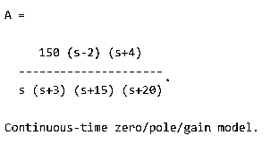
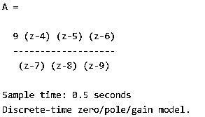
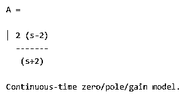
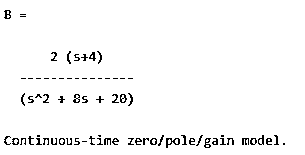
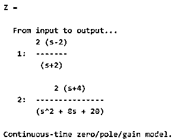

# Matlab 中的 zpk

> 原文：<https://www.educba.com/matlab-zpk/>

## Matlab zpk 简介

下面的文章提供了 Matlab zpK 的概要。Matlab 为用户提供不同类型的功能；zpk 是 Matlab 的函数之一。基本上，它用于创建零极点增益模型，或者我们可以说，它用于将动态系统模型转换为零极点增益形式。例如，在 zpk()函数中，我们可以直接使用极点、增益和零点来创建零极点增益形式。同样，转换零极点增益形式的另一种方法是状态空间模型，我们也可以称之为 SS，因此通过这种方法，我们也可以转换零极点增益形式。

**语法**

<small>Hadoop、数据科学、统计学&其他</small>

Matlab 中的 zpk()函数有多种语法可供使用；我们只写三个如下。

`Variable_Name = zpk(zeroes, poles, gain)
Variable_Name = zpk(zeroes, poles, gain,time)
Variable_Name = zpk(zeroes, poles, gain, sample time)`

**解释**

在上面的语法中，我们使用了如下不同的参数。

在第一种语法中，我们使用 Varible_Name，它表示依赖于用户的变量的实际名称。之后，我们使用 zpk 函数，通过矢量和标量值创建零极点增益形式。zpk()函数输出是模型数据和存储在任何指定变量中的数据。得到输出后，我们需要将零点和极点值设置为[ ]，没有特定的条件意味着这两个输入可以不同也可以相等。

在第二种语法中，我们执行获得零极点增益形式的步骤，但这里唯一的区别是，通过使用第二种语法，我们可以通过简单地添加时间参数来创建离散时间零极点增益形式，如上面的语法所示。在此语法中，时间应该是-1 或[ ]。

在第三种语法中，我们可以通过包含上面语法中所示的采样时间来继承动态系统的属性。

### zpk 在 Matlab 中是如何工作的？

现在让我们看看 zpk()函数在 Matlab 中是如何工作的，如下所示。

基本上，在 zpk()函数中，我们需要考虑如下不同的执行参数。

**输入参数如下:**

在 zpk()函数中，我们有一个不同类型的输入参数，如下所示。

1.  **从零开始的零极点增益模型**

其中我们使用 SISO 模型的行向量。例如，我们可以考虑[2，3+j，3-2]，我们需要创建一个带有零的模型，例如 v=2，v=3+j，v= 3-2。

在这种方法中，我们可以使用 Ny-by-Nu-cell 的数组向量。创建离散时间零极点增益模型也很有用。

2.  **从极点到零极点增益模型的极点:**

它还指定了两个不同的向量，比如 row 向量和 Ny-by-Nu-cell 向量。因此，在这种方法中，我们可以通过使用行向量来创建 SISO 零极点增益模型，通过使用 Ny-by-Nu-cell 向量，我们可以创建离散时间 MIMO SISO 零极点增益模型。

3.  **增益零极点增益模型从增益:**

它指定标量和 Ny-by-Nu-cell 向量单元阵列来获得零极点增益形式。该方法对 SISO 时间零极点增益模型使用标量向量，对 MIMO 零极点增益模式使用 Ny-by-Nu-cell 向量单元阵列。

4.  **采样时间:**

采样时间用于指定标量，通过使用自变量，我们可以初始化采样时间的初始值。

5.  **动力系统:**

这个参数也用于指定 SISO 和 MIMO 模型，但是是动态的。

6.  **静态增益:**

它用来指定标量或矩阵，它代表输出的比率。

**现在我们来看看 zpk 中的输出参数如下。**

在输出参数中，我们使用了不同的对象，如 genss 模型对象、uss 模型对象和 zpk 模型对象。当输入包含可调参数时，Genss 模型对象返回；当输入包含不确定参数时，模型对象返回；当输入包含数值时，零模型对象返回。

### Matlab zpk 示例

现在让我们看看 Matlab 中 zpk()函数的不同例子，以便更好地理解。

现在让我们看一个非常简单的 zpk()函数的例子，如下所示。

`A = zpk ([2, -4], [0, -3, -15, -20], 150)`

**解释**

通过使用上述示例，我们尝试创建 SISO 零极点增益模型。这里我们指定所有的零点、极点和增益值，如上面的语句所示。我们用下面的截图说明了上述语句的最终结果。

现在让我们看看离散时间 SISO 模型的例子如下。

`zeros = [4 5 6];
poles = [7 8 9];
gain = 9
ts = 0.5
A = zpk(zeros, poles, gain, ts)`

**解释**

在上面的例子中，我们使用采样时间来创建离散 SISO 模型。我们用下面的截图说明了上述语句的最终结果。

现在让我们看看如何连接 SISO 模型并生成 MIMO 模型，如下所示。

`zeros_1 =2;
poles_1 = -2;
gain = 2;
A = zpk(zeros_1, poles_1, gain)`

**解释**

通过使用上面的代码，我们创建了第一个 SISO 模型。我们用下面的截图说明了上述语句的最终结果。

现在使用下面的代码再创建一个 SISO 模型，如下所示。

`zeros_2 = -4;
poles_2 = [-4+2i -4-2i];
B = zpk(zeros_2,poles_2,gain)`

**解释**

我们用下面的截图说明了上述语句的最终结果。

现在合并两个 SISO 模型，创建一个 MIMO 模型如下。

`Z = [A;B]`

**解释**

在上面的语句中，我们只是连接了两个 SISO 模型。我们用下面的截图说明了上述语句的最终结果。

这样，我们就可以根据自己的需要使用不同语法的 zpk()函数。

### 结论

我们希望你从这篇文章中学习 Matlab zpk。从上面的文章中，我们学习了 zpk 的基本语法和 zpk 的不同例子。从这篇文章中，我们了解了如何以及何时使用 Matlab zpk。

### 推荐文章

这是一个 Matlab zpk 的指南。这里我们讨论如何以及何时使用 zpk 以及 Matlab zpk 的不同例子。您也可以看看以下文章，了解更多信息–

1.  [Matlab 反斜杠](https://www.educba.com/matlab-backslash/)
2.  [Matlab 单位阶跃函数](https://www.educba.com/matlab-unit-step-function/)
3.  [Matlab 反斜杠](https://www.educba.com/matlab-backslash/)
4.  [Matlab 块注释](https://www.educba.com/matlab-block-comment/)

