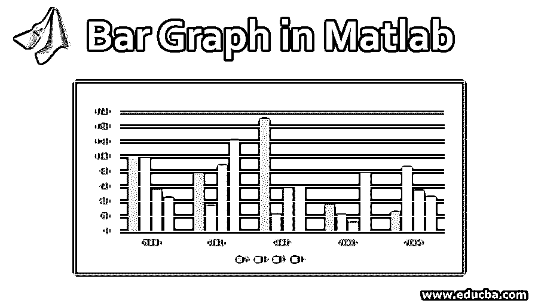
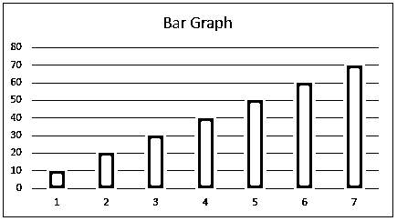
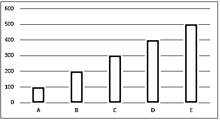
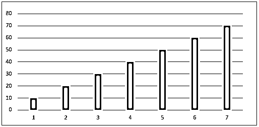
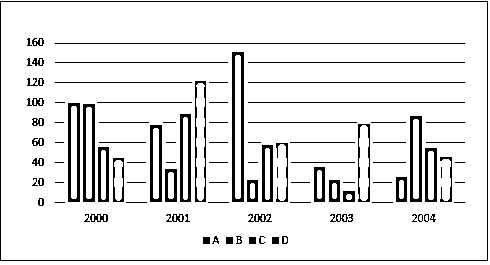

# Matlab 中的条形图

> 原文：<https://www.educba.com/bar-graph-in-matlab/>

## Matlab 中的条形图介绍

条形图是数据分布的直观表示。它们是矩形条，根据需要，范围从属性的最小值到最大值。Matlab 中有各种类型的条形图，如 2d 条形图，水平、垂直和不同的特征都与它们相关联。可以使用条形图调整宽度、颜色、轴等特征。在 Matlab、R、Python 等各种平台上都使用条形图来分析数据，得出结论。

**条形图的语法**

<small>Hadoop、数据科学、统计学&其他</small>

Matlab 中的条形图可以用 bar()函数来表示，其特性可以通过在语句中添加参数来调整。请查看下面的例子，了解如何在 Matlab 中使用条形图:

`A = [10,20,30,40,50,60,70] B = bar(A)`

这里我们没有在 x 轴上指定，所以这些值在 Y 轴上表示，值 1，2…7 是默认值，但是我们可以在两个轴上都提到这些值。

### Matlab 中的条形图示例

在 Matlab 中使用条形图和示例:

`X = [A, B, C, D, E] Y= [100,200,300,400,500] bar (X, Y)`

条形图也可以用 x 轴和 y 轴上的值来表示。在上图中，Y 值的范围是从 100 到 500，x 值是从 A 到 e。

`X= [10,20,30,40,0,60,70] bar (X, width of the bars)
bar(X,0.4)`

我们也可以增加或减少酒吧的宽度。在上图中，宽度设置为 0.4。

我们还可以绘制具有多个值的柱形图。在下图中，每个类别分为 4 组。类别为 A、B、C、D，X 值范围从 2000 年到 2004 年。

我们可以改变图形的许多特性，如改变条形或轮廓颜色。条形颜色可以用“b”代表蓝色，“r”代表红色，“c”代表青色，“m”代表洋红色，等等。

Matlab 中使用不同类型的条形图，如:

#### 二维条形图

这里，值分布在 x 轴上。如果该组有 6 行 4 列，则图形显示为 6 组 4 条。也可以用 barh()函数水平表示。

`H= [11,13,14,15
18,17,15,16
14,19,16,12
10,11,12,13
23,34,67,78
56,67,88,89]`

**barh(H):** 这将绘制具有 6 个类别的图形，每个类别有 4 个组或水平条形。

#### 三维条形图

这里，元素相对于 y 轴分布在三维框或块中。它们可以通过使用 bar3()函数来绘制。它们也可以通过使用 bar3h()函数水平表示，并且块相对于 z 轴分布。

`H= [11,13,14,15
18,17,15,16
14,19,16,12
10,11,12,13
23,34,67,78
56,67,88,89]`

**bar3(H):** 这将根据 y 轴分布数值。

**bar3h(H):** 这将关于 z 轴水平分布数值。

有各种属性和功能可以改变条形图的可视化表示。他们可以完全改变图形的外观，从图形中条形的排列、宽度、颜色以及条形的布局开始。

### 条形图的优势

*   它提供了易于解释的数据的基础信息。
*   它向不知情的观众提供了大量的信息。
*   可以看到与各个部门相关的不同趋势。
*   它可以表示提供适当信息的大量数据。

### 结论

条形图在各种平台中用于传达关于任何数据集的不同列或属性的信息。尽管该图有许多优点，但有时它需要对分析进行更多的解释，因为没有有效的假设或理由，这往往会导致误导信息。

### 推荐文章

这是一个 Matlab 中的条形图指南。在这里，我们讨论如何在 Matlab 中使用条形图，以及各自的例子和优势。你也可以看看下面这篇文章。

1.  [Matlab 中的求和函数](https://www.educba.com/sum-function-in-matlab/)
2.  [MATLAB 函数](https://www.educba.com/matlab-functions/)
3.  [Matlab 的优势](https://www.educba.com/advantages-of-matlab/)
4.  [Matlab 中的向量](https://www.educba.com/vectors-in-matlab/)
5.  [R 中的向量|类型|运算|示例](https://www.educba.com/vectors-in-r/)
6.  [JavaScript 中的矢量指南](https://www.educba.com/vectors-in-javascript/)

