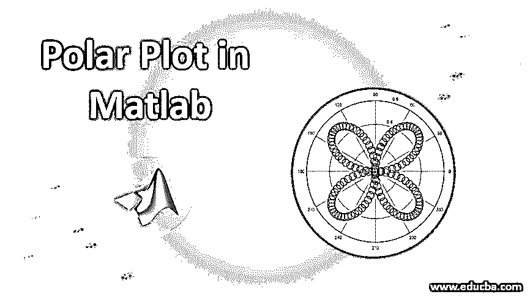
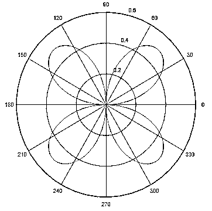
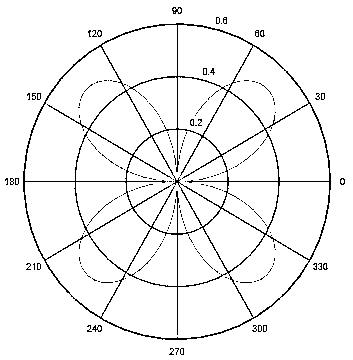
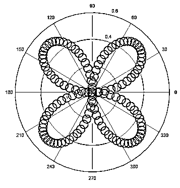

# Matlab 中的极坐标图

> 原文：<https://www.educba.com/polar-plot-in-matlab/>

## Matlab 中的极坐标图介绍

在本文中，我们将讨论 Matlab 中的极坐标图。图表是以图形方式显示模式或趋势的方式，易于理解并做出相关的商业决策。对于没有或仅有一点相关背景知识的无知观众来说，它们是很大的帮助。有不同类型的图用于显示不同的模式或趋势。例如:如果我们想显示一个特定区域的特定特征的分布，那么我们可以使用散点图。因此，我们可以根据业务需求选择绘图类型。

### Matlab 中极坐标图的使用

极坐标图是一种通常用于创建不同类型的图的图，如在各自的极坐标中的线图、散点图。它们也有助于改变极坐标图中的轴。在 Matlab 中，可以使用 polarplot()函数绘制极坐标图。请查找以下解释极坐标图不同属性的语法:

<small>Hadoop、数据科学、统计学&其他</small>

*   **P = polar plot(θ值，半径):**用于在极坐标中绘制直线。这里，θ值是弧度形式的角度，半径是每个点的半径值。输入可以是任何格式，例如，如果输入是向量或矩阵，那么它们可以具有相同的大小和长度。如果输入是矩阵的形式，则极坐标图将具有半径值的线绘制为列和θ值的列。输入也可以是向量和矩阵，只要它们大小相等，即向量的长度应该等于矩阵的维数。
*   **P=polarplot (theta 值，半径，线条属性):**该语法用于改变线条样式、颜色或标记符号的属性。
*   **P = polar plot(****θ****值 1，半径 1，…，****θ****值 N，半径 N):** 用于成对绘制多个θ值和半径。
*   **P=polarplot(半径值):**用于在 0-2π范围内均匀绘制不同间隔角度的线。
*   **P=polarplot(半径值，线的规格):**我们可以改变绘制线的线属性、颜色和标记符号。
*   **P=polarplot(I):** 用于绘制复数值。
*   **P=polarplot (I，线条规格):**我们可以改变所绘制线条的线条属性、颜色和标记符号。
*   **P=polarplot(___，** **名称参数，值** **参数):**这用于绘制名称-值对中的线条，但是我们指定的属性将应用于所有线条，因为我们不能为多条线条设置不同的属性。

### Matlab 中极坐标绘图实例

在下面的文章中，我们将看到 Matlab 中极坐标图的例子。

#### 示例#1

`tvalue = 0:0.05:2*pi;
r = sin(tvalue).*cos(tvalue);
polar(tvalue,r)`

**输出:**

在上面的例子中，这将在各自的极坐标中绘制直线。我们应该总是用弧度来表示θ值。如果是以度为单位，那么我们要用 Matlab 中的 deg2rad 函数将其转换成弧度，并在绘图中使用。我们可以通过使用 Matlab 中的 thetalim 函数来改变角度轴的界限。图中的半径值可以是向量或矩阵，负值表示为零。可以使用 Matlab 中的 rlim 函数来调整半径值限制。Matlab 中的极坐标图有多种属性，例如:

*   我们可以通过使用任何特定的说明符来更改标记符号、颜色或线的类型，从而更改绘制线的线规格。我们可以根据需要使用任何属性，例如，我们只能指定标记符号，而不能指定线，那么绘图将只显示我们选择的标记符号。有不同的线条样式用于改变极坐标图的外观，如'-. '代表点划线，':'代表虚线。--'用于显示虚线，而“-”用于实线。

#### 实施例 2

`tvalue = 0:0.05:2*pi;
r = sin(tvalue).*cos(tvalue);
polar(tvalue,r,’g’)`

**输出:**

在上面的例子中，它将在极坐标中绘制一条线，它将是绿色的，因为我们已经提到了颜色属性。

*   我们可以通过提及颜色或 RGB 三元组值来用不同的值改变线条的颜色。RGB 值表示红色、绿色和蓝色的强度，它们决定了线条的最终颜色。颜色可以是黄色、红色、绿色、蓝色、青色、品红色、白色、黑色和无。我们还可以通过指定线条宽度属性中的值来自定义线条的粗细。这些值可以是任何正值，默认值为 0.5 倍宽度。
*   标记符号是打印时的主要属性之一。根据我们提供的输入，它们可以是任何形状和大小。如果我们用不同的标记符号指定它们，它们有助于区分不同的线型和趋势。标记符号可以是圆、点、星号、加号、十字、正方形、菱形、三角形等。默认情况下，绘制的线没有任何标记，我们必须在编写命令时指定标记符号。

#### 实施例 3

`tvalue = 0:0.05:2*pi;
r = sin(tvalue).*cos(tvalue);
polar(tvalue,r,’o’)`

**输出:**

在上面的示例中，这会将带有标记符号的线绘制为一个圆。我们还可以通过为其提供任何正值来更改标记大小，并且我们还可以更改标记面颜色，该颜色也可以是不同的面颜色。

*   我们可以自定义θ值、半径值、网格线、θ轴单位值、θ轴网格颜色、绘图标签以及与不同轴相关的图例。

### 结论

在柱状图、折线图和散点图等极坐标图的帮助下，可以绘制不同的图，但在上面的部分，我们已经讨论了使用极坐标定制折线图。同样，也可以用同样的方式绘制和定制其他图。

### 推荐文章

这是 Matlab 中的极坐标绘图指南。在这里，我们讨论了 Matlab 中极坐标图的介绍和工作，以及不同的例子和它的语法。您也可以阅读以下文章，了解更多信息——

1.  [Matlab 中的网格线](https://www.educba.com/grid-on-matlab/)
2.  [理解 Python 中的 Matplotlib](https://www.educba.com/matplotlib-in-python/)
3.  [Matlab 中的自然日志及示例](https://www.educba.com/natural-log-in-matlab/)
4.  [Matlab 中数组的各种运算](https://www.educba.com/arrays-in-matlab/)
5.  [Tableau 中图例的各种操作](https://www.educba.com/legend-in-tableau/)
6.  [Matlab 图例工作示例](https://www.educba.com/matlab-legend/)

