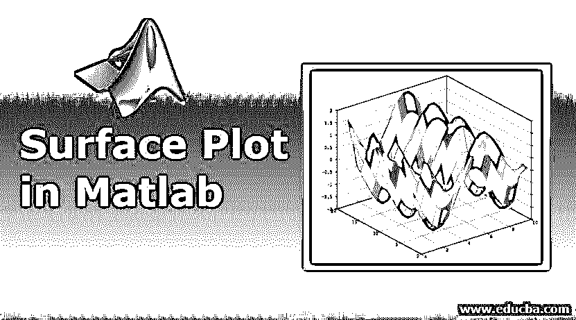
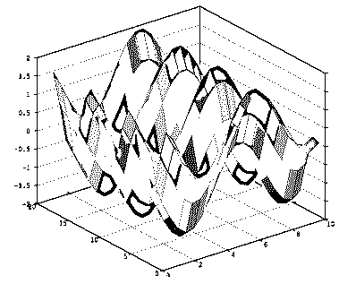
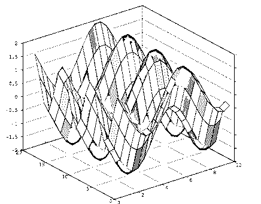
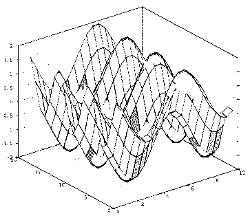

# Matlab 中的曲面图

> 原文：<https://www.educba.com/surface-plot-in-matlab/>

## Matlab 中曲面绘制的介绍

图表是以图形方式显示数据分布的手段。如果情节策划得当，那么它向不知情的观众展示了许多关于情节重要性的相关信息。有时，如果数字很大，那么就不可能在图表中显示出来。对于上述情况，有一些被称为表面图的图，如果范围太大而无法在正常图中显示，则用于可视化矩阵。在这个主题中，我们将学习 Matlab 中的曲面图。

### 用语法处理 Matlab 中的曲面图

在 Matlab 中，可以在关键字“surf”的帮助下使用不同的参数绘制曲面图，这些参数服务于图中的各种属性。使用 Matlab 可以创建不同的曲面图。

<small>Hadoop、数据科学、统计学&其他</small>

请查找以下带有用于绘制表面图的参数的语法:

*   surf (e，f，g): 这用于创建一个三维绘图，其中可以有不同的颜色和属性。矩阵 g 中的值可用于绘制网格顶部的高度，如 e 中所述，f 绘制在 e-f 平面中。不同的 g 值有不同的颜色，它将被绘制成表面图的一部分。
*   **surf (e，f，g，C):** 这将按照上面的语法描述绘制表面图。输入参数中的 c 用于指定表面图的颜色。
*   **surf(g):** 这用于绘制表面图，其值在 g 中给出的矩阵的行和列中提及。
*   **surf (g，C):** 这将按照上面的语法描述绘制表面图。输入参数中的 c 用于指定表面图的颜色。
*   **surf (axes value，__):** 该语法用于用给定的轴值而不是当前的轴值实现表面绘图，它应作为第一个输入参数。
*   **surf (___，命令的名称，它的值):**该语法用于绘制关于我们可以在命令部分提及的属性的表面图，并根据需要提供值。

### 例子

下面举几个例子

#### 示例#1

`[a, b] =meshgrid(1:0.5:10,1:20);
C = cos(a) + sin(b);
surf(a,b,C)`

**输出:**

有几个与曲面图相关的属性可以改变曲面图的外观。

请查找 Matlab 中使用的属性列表:

*   我们可以根据给曲面图的 CData 属性赋予的值来更改每个面的面颜色。这些值可以是平面、RGB 三元组值、纹理贴图、interp 等。RGB 三元组值对于提供红色、绿色和蓝色强度级别的所有颜色都是唯一的。RGB 三元组的强度等级在[0，1]的范围内。颜色可以是红色、蓝色、绿色、品红色、青色、黑色、黄色、白色，并且它们具有独特的 RGB 值。
*   我们也可以改变每个表面的面 Alpha 值。这些值可以是 scalar、flat、interp、texturemap。如果输入是标量，则范围从 0 到 1，0 表示完全不透明，1 表示完全透明。0 和 1 之间的值可以是半透明的。1 是面 alpha 的默认值。

#### 实施例 2

`[a, b] =meshgrid(1:0.5:10,1:20);
C = cos(a) + sin(b);
surf(a,b,C,'FaceAlpha',0.5)`

**输出:**

#### 实施例 3

`[a, b] =meshgrid(1:0.5:10,1:20);
C = cos(a) + sin(b);
surf(a,b,C,'FaceAlpha',0.4)`

**输出:**

*   我们也可以修改表面上每个面的光照。我们可以为输入参数提供的值有 flat、Gouraud 和 none。如果该值为 flat，则灯光均匀地应用到每个面上，如果该值为 Gouraud，则灯光在曲面的每个面上变化，如果该值为 none，则不应用任何灯光。
*   我们还可以更改对齐方式，以锐化绘图的垂直和水平边缘。该属性的值可以是 OFF 或 ON。如果关闭此属性的输入，则不会锐化绘图的边缘，这将提供不均匀的光洁度；如果打开，则水平和垂直边缘将被锐化，以提供平滑的绘图光洁度。
*   我们也可以改变水平和垂直边缘的照明。我们可以为输入参数提供的值有 flat、Gouraud 和 none。如果该值为 flat，则灯光均匀地应用到每个面上，如果该值为 Gouraud，则灯光在曲面的每个面上变化，如果该值为 none，则不应用任何灯光。
*   有各种与标记、坐标日期、法线、照明方法、图例、交互性、回调和标识符相关的属性。所有属性都有自己的功能，它们可用于更改表面图的各种属性。

### 结论

表面图用于非常大的数值的图形说明，在正常图中不可能实现。因此，当我们在所有业务需求中面对上述场景时，了解这些情节是非常重要的。

### 推荐文章

这是一个在 Matlab 中绘制曲面的指南。这里我们用语法来讨论 Matlab 中曲面绘图的例子和工作。您也可以浏览我们推荐的其他文章，了解更多信息——

1.  [Matlab 中的 3D 绘图](https://www.educba.com/3d-plots-in-matlab/)
2.  [Matlab 反函数](https://www.educba.com/matlab-inverse-function/)
3.  [Matlab 逻辑运算符](https://www.educba.com/matlab-logical-operators/)
4.  [MATLAB 中的热图](https://www.educba.com/heatmap-in-matlab/)
5.  [Tableau 中图例的各种操作](https://www.educba.com/legend-in-tableau/)
6.  [Matlab 中的 mesh grid |如何工作及实例？](https://www.educba.com/meshgrid-in-matlab/)
7.  [Matlab 图例示例](https://www.educba.com/matlab-legend/)

