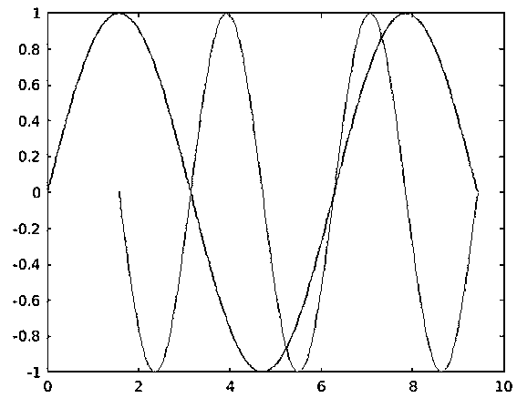
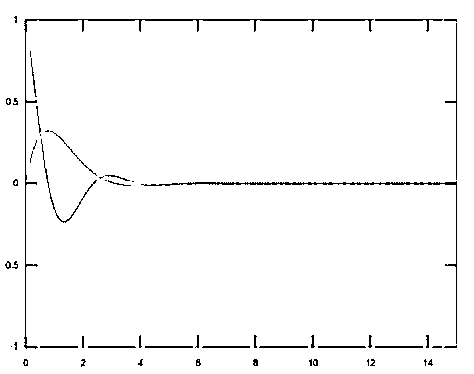
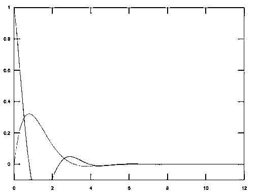
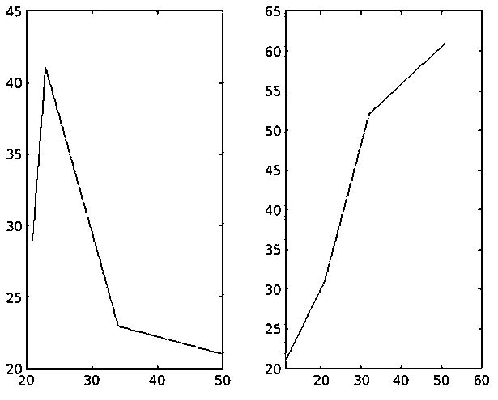
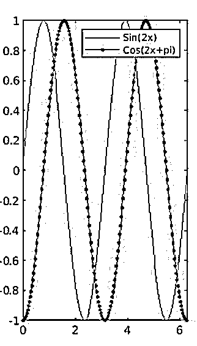
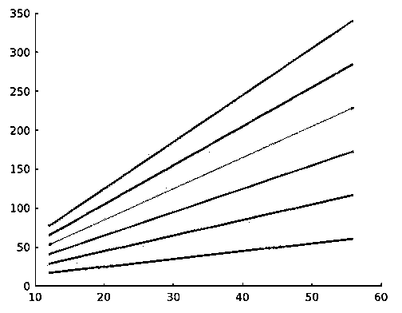
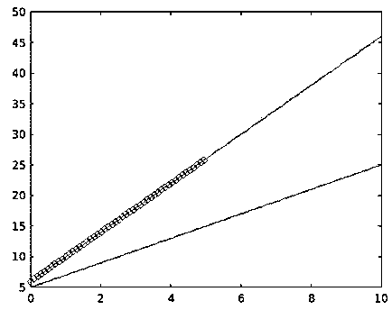
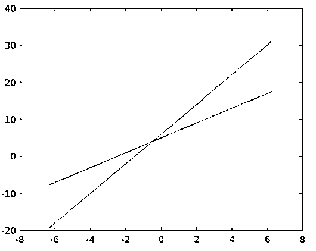
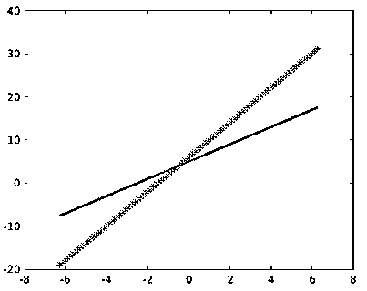

# Matlab 绘制多条线

> 原文：<https://www.educba.com/matlab-plot-multiple-lines/>

## Matlab 绘图多行介绍

通过结合二维绘图函数 plot()，用 Matlab 绘制一条线是可行的，该二维绘图函数 plot()创建了因变量相对于因变量的二维图形。Matlab 支持在单个 2D 平面上绘制多条直线。从绘图函数中绘制的线本质上可以是连续的或离散的。数据 Y1，Y2，…，Yn 的行相对于它们相应的数据集 X1，X2，..，Xn。Matlab 可以在一个循环中使用 plot 函数生成多个 2D 线图。通过改变绘图函数的不同属性，绘图的定制也是可行的。

**语法:**

<small>Hadoop、数据科学、统计学&其他</small>

在一个平面图中绘制多条线的一般语法是:

`plot(X1,Y1,...,Xn,Yn)`

然而，根据用于定制线条显示的属性，语法被定义为:

`plot(X1,Y1,LineSpec1,...,Xn,Yn,LineSpecn)`

此语法设置每条线的线型、标记类型和颜色。LineSpec i 被应用于数据对 X i ，Y i 。

`plot(___,Name,Value)`

此语法用于使用名称/值对参数对行的显示进行定制。

### Matlab 绘制多条直线的例子

下面是提到的例子:

#### 示例#1

让我们为两个函数 y1=sin(x1)和 y2=sin(2*x2)创建两个线图，其中 x1 的范围是从 0 到 3*pi x2 的范围是从 pi/2 到 3*pi。

**代码:**

`x1=0:pi/100:3*pi;
x2=pi/2:pi/100:3*pi;
y1=sin(x1);
y2=sin(2*x2);
figure
plot(x1,y1,x2,y2)`

**输出:**

合成图由两条正弦曲线‘y1’和‘y2’组成，它们具有两组不同的值‘x1’和‘x2’，但共享一个共同的 x-y 平面。

通过改变下述任何属性或属性的任意组合，可以实现从单个绘图函数绘制的线的定制:

**a. xlabel:** 给 x 轴添加标签。

**b. Ylabel:** 给 y 轴添加标签。

**c .标题:**更新图形标题。

**d .网格打开:**使网格线对图形可见。

**e .轴相等:**可以用共同的比例因子和空间为两个轴创建图。

**f .轴正方形:**可以生成一组正方形图。

下面定义的示例演示了通过修改上面给出的属性来定制图形表示的过程。

**代码:**

`x=0:pi/100:2*pi;
y1=sin(x);
y2=cos(2*x);
%Adding x-label, y-label and title to the resultant plot
plot(x, y1,x,y2), xlabel('x-axis'), ylabel('y-axis'), title('Graph customisation'),`

**输出:**

**g 轴缩放**

可使用命令“轴”将图的极限值加到轴上。

**合并轴限制的语法:**

`axis ( [xminxmaxyminymax] )`

**举例:**

`x = [0 : 0.1: 20];
y1 = exp(-x).*cos(2*x);
y2= exp(-x).*sin(x);`

**案例 1:**

%x 轴最大值 15

%x 轴最小值 0

%y 轴最小值-1

%x 轴最大值 1

**代码:**

`plot(x, y1,x,y2), axis([0 15 -1 1])`

**输出:**

**案例二:**

% y 轴的最小值更新为-0.1，x 轴的最大值更新为 12。

**代码:**

`plot(x, y1,x,y2), axis([0 12 -0.1 1])`

**输出:**

**h .在不同的子图中排列多个线图:** Matlab 支持呈现在单次执行中生成的线图，具有不同的轴组。

下面的例子展示了用两组不同的轴从程序的一次执行中产生的 2 条线图。

**代码:**

`x1=[21 23 34 50];
y1=[29 41 23 21];
x2=[11 21 32 51 ];
y2= [ 21 31 52 61];
%Placing the first line plot in the first cell of the frame
subplot(1,2,1)
plot(x1,y1)
hold on
%Placing the second line plot in the second cell of the frame
subplot(1,2,2)
plot(x2,y2)
hold off`

**输出:**

**i .包括图例以区分线图:**属性“图例”的应用将信息添加到图上，以指导用户根据其绘图功能识别线条。

编写代码以显示将每一行映射到其相应绘图函数的数据。

**代码:**

`x = [0 :pi/100:2*pi];
y1 = sin(2*x);
y2 = cos(2*x+pi);
plot(x, y1, x, y2, '.-'), legend('Sin(2x)', 'Cos(2x+pi)')`

**输出:**

#### 实施例 2

使用循环生成多条线。

Matlab 使用户能够在单个平面上绘制两个以上的线条。这也可以通过在循环中调用绘图函数来实现，其中绘图函数可以定义为循环变量的函数。

下面的代码片段为“y”定义的函数生成了 6 行代码，该函数是循环变量“x”的函数。

**代码:**

`t = [25 50 75 100 125 150] for i=1:length(t);
x=[20 23 45 56 30 12];
y= x*i+5;
figure(1)
hold on
plot(x,y,'LineWidth',2)
end`

**输出:**

#### 实施例 3

显示线条的特定数据点的标记。

标记有助于在绘制的线上指出不同的数据点，以计算出由函数计算出的精确值。如果图形包含的线条多于 3 条，并且呈现重叠，则有助于确定哪个数据点属于哪个图。

以下示例生成 2 个线图，其中一个图用标记符号'-o '突出显示。

**代码:**

`x = linspace(0,10);
y1 = 2*x+5;
y2=4*x+6;
plot(x,y1,x,y2,'-o','MarkerIndices',1:1:50)`

**输出:**

#### 实施例 4

创建地块后自定义线条的显示。

Matlab 扩展了它在 2D 线图中的特性，即使在图生成之后，也可以通过执行来自定义图的显示。生成的绘图被分配给图表线对象，并且通过改变存储图表线对象的属性来定制其显示。

编写下面的代码来生成两条线性曲线，并通过改变图表线对象的属性来编辑图形的显示。

**阶段 1:** 地块的创建。

**代码:**

`x = linspace(-2*pi,2*pi);
y1 = 2*x+5;
y2=4*x+6;
p = plot(x,y1,x,y2);`

**输出:**

**阶段 2:** 使用图表线对象“p”的属性编辑绘图的显示。

**代码:**

`p(1).LineWidth = 2;
p(2).Marker = '*';`

**输出:**

**Note:** Input values like ‘NaN’ and ‘Inf’ breaks the line plots. Colors and line styles are applied based on the ColorOrder and LineStyleOrder properties of the axes for any line plot.

### 结论

使用 Matlab 的 2D 绘图功能生成多行代码，提高了编程的代码质量，优化了代码大小。它有助于可视化数据点、执行数据分析操作以及对可用数据点执行各种类型的比较分析。

### 推荐文章

这是一个 Matlab 绘制多行的指南。在这里，我们讨论了 Matlab 绘图多线的介绍，以及更好地理解的例子。您也可以看看以下文章，了解更多信息–

1.  [傅立叶级数 Matlab](https://www.educba.com/fourier-series-matlab/)
2.  [Matlab mesh()](https://www.educba.com/matlab-mesh/)
3.  [Matlab sphere()](https://www.educba.com/matlab-sphere/)
4.  [MATLAB 索引](https://www.educba.com/matlab-indexing/)

