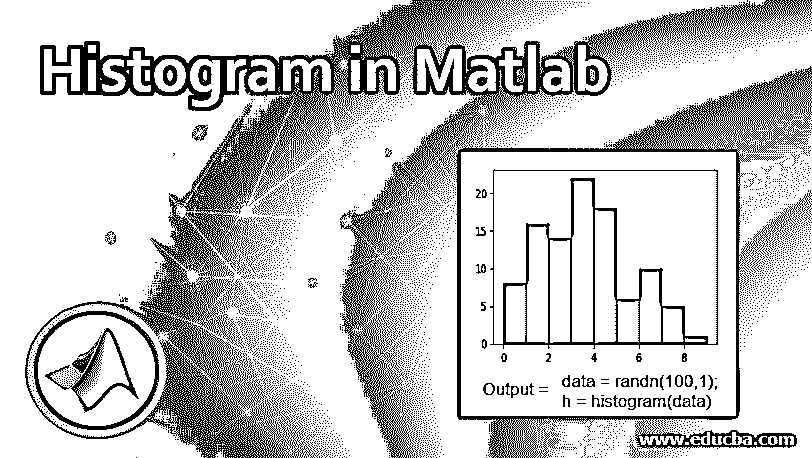
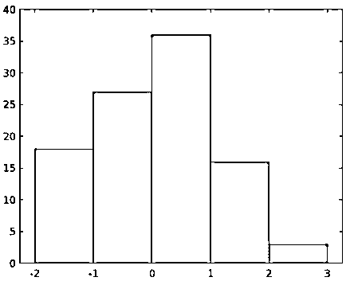
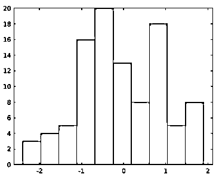
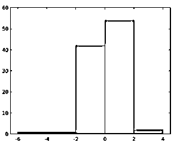
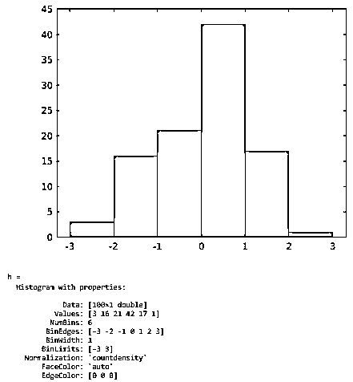
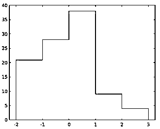
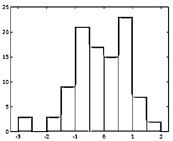

# Matlab 中的直方图

> 原文：<https://www.educba.com/histogram-in-matlab/>

## Matlab 中直方图介绍

直方图是任何统计信息的表示，显示连续间隔中数据项的频率。MATLAB 支持绘制直方图功能，使用户能够为任何向量或矩阵创建条形图，并使用自动宁滨算法将数据分组到仓中。对于每个容器，面积代表数据出现的频率，而不是高度。它支持直方图表示中的定制。

**语法:**

<small>Hadoop、数据科学、统计学&其他</small>

在早期版本中，hist()和 histc()用于生成直方图。在更高版本中，这些函数被具有高级功能的新函数所取代，即 histogram()、histcounts()和 discretize()。

上述推荐函数的语法如下:

*   **直方图(X，a 1， a 2，…..， a n )**
*   历史计数(X，a 1， a 2，…..， a n )
*   **离散化(X，a 1， a 2，…..， a n )**

其中 X:以向量或矩阵形式输入的数据。

一个 1，一个 2，…..，一个 n: 属性值(可选)

**在 Matlab 中创建直方图:** MATLAB 只需点击一下鼠标，即可为任何数据创建直方图。可以使用内置函数 histogram()创建直方图。

**举例:**

编写下面的代码来生成 100 个随机数，并使用 histogram()为生成的数据绘制直方图。

**代码:**

`data = randn(100,1);
h = histogram(data)`

**输出:**

一旦创建了任何直方图对象，就可以通过改变其属性值来改变它，从而改变条柱的属性，并因此改变显示。

### Matlab 中直方图的性质

MATLAB 中直方图的各种特性如下:

#### 1.垃圾箱

| **参数** | **描述** |
| 使麻木的 | 决定要生成的箱数。 |
| 带宽 | 决定每个箱子的宽度。 |
| 宾杰斯 | 向量的第一个元素决定直方图的第一个面元的边缘，最后一个元素决定直方图的最后一个面元的边缘。 |
| Binlimits | 设置输入向量/矩阵值的限制。 |
| BinLimitModes | 决定设置限制的模式。 |
| BinMethod | 选择算法来配置箱宽。 |

#### 2.种类

该属性允许为输入分类数组中定义的每个类别绘制直方图。如果指定了箱计数，类别将在图中设置相关的类别描述。

该属性包含如下参数:

| **参数** | **描述** |
| 显示顺序 | 根据高度决定条形的顺序。 |
| NumDisplayBins | 决定要显示的类别数量。 |
| 向他人展示 | 决定包含所选类别的排除元素的附加栏的可见性。 |

#### 3.数据

该值分布在各个条块的直方图上。该属性由不同的参数组成，例如:

| **参数** | **描述** |
| 价值观念 | 决定要添加到特定箱中的数据元素的数量。 |
| 正常化 | 对数据应用特定类型的标准化，如计数、概率、计数密度、pdf、累计计数等。 |
| BinCounts | 接受来自外部条柱计算方法的条柱计数作为输入，而不是直方图数据宁滨。 |
| 宾 CountsMode | 表示确定 bin 计数的模式。 |

#### 4.颜色和款式

| **参数** | **描述** |
| 显示样式 | 决定直方图显示的样式。 |
| 方向 | 决定直方图上条形的方向-垂直或水平。 |
| BarWidth | 控制分类条的分隔。 |
| FaceColor(面颜色) | 设置条形的颜色。 |
| EdgeColor | 设置边缘的颜色。 |
| FaceAlpha | 决定条形的透明度。 |
| 边缘阿尔法 | 决定边缘的透明度。 |
| LineStyle | 设置条形图轮廓的样式。 |
| 行距 | 设置条形轮廓的宽度。 |

#### 5.图例

MATLAB 中的该属性为绘图添加了描述性标签。它包括:

| **参数** | **描述** |
| 显示名称 | 设置要添加到轴描述中的文本。 |
| 注释 | 控制图例中对象的包含，并将排除的对象设置为注释对象。 |

#### 6.交互性

| **参数** | **描述** |
| 看得见的 | 设置对象的可见性。 |
| 数据提示模板 | 决定出现在数据提示上的内容。 |
| UIContextMenu | 设置对象的上下文菜单，在对象上单击鼠标右键时显示。 |
| 挑选 | 管理对象的选择模式。 |
| 选择高亮显示 | 决定对象周围选择处理程序的可见性。 |

#### 7 .回访

| **参数** | **描述** |
| ButtonDownFcn | 接受函数作为单击对象时要执行的值。 |
| 创建 Fcn | 接受一个函数作为创建对象时要执行的值。 |
| 删除 Fcn | 接受一个函数作为删除对象时要执行的值。 |

#### 8.回调执行控制

| **参数** | **描述** |
| [计]可中断的 | 确定回调函数是否可以被中断。 |
| 忙碌行动 | 确定如何处理回调函数中的中断。 |
| 可挑选的零件 | 设置对象的上下文菜单，在对象上单击鼠标右键时显示。 |
| 挑选 | 用于启用/禁用捕获鼠标点击。 |
| 击中测试 | 决定直方图上捕获的鼠标单击的响应。 |
| 正在被删除 | 用于存储 DeleteFcn 回调的执行状态。 |

#### 9.父母/子女

| **参数** | **描述** |
| 父母 | 轴、极轴、变换对象或组对象被指定为父对象。 |
| 儿童 | 此属性是一个只读元素，用于查看绘制在直方图中的数据提示列表。 |
| 手柄可见度 | 接受一个函数作为删除对象时要执行的值。 |

#### 10.标识符

| **参数** | **描述** |
| 类型 | 表示图形对象的类型。 |
| 标签 | 用作对象标识符。 |
| UserData | 在对象上存储任意数据。 |

### Matlab 中直方图的例子

让我们参考下面给出的各种例子来理解不同属性的用法:

#### 示例# 1–改变箱子数量

**代码:**

`data = randn(100,1);
nbins = 10;
h = histogram(data,nbins)`

**输出:**

#### 示例 2–改变箱子宽度

**代码:**

`data = randn(100,1);
histogram(data,'BinWidth',2)`

**输出:**

#### 示例# 3–更改标准化类型

**代码:**

`data = randn(100,1);
h = histogram(data,'Normalization','countdensity')`

**输出:**

#### 示例 4–改变展示风格

**代码:**

`data = randn(100,1);
h = histogram(data,'DisplayStyle','stairs')`

**输出:**

#### 示例 5–改变条形的颜色

**代码:**

`data = randn(100,1);
h = histogram(data,'FaceColor','#A2142F')`

**输出:**

直方图可让您理解和分析频率分布下的一组连续数据。它优于条形图，因为它允许将数据按箱分类，这有助于根据需要检查特定类别的数据。

**补充说明:**

*   函数 histogram()创建一个直方图对象，其中包含可修改的属性。
*   Histogram()和 histcount()具有通用的内置选项、自动宁滨和归一化功能。
*   直方图的主要计算函数，即 histcounts()表现出一致的行为。
*   Discretize()有一个扩展特性，可以决定每个元素的位置。

### 推荐文章

这是 Matlab 中的直方图指南。在这里，我们讨论了 Matlab 中直方图的创建和它的属性，以及它的例子和代码实现。您也可以浏览我们推荐的文章，了解更多信息——

1.  [MATLAB 函数介绍](https://www.educba.com/matlab-functions/)
2.  [Matlab 的十大优势](https://www.educba.com/advantages-of-matlab/)
3.  [Matlab 中均值函数概述](https://www.educba.com/mean-function-in-matlab/)
4.  [如何使用 Matlab？|使用的运算符](https://www.educba.com/how-to-use-matlab/)
5.  [Matlab stem()完全指南](https://www.educba.com/matlab-stem/)

