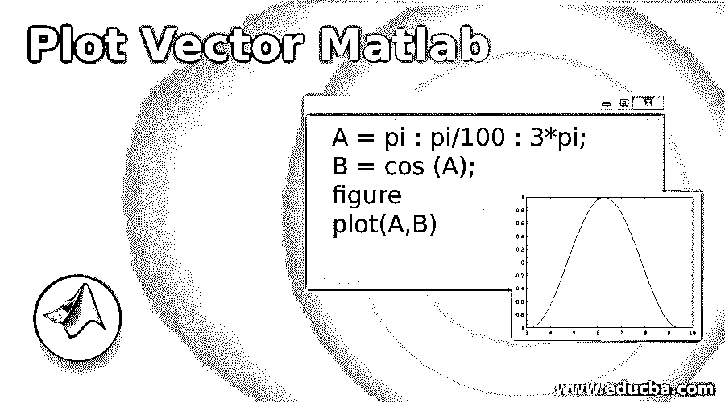
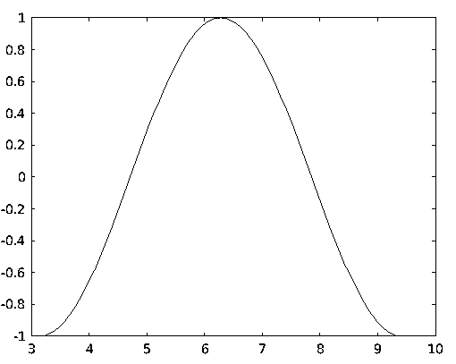
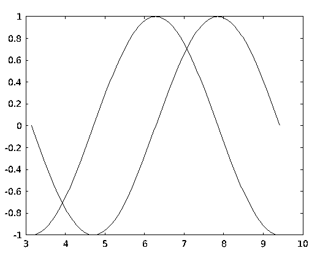
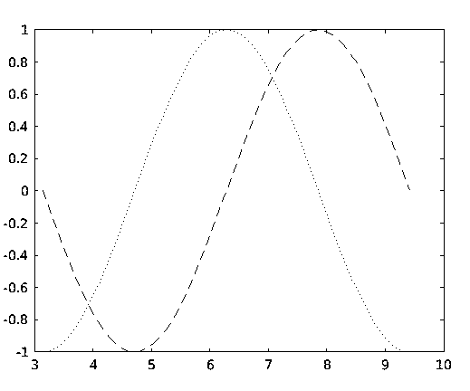
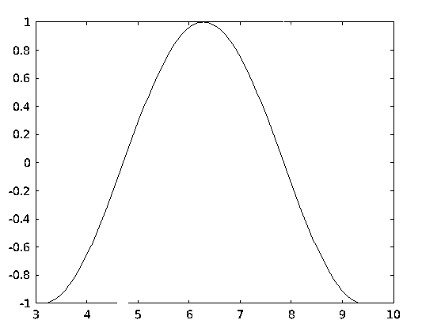

# 绘图向量 Matlab

> 原文：<https://www.educba.com/plot-vector-matlab/>

## 绘图向量 Matlab 简介

MATLAB 为我们提供了大量的功能，在各种计算问题中非常有用。在这篇文章中，我们将学习如何在 MATLAB 中创建矢量图。首先让我们理解为什么我们需要画出向量。我们创建用于可视化数据的图。数据可视化有助于更好地理解数据。数据图具有广泛的用途；比较大量数据，跟踪数据随时间的变化

### 句法

`Plot (A, B)`

<small>Hadoop、数据科学、统计学&其他</small>

**解释:**该函数将绘制矢量 A & B，条件是两个 A & B 的长度应该相同简单地说，将在 A 对 B 的数据点之间创建一个图

**表 1:线条样式**

| **线条样式** | **图案** |
| **–** | 固体 |
| **—** | 虚线 |
| **:** | 有点的 |
| **-。** | 虚线和圆点 |

**表 2:对于颜色**

| **颜色代码** | **颜色** |
| **Y** | 黄色 |
| **C** | 蓝绿色 |
| **G** | 绿色的 |
| **B** | 蓝色 |
| **M** | 品红 |
| **K** | 黑色 |
| **W** | 怀特（姓氏） |

### 实现绘图向量的 Matlab 实例

以下是一些例子:

#### 示例#1

首先，我们将“A”定义为包含 pi (π)和 3π之间的值的向量。我们将在这些值之间定义一个增量π/100。接下来，我们将 B 定义为 A 值的 cos 函数。然后，我们的输入 A & B 将作为参数传递给函数 plot (A，B)。这是我们的输入和输出在 MATLAB 控制台中的样子:

**代码:**

`A = pi : pi/100 : 3*pi;
B = cos (A);
figure
plot(A,B)`

**输出:**

#### 实施例 2

让我们借助上例中使用的“A”来理解这一点。此外，我们将“b”和“c”定义为另外两个向量，它们的正弦值和余弦值分别为 A。然后，我们的输入 A、b 和 c 作为参数传递给我们的函数。这是我们的输入和输出在 MATLAB 控制台中的样子:

**代码:**

`A = pi : pi/100 : 3*pi
b = sin (A);
c = cos (A);
figure
plot(A,b,A,c)`

**输出:**

#### 实施例 3

接下来，如果我们需要以其他方式可视化这两个并排获得的图，该怎么办？也就是有没有办法定义剧情的风格？是的，有，我们只需要在我们的 plot 函数的参数中传递预定义的线条样式。(关于预定义的线条样式，请参考本文末尾的表 1)作为示例，让我们将上面的输入绘制为虚线和点线。我们将正弦函数绘制为虚线，cos 函数绘制为虚线。然后，我们的输入 A、b 和 c 作为参数传递给我们的函数。这是我们的输入和输出在 MATLAB 控制台中的样子:

**代码:**

`A = pi : pi/100 : 3*pi
b = sin (A)
c = cos (A)
figure
plot(A,b,’--’,A,c,’:’)`

正如我们在输入中可以注意到的，我们已经为‘b’和‘c’传递了预定义的线条样式，分别得到虚线和点状图。

**输出:**

#### 实施例 4

接下来，我们将学习如何用我们选择的颜色绘制图形。为此，我们将预定义的颜色代码作为参数传递给 pot 函数。作为一个例子，我们将尝试获得上面的黄色和品红色的绘图。让我们有一个黄色的正弦函数和洋红色的余弦函数。(请参考本文末尾的表 2 以获得预定义的颜色代码)这是我们的输入和输出在 MATLAB 控制台中的样子:

**代码:**

`A = pi : pi/100 : 3*pi
b = sin (A)
c = cos (A)
figure
plot(A,b,'y',A,c,'m')`

正如我们在输入中看到的，我们所做的只是在参数中传递了所需的颜色代码。

**输出:**

正如我们在获得的输出中看到的，正弦和余弦函数分别以黄色和洋红色获得，如预期的那样。

### 结论

我们学习了如何在 MATLAB 中绘制向量，以及如何获得想要的样式。作为一个额外的提示，请记住，如果我们需要一个有颜色和某种图案的图，我们可以将“颜色”和“线条样式”作为输入。只需从下表中选择所需的代码，并将其作为输入传递，如本文所述。

### 推荐文章

这是一个绘制矢量的 Matlab 指南。在这里，我们讨论绘图矢量 Matlab 的介绍，语法与解释，代码和输出的例子。您也可以浏览我们的其他相关文章，了解更多信息——

1.  [Matlab stem()](https://www.educba.com/matlab-stem/)
2.  [Fzero Matlab](https://www.educba.com/fzero-matlab/)
3.  [Matlab 计数](https://www.educba.com/matlab-count/)
4.  [Matlab fill()](https://www.educba.com/matlab-fill/)
5.  [MATLAB 索引|五大示例](https://www.educba.com/matlab-indexing/)
6.  [Matlab sphere() |语法和示例](https://www.educba.com/matlab-sphere/)

