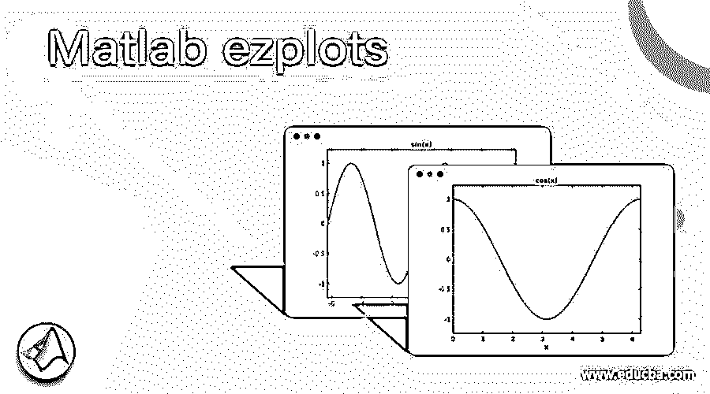
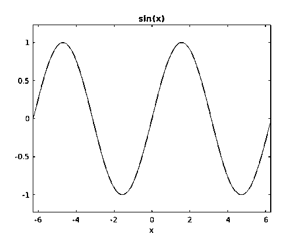
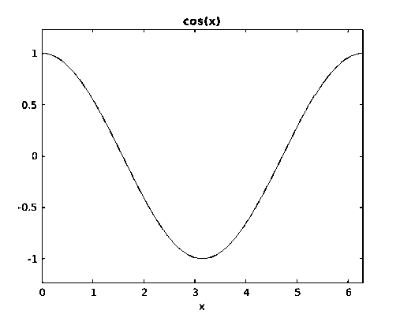
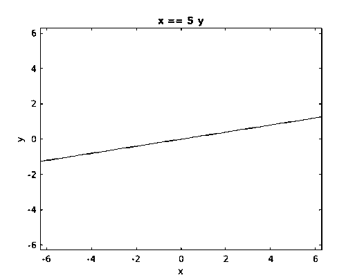
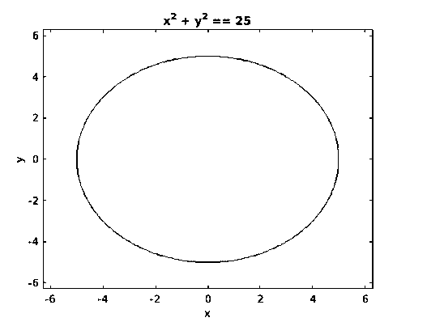

# Matlab ezplots

> 原文：<https://www.educba.com/matlab-ezplots/>

## Matlab ezplots 简介

MATLAB 也是一个很好的可视化工具。它让我们有能力创造各种各样的情节。在本文中，我们将重点介绍用于创建函数和方程图的 ezplot 函数。

**语法:**

<small>Hadoop、数据科学、统计学&其他</small>

让我们了解一下 MATLAB 中 ezplot 函数的语法

1.  `ezplot (f)`
2.  `ezplot (f, [minimum, maximum])`
3.  `ezplot (x, y)`

### Matlab 中 ezplot 函数的描述

1.  **ezplot (f):**
    1.  ezplot (f)将创建一个作为参数传递的方程、符号表达式或函数的绘图
    2.  默认情况下，Ezplot (f)将在[–2*π到* 2 *π* 或[–2*π到* 2 *π* 的子区间]上绘制函数或表达式
2.  **ezplot (f，[最小值，最大值]):**
    1.  该函数将在参数传递的范围内绘制输入函数或方程
3.  **ezplot (x，y):**
    1.  该函数将绘制 0 <= z <= 2π或 0 <= z <= 2π的子集上的平面定义曲线 xand 和 y

### 例子

让我们通过几个例子来理解 ezplot (f ):

#### 示例#1

让我们举一个正弦函数的简单例子，并尝试使用 ezplot 绘制它。

`syms x[initializing variable x] ezplot(sin(x))[passing the input function]`

**【注意，我们没有为区间传递任何参数，因此默认情况下，ezplot 函数将绘制区间[–2π到 2π] ]** 中的正弦波

**输入:**

`syms x
ezplot(sin(x))`

**输出:**

正如我们在输出中看到的，正弦函数绘制在[–2π至 2π] ]范围内。

接下来，我们将传递一个参数来定义输出的时间间隔。 **T2】**

#### 实施例 2

让我们以一个 cos 函数为例，尝试使用 ezplot 在 0 至 2π范围内绘制它

`syms x[initializing variable x] ezplot(cos(x), [0, 2 * pi])[passing the input function and the required interval]`

[Here notice that we have passed [0 to 2π] as an argument for the interval]

**输入:**

`syms x
ezplot(cos(x), [0, 2 * pi])`

**输出:**

正如我们在输出中看到的，获得的 cos 函数在 0 到 2π的范围内；正如我们所料。

#### 实施例 3

在这个例子中，我们将使用 ezplot (x，y)来创建一个直线方程的绘图

`syms x y[initializing variables x& y] ezplot(x == 5 * y )[passing the input straight line equation]`

[Notice the double equal to sign for representing ‘=’ ]

**输入:**

`syms x y
ezplot(x == 5 * y )`

**输出:**

正如我们所看到的，我们已经得到了一个直线方程的图形。

#### 实施例 4

在这个例子中，我们将使用 ezplot (x，y)绘制球体的方程。

`syms x y[initializing variables x& y] ezplot(x ^ 2 + y ^ 2 == 25 )[passing the equation of a sphere with radius 5]`

[Notice the double ‘equal to’ sign for representing ‘=’ ]

**输入:**

`syms x y
ezplot(x ^ 2 + y ^ 2 == 25 )`

**输出:**

正如我们在输出中看到的，我们已经获得了半径为 5 的 ezplot 函数。

### 结论

MATLAB 可以用来绘制我们的数据，以便可视化和直观地理解它。可能会有这样的情况，我们不得不画出方程或函数。在这种情况下，我们利用 MATLAB 中的“ezplot”函数。我们可以使用默认范围或定义自己的范围来绘制函数或方程。

此外，请记住，如果一个方程或函数有两个变量，那么按字母顺序排在第一位的变量将出现在横轴上，另一个将出现在纵轴上。

### 推荐文章

这是一个 Matlab ezplots 的指南。这里我们讨论 Matlab ezplots 的介绍、语法、描述和代码实现示例。您也可以看看以下文章，了解更多信息–

1.  [MATLAB 文本()](https://www.educba.com/matlab-text/)
2.  [费瓦尔 Matlab](https://www.educba.com/feval-matlab/)
3.  [MATLAB 工具箱](https://www.educba.com/matlab-toolbox/)
4.  [MATLAB 冒号](https://www.educba.com/matlab-colon/)

