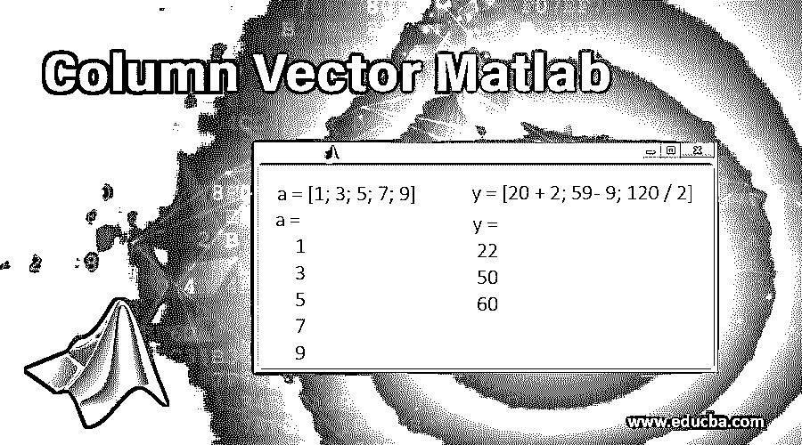
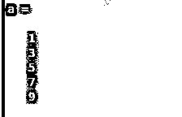

# 列向量 Matlab

> 原文：<https://www.educba.com/column-vector-matlab/>

## 列向量 Matlab 简介

MATLAB 是 MathWorks 拥有和开发的一种简单的编程语言。它最初是一种矩阵编程语言，因为线性代数编程很简单。Matlab 可以实现为批处理作业，也可以实现为交互式会话。在本文中，我们将了解 Matlab 的一个非常基本和有用的元素，称为“列向量 MATLAB”。

****列向量的用途 Matlab:****

<small>Hadoop、数据科学、统计学&其他</small>

*   计算
*   模拟
*   造型
*   数据分析
*   样机研究
*   应用开发
*   工程和科学制图

MATLAB 中的列向量是通过将所需的一组元素放在方括号中创建的。然后用分号来分隔元素。更简单地说，我们可以使用方括号[ ]创建一个列向量。然后，列向量中的元素由换行符或分号分隔(换行符可以通过按 Enter 键获得)。

### 列向量 Matlab 示例

现在让我们通过几个例子来理解这一点:

#### **示例# 1–创建一个包含 3 个元素的列向量**

 ****代码:**

`a = [1; 3; 5]`

我们将得到的输出将是包含元素 1、3、5 的单个列。

**输出:**

#### 示例 2-**创建一个包含 5 个元素的列向量**

 ****代码:**

`a = [1; 3; 5; 7; 9]`

我们将得到的输出将是包含元素 1、3、5、7、9 的单个列

**输出:**

列向量中的元素也可能是算术运算的结果。让我们通过下面的例子来理解这一点:

#### 示例# 3–用不同的元素创建列向量

让我们尝试创建“y”，一个列向量，其元素具有以下描述:

*   20 英寸换算成厘米(1 英寸等于 2.54 厘米)。
*   140 华氏度换算成摄氏度(换算公式为摄氏度= 5(F–32)/9)。
*   120 磅千克(1 千克= 2.2 磅)。

**代码:**

`y = [20 / 2.54; (5 / 9) * (140 - 32); 120 / 2.2]`

我们将得到的输出是一个包含 3 个元素的单列。

**输出:**

#### 示例# 4–使用算术运算创建列向量

让我们举一个涉及简单算术运算的简单例子:

**代码:**

`y = [20 + 2; 59 - 9; 120 / 2]`

我们将得到的输出是一个包含 3 个元素的单列。

**输出:**

### Matlab 中行列向量之间的运算

这里要记住的一点是，我们使用普通的圆括号( )来访问列向量的元素，这正是我们访问行向量的元素的方式。向量算术对于列向量和行向量也是一样的。要记住的限制是我们不能混合使用列和行向量。

**使用转置转换向量:**我们可以使用转置将列向量转换为行向量。使用转置从列向量创建行向量。

**代码:**

`a = [1; 3; 5]’`

**输出:**

我们将得到的输出将是包含元素 1、3、5 的单行。正如我们所观察到的，这里没有得到列向量，而是得到了行向量。这是因为我们在 MATLAB 命令中使用了“转置”。

### 结论

*   方括号不仅可以用来创建列向量，也可以用来创建行向量。
*   MATLAB 中的方括号，用分号分隔元素，用于创建列向量。
*   “转置”将列向量转换为行向量，反之亦然。
*   如果我们用元素 1，2，3，4 定义一个行向量 x = [1 2 3 4]，它和列向量 y =[1；2;3;4]与元素 1、2、3、4。注意这里元素之间分号的区别。

### 推荐文章

这是一个列向量 Matlab 指南。在这里，我们讨论列向量 Matlab 的基本概念和用途，以及示例和代码实现。您也可以阅读以下文章，了解更多信息——

1.  [Matlab 中 Comet()的使用方法](https://www.educba.com/matlab-comet/)
2.  [Matlab 对数图示例](https://www.educba.com/log-plot-matlab/)
3.  [Matlab 中 3D 绘图的类型](https://www.educba.com/3d-plots-in-matlab/)
4.  [Matlab 中的 Repmat 是什么？](https://www.educba.com/repmat-in-matlab/)
5.  [如何用实例在 Java 中创建 Vector？](https://www.educba.com/vector-in-java/)

****