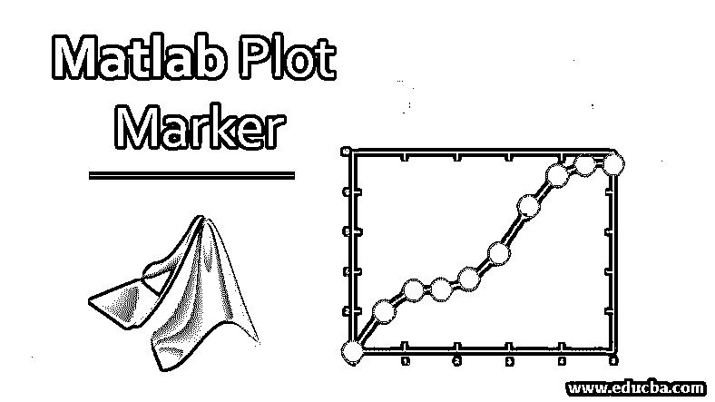
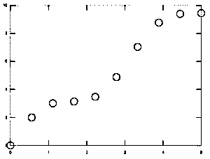
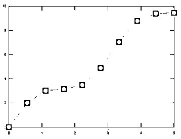

# Matlab 绘图标记

> 原文：<https://www.educba.com/matlab-plot-marker/>

## Matlab 绘图标记简介

图用于在没有任何关于变量性能的背景知识的情况下获得特定主题的知识。它们非常有助于不知情的观众做出决定。根据业务需求，可以使用多种类型的图。它们可以是条形图、折线图、散点图等。在图中使用标记来标识线之间的差异，或者突出显示在相应区域中进行分析时所需的线中的一些相关点。

### Matlab 标记在绘图中的应用

绘图中的标记可用于许多原因，如突出分析所需的一些重要点，或区分不同的点，以便他们可以用不同的印刷品和图案绘制它们。我们可以使用这个属性，同时在使用不同标记属性的输入参数中提到它。

<small>Hadoop、数据科学、统计学&其他</small>

**语法:**

`plot (a, b,’ name of the property’, ‘value’)`

这里 a 和 b 是我们在绘制任何图形时指定的输入。一般来说，我们使用 Marker 通过名称-值对来绘制线图，其中我们可以使用 Matlab 中的 plot()函数来绘制图形。

### Matlab 绘图标记示例

以下是 matlab 绘图标记的示例:

#### 示例#1

`a = linspace (0,5,10);
b= a*2+sin(2*a);
plot (a, b,’-o’)`

**输出:**

这将绘制一个线图，其中所有的点都以圆形格式标记，这通常称为圆形标记。如果我们在命令中没有指定线，那么输出将只是标记的形式，而不显示任何需要连接这些点的线。

#### 实施例 2

`a = linspace (0,5,10);
b= a*2+sin(2*a);
plot (a, b,’o’);`

**输出:**

我们可以指定标记的大小和颜色来显示标记的位置。我们可以使用名称-值对来改变这些属性，这些名称-值对描述了标记的属性以及各个属性所需的值。标记大小是用于指定点大小的属性，它始终为正值。标记边缘颜色是用于指定我们想要标记图形轮廓的颜色的属性。每种颜色都有自己独特的 RGB 三元组值，这也可以在论证中提及。

我们还可以在输入参数中提到颜色名称，以表示图中的变化。标记面颜色用于我们希望在绘图中给出的内部颜色。该属性也可以在输入参数中使用颜色名称或 RGB 三元组值来指定。标记颜色可以是红色、蓝色、绿色、青色、洋红色、黄色、黑色和白色。我们还可以通过指定必要的符号以及标记符号或形状来查看线条的属性，例如'-'是实线，这是默认线条，-'是虚线，':'是虚线，'-. '是点划线。

#### 实施例 3

`a = linspace (0,5,10);
b= a*2+sin(2*x);
plot (a, b,'-s','MarkerSize',5, ...
'MarkerEdgeColor','blue’, ...
'MarkerFaceColor',[1 .4 .4])`

**输出:**

在上面的例子中，我们使用了上一段中讨论过的所有三个属性。我们给定的标记尺寸为 5，标记边缘颜色为蓝色，最后一个属性标记表面颜色使用 RGB 三元组值指定。基于我们想要的强度，我们可以决定 RGB 三元组值，并在命令中提及它以获得想要的结果。

我们还可以根据需求控制标记的位置，这样我们就可以只在输入参数中提到的某些数据点显示标记。这可以通过使用 Matlab 中的标记指数属性来实现，该属性有助于在相关数据点中分布标记。例如:如果我们想在从第一个数据点开始的每第 5 个个数据点中显示标记，那么我们可以将其作为命令的输入，该命令将只显示相应位置的标记。我们还可以通过在“标记索引”属性中指定最大值和最小值来显示折线图中的最大值和最小值。请查看以下解释上述属性的示例。

在上述示例中，我们应用了查找函数来查找具有函数的输入中的最小值和最大值，然后在标记索引属性中应用这些变量来仅表示最大值和最小值点。如果我们想要恢复任何更改，我们还可以将标记的位置更改为默认位置。这也可以通过使用 Matlab 中的标记指数属性来实现，方法是描述从绘图起始点开始使用的变量的长度。

绘制线图时使用不同的标记符号，Matlab 支持这些标记符号，如“o”用于表示圆形标记，“*”称为星号标记被称为点标记，“+”被称为加号标记，“x”被称为十字标记，“s”被称为方形标记，“d”被称为菱形 marker,'^'被称为向上的三角形标记，“v”是向下的三角形，“>”被称为指向右边的三角形，“

### 结论

Matlab 中使用了标记图，标记图用于绘制线图和散点图，帮助我们区分几种情况下的各种数据点。它们用于业务分析，以了解数据的分布或了解与变量中的数据点相关的几个属性。

### 推荐文章

这是一个 Matlab 绘图标记指南。在这里，我们讨论了 Matlab 绘图标记的介绍，工作，语法和不同的例子。您也可以看看以下文章，了解更多信息–

1.  [Matlab 中的 3D 绘图](https://www.educba.com/3d-plots-in-matlab/)
2.  [MATLAB 中的热图](https://www.educba.com/heatmap-in-matlab/)
3.  [Matlab 免费](https://www.educba.com/matlab-free/)
4.  [Matlab 逻辑运算符](https://www.educba.com/matlab-logical-operators/)

