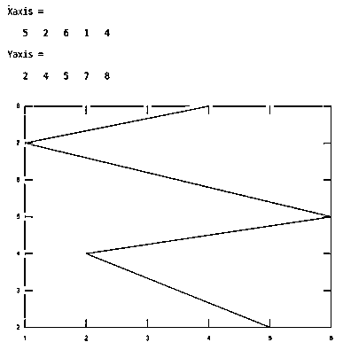
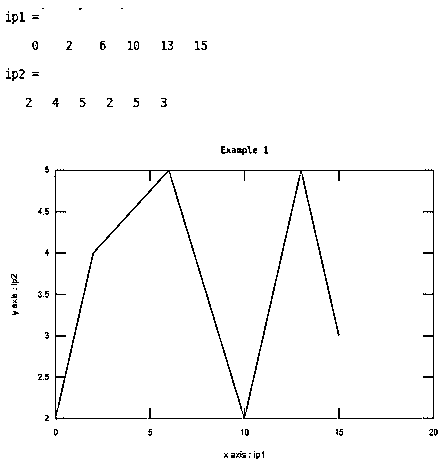
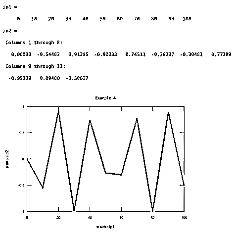
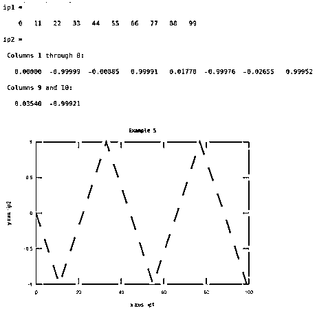
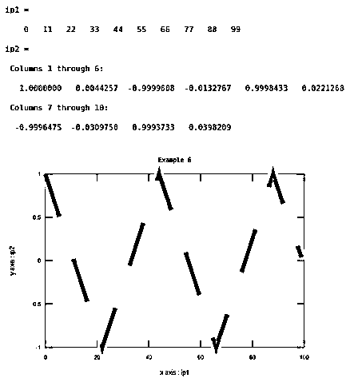
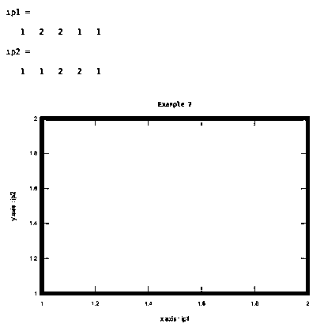

# Matlab 线宽

> 原文：<https://www.educba.com/matlab-linewidth/>

## Matlab 线宽介绍

Matlab 中有各种各样的直线运算，线宽是其中的一种运算。线宽用于调整(增加)任何对象的宽度。线宽操作主要在绘图操作内部执行。绘图操作用于以图形方式绘制输入和输出。我们可以把物体的宽度增加到任何程度。默认情况下，Matlab 中的线宽大小为“1”。有时在复杂的图形或图表中，输出会受到干扰或消失，在这种情况下，线宽起着重要的作用。该命令表示为“线宽”。在这个主题中，我们将学习 Matlab 线宽。

**语法—**

<small>Hadoop、数据科学、统计学&其他</small>

`Plot( x axis values, y axis values, ‘LineWidth’, value of width)`

示例—`plot(x,y,'LineWidth',1)`

### Matlab 线宽是如何工作的？

在 Matlab 中实现线宽命令的算法如下:

**步骤 1:** 接受两个输入来绘制图形

第二步:绘制图表

**第三步:**应用线宽命令

**第四步:**显示结果

### 例子

下面是 Matlab 线宽的例子

#### 示例#1

让我们考虑两个输入，即 x 轴和 y 轴。这里，第一个输入的值是 5，2，6，1，4，第二个输入的值是 2，4，5，7，8。并且线宽值是 1。这个例子如表 1 所示。

**代码:**

`Xaxis =[ 5 2 6 1 4] Yaxis =[2 4 5 7 8 ] plot(Xaxis , Yaxis ,'LineWidth', 1)`

**输出:**

让我们考虑两个输入:xaxis 和 yaxis。这里第一个输入的值是 0，2，6，1 0，1 3，1 5，第二个输入的值是 2，4，5，2，5，3。并且线宽值是 1。这个例子如表 2 所示。

**代码:**

`ip1=[ 0 2 6 10 13 15] ip2=[2 4 5 2 5 3] xlabel('x axis : ip1');
ylabel('y axis : ip2');
plot(ip1 ,ip2,'LineWidth',1)
title('Example 1')`

**输出:**

#### 实施例 2

让我们考虑两个输入:xaxis 和 yaxis。这里第一个输入的值是 0，2，6，1 0，1 3，1 5，第二个输入的值是 2，4，5，2，5，3。线宽值为 3。这个例子在表 3 中示出

**代码:**

`ip1=[ 0 2 6 10 13 15] ip2=[2 4 5 2 5 3] xlabel('x axis : ip1');
ylabel('y axis : ip2');
plot(ip1,ip2,'LineWidth',3)
title('Example 1')`

**输出:**

#### 实施例 3

让我们考虑两个输入:xaxis 和 yaxis。这里第一个输入的值是 0，2，6，1 0，1 3，1 5，第二个输入的值是 2，4，5，2，5，3。线宽值为 10。这个例子在表 3 中示出

**代码:**

`ip1=[ 0 2 6 10 13 15] ip2=[2 4 5 2 5 3] xlabel('x axis : ip1');
ylabel('y axis : ip2');
plot(ip1,ip2,'LineWidth',10)
title('Example 1')`

**输出:**

#### 实施例 4

让我们考虑两个输入:xaxis 和 yaxis。这里，第一个输入的值在 0 到 100 之间，步长为 10，第二个输入的值是正弦函数。线宽值为 3。这个例子在表 4 中示出

**代码:**

`ip1=0:10:100
ip2=sin(ip1)
xlabel('x axis : ip1');
ylabel('y axis : ip2');
plot(ip1,ip2,'LineWidth',3)
title('Example 4')`

**输出:**

#### 实施例 5

让我们考虑两个输入:xaxis 和 yaxis。这里，第一个输入的值在 0 到 100 之间，步长为 10，第二个输入的值是正弦函数。线宽值为 3。前面的例子和这个例子的区别在于宽度的模式。这个例子如表 5 所示。

**代码:**

`ip1=0:11:100
ip2=sin(ip1)
xlabel('x axis : ip1');
ylabel('y axis : ip2');
plot(ip1,ip2,'--','LineWidth',3)
title('Example 5')`

**输出:**

#### 实施例 6

在此示例中，第一个输入是从 0 到 100 的值范围，步长为 11。第二输入是相对于第一输入的余弦信号。此处线宽为 8，图案为虚线。

**代码:**

`ip1=0:11:100
ip2=cos(ip1)
xlabel('x axis : ip1');
ylabel('y axis : ip2');
plot(ip1,ip2,'--','LineWidth',8)
title('Example 6')`

**输出:**

#### 实施例 7

在本例中，输出是一个矩形对象。线宽是 8，宽度的颜色是红色，我们需要在程序中声明。否则，默认颜色是蓝色，就像前面的例子一样。

**代码:**

`ip1=[1 2 2 1 1] ip2=[1 1 2 2 1] xlabel('x axis : ip1');
ylabel('y axis : ip2');
plot(ip1,ip2,'LineWidth',8,'color','red')
title('Example 7')`

**输出:**

### 结论

如果程序的输出是一个特定的对象，那么线宽起着重要的作用，它给出了对象的正确视图。线宽基本上是用来增加宽度线的粗细。随着厚度，我们可以改变宽度的颜色和宽度的模式。

### 推荐文章

这是一个 Matlab 线宽指南。这里我们讨论在 Matlab 中实现线宽命令的算法，并给出例子和输出。您也可以看看以下文章，了解更多信息–

1.  [Matlab 中的数组](https://www.educba.com/arrays-in-matlab/)
2.  [Matlab 中的 3D 绘图](https://www.educba.com/3d-plots-in-matlab/)
3.  [Matlab 创建函数](https://www.educba.com/matlab-create-function/)
4.  [Matlab 中的循环](https://www.educba.com/loops-in-matlab/)
5.  [在 Matlab 中完成整形指南](https://www.educba.com/reshape-in-matlab/)
6.  [xlabel Matlab 示例](https://www.educba.com/xlabel-matlab/)

