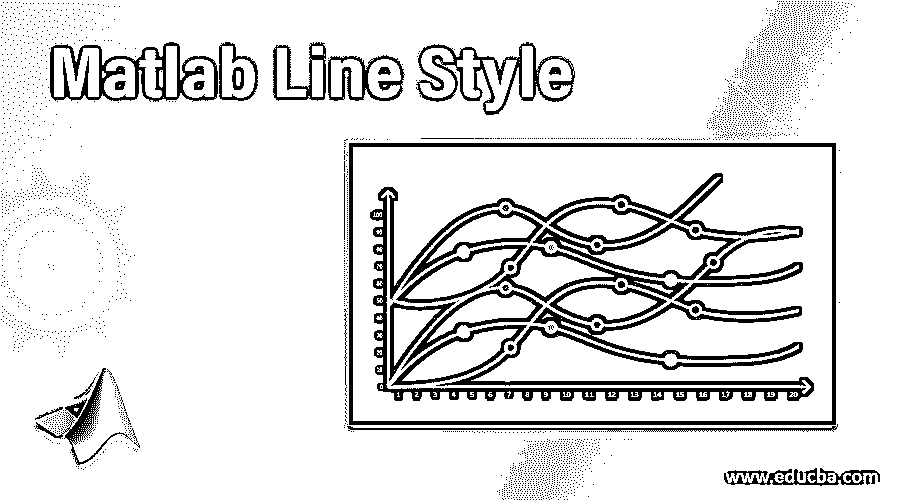
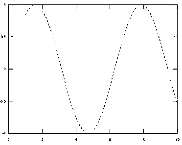
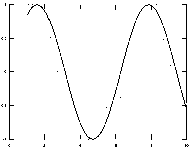
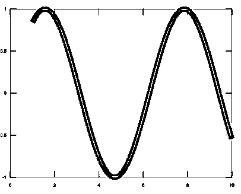

# Matlab 线条样式

> 原文：<https://www.educba.com/matlab-line-style/>

## Matlab 线条样式介绍

线形图或线形图用于绘制线条或显示本质上连续的特征变化。

**为** **举例:**显示某一时期公司的财务增长情况。通常，线图由水平 x 轴和垂直 y 轴组成。它们用于显示短期和长期的特征变化。Matlab 中还使用了折线图来显示某一段时间内特征的变化。在 Matlab 中，线图的各种属性都包含在 Line Style 下。

<small>Hadoop、数据科学、统计学&其他</small>

### 使用 Matlab 线条样式

Matlab 中的线条样式控制线条图中的所有属性，线条图用于修改线形图的外观。

可以使用以下语法或使用 plot 命令来更改它们:

`plot (First Feature, Second feature, Property name, Value of the property)`

线条样式更改颜色、线条样式、线条宽度、线条渐变、可见性和方向。

### Matlab 线条样式的属性

以下是 Matlab 线条样式下的属性:

#### 1\. Linestyle

它是可以改变线条样式的属性之一，有各种样式，如虚线、点线和实线。它们用于区分各种曲线。它们用于改变各种线条对象的样式，如表面参数线、箭头、二维和三维的不同曲线等。然而，生活方式不能用于改变轴线和不同网格线的线型。绘图中的轴始终显示为实线样式。

**举例:**

使用输入中提供的值显示虚线样式的使用。

`x=1:0.1:10;
plot(x, sin(x),"LineStyle",'--');`

**输出:**

在上面的例子中，给定函数的输出以虚线的形式显示。

#### 2.LinecolorType

改变线条的颜色是 Matlab 中线条样式的属性之一。默认情况下绘制的线条由属性 Line Color 设置，该属性通过将 LineColorType 属性设置为“Flat”来获得。

LinecolorType 有各种值，如下所示:

*   **双色线颜色类型:**该属性由线中的点定义，其颜色取决于高度值。线的最高点由 LineColor 属性决定，而最低点由 Linecolor2 属性定义。线中存在的其他点通过采用 RGB 颜色方案中的线性插值来绘制。
*   **单色线条颜色类型:**这里的颜色是从线条颜色到线条颜色属性的变暗部分的各种混合的混合物。
*   **扁平线条颜色类型:**没有任何混合，线条是在属性 Line Color 的帮助下绘制的。
*   **彩虹颜色类型:**这类似于双色线颜色类型，但结果效果与双色线颜色类型完全不同，因为点的线性插值发生在 HSV 颜色空间。该效果是彩虹效果的形式。
*   **函数颜色类型:**此处不考虑属性 LineColor 和 Linecolor2，颜色方案从 Linecolor 函数获得。如果没有给定颜色函数，则默认情况下线条颜色类型为“扁平”。

#### 3.行距

它是改变线条宽度的线条样式属性下的属性之一。它们用于改变各种线条对象的宽度，如表面参数线、箭头、二维和三维的不同曲线等。然而，生活方式不能用于改变轴线和不同网格线的线宽。宽度本质上应该是数字，并且以长度单位 mm 的形式给出。

#### 示例#1

显示折线图的线宽属性。

`x=1:0.1:10;
plot(x, sin(x),"LineWidth",2);`

**输出:**

#### 实施例 2

显示折线图的线宽属性。

`x=1:0.1:10;
plot(x, sin(x),"LineWidth",12);`

**输出:**

在上面的两个例子中，我们可以看到，当我们改变 Line Width 属性的值时，线条的宽度也随之改变。

#### 4.线可见度

它决定了可以设置为逻辑值 True 或 False 的线条的可见性。如果属性的值设置为 True，则线条将可见，否则不可见。VLinesVisible 和 ULinesVisible 决定在三维空间中绘制的表面上的坐标线的线的可见性。XLinesVisible 和 YLinesVisible 决定了三维空间中各种矩阵图和函数图上坐标线的线的可见性。该属性对坐标轴和网格线没有任何影响。

#### 5.线方向

如果 Line-color 类型的值实际上是双色的，则这是决定线条方向的另一个属性。如果一个图中有多个函数，并且结果图由单个图形中的多个线图组成，则根据线图顺序的线型顺序和线条颜色也可以在 ColorOrder 和 line style order 属性的帮助下决定。

### 结论

Matlab 线条样式下还有各种其他属性，用于改变线条图的外观。如果特征本质上通常是数字，并且它们随时间变化，则它们用于显示图。

### 推荐文章

这是一个 Matlab 线条样式的指南。在这里，我们讨论的介绍，与 MatLab 的线条样式和属性。您也可以看看以下文章，了解更多信息–

1.  [测井曲线 Matlab](https://www.educba.com/log-plot-matlab/)
2.  [Matlab 彗星()](https://www.educba.com/matlab-comet/)
3.  [Matlab 运算符](https://www.educba.com/matlab-operators/)
4.  [Matlab stem()指南](https://www.educba.com/matlab-stem/)
5.  [Optimset Matlab |如何工作？](https://www.educba.com/optimset-matlab/)
6.  [绘图矢量 Matlab |函数](https://www.educba.com/plot-vector-matlab/)
7.  [Matlab 图|示例](https://www.educba.com/matlab-figure/)

