# Matlab 正弦波

> 原文：<https://www.educba.com/matlab-sine-wave/>

## Matlab 正弦波简介

正弦波，也称为正弦波，是一种表示重复振荡的数学表达式。这是时间的函数。MATLAB 支持使用 2D 图函数生成正弦波。在本主题中，我们将学习 Matlab 正弦波。

正弦输入的一般语法可由下式给出:

<small>Hadoop、数据科学、统计学&其他</small>

`s(t)= A(sinBt+C)`

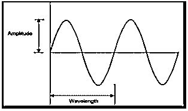

s(t)的正弦波图使用 plot()函数生成，如下所示:

`plot(s(t),t)`

其中“A”决定波的峰值，即振幅。

**举例**:

编写以下代码以生成振幅值为“1”的正弦波。

`t = 0:pi/100:2*pi;
st = sin(t);
plot(t,st)`

**输出**:

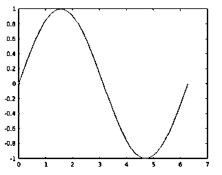

在实时应用中，正弦波输入形成为

`Asin(w*t+theta)`

或者

`Asin(2*pi*f*t+theta)`

其中:

| 英语字母中的第二十三个字母 | 决定波的角频率 |
| 希腊字母的第八字 | 决定频率的相位角 |
| 英语字母表中第六个字母 | 决定波的线性频率 |

**注:**角频率 w 和线性频率 f 的关系如下

`w=2*pi*f`

### Matlab 正弦波示例

下面举几个例子:

#### 示例#1

以下代码用于生成振幅值为“4”且角频率值为“5”的正弦波。

`t = 0:0.01:2;
w = 5;
a = 4;
st = a*sin(w*t);
plot(t,st);`

**输出**:

合成的正弦波在 0 到 2 的持续时间内显示，在第一半周期达到峰值振幅+4，在第二半周期达到峰值振幅-4，角频率为 5。

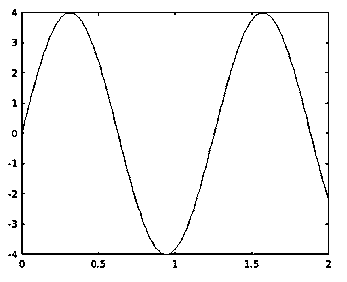

#### 实施例 2

以下代码用于生成振幅值为“1”且线性频率值为“10”的正弦波。

`f = 10;
t = 0:0.1:10000;
st = sin(2*3.141516*f*t);
plot(t,st);`

**输出**:

合成正弦波在 0 到 10000 的持续时间内显示，在第一个半周期达到峰值振幅+1，在第二个半周期达到峰值振幅-1，具有线性频率 10。

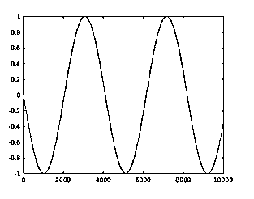

MATLAB 具有定制正弦波图的灵活性。这可以通过编辑 plot()函数的属性来实现。

1.  **xlabel:** x 轴标签生成。
2.  **Ylabel:** y 轴标签生成。
3.  **标题:**标题被添加到正弦波图中
4.  **轴方:**用户可以生成方波形式的正弦波。
5.  **轴相等:**用户可以为两个轴创建具有共同比例因子和空间的正弦波图
6.  **网格打开:网格线**为正弦波图启用

**举例:**

以下代码用于生成振幅值为“1”且线性频率值为“10”的正弦波。

`f = 10;
t = 0:0.1:10000;
st = sin(2*3.141516*f*t);
plot(t,st), xlabel('time-axis'), ylabel('st'), title('Sine wave'),
grid on`

**输出**:

合成正弦波在 0 到 10000 的持续时间内显示，在第一个半周期达到峰值振幅+1，在第二个半周期达到峰值振幅-1，具有线性频率 10。通过插入 xlabel 和 ylabel 的值以及图的标题来自定义图。

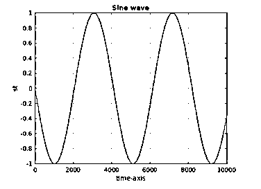

### 生成具有不同轴对的多个正弦波图

使用单个命令在同一布局中用不同的轴对生成多个正弦图的特征可以使用“子图”来应用。

**举例**:

开发以下代码以生成 2 个正弦波，其振幅值分别为 5 和 10，角频率值分别为 3 和 5。

`t = [0:0.01:5];
st = 5*sin(3*t);
subplot(1,2,1)
plot(x,y), xlabel('t'),ylabel('subplot 1')
st = 10*sin(5*t);
subplot(1,2,2)
plot(x,y),xlabel('t'),ylabel('subplot 2')`

**输出**:

结果图包含在同一布局中创建的两个不同的正弦图。第一个正弦波在布局的第一个单元中产生，振幅为 5，角频率为 3。在布局的第二单元中产生振幅为 10 且角频率为 5 的第二正弦波。

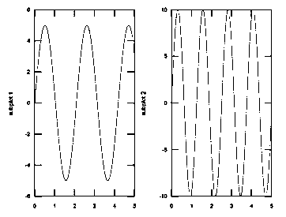

#### 1.呈现具有公共轴的多个正弦波

MATLAB 还支持显示共享一组公共轴的多个正弦波。这可以通过一个命令来实现，如下例所示。

**举例**:

代码片段的编写是为了在一个共用一对轴的公共平面上显示两个不同的正弦波。

`t = [0 :pi/10: 10];
st1 = 5*sin(t);
st2 = 10*sin(2*t+3);
plot(t,st1,t,st2,'.-'), legend('signal1', 'signal2')`

**输出:**

结果图包含一个振幅为 5、角频率为 1 的正弦波和另一个振幅为 10、角频率为 2、相移为 3 的正弦波。

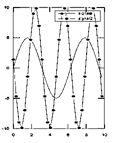

#### 2.创建正弦波函数的面积图

MATLAB 2d 绘图方法 area()可用于表示输入正弦波，曲线下的区域被填充。时间轴的第 n 个间隔处的曲线表示关于曲线的总高度的每个输入元素的相对份额。

**举例**:

以下代码为给定的正弦波输入生成面积类型图。

`t=[0:pi/100:2*pi];st=10*sin(5*t);area(st)`

**输出**:

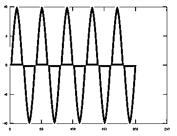

#### 3.创建正弦波函数的散点图

MATLAB 2d 绘图方法散点图()可用于将输入正弦波数据点表示为与“t”轴上的值相关的小圆圈。

**举例:**

`t=[0:pi/100:2*pi];st=10*sin(5*t);scatter(t,st)`

**输出:**

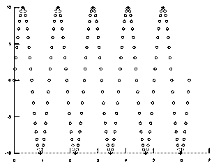

#### 4.为正弦波函数创建阶梯图

MATLAB 2d 绘图方法 stairs()可用于以在“t”轴上绘制的阶梯形式表示输入正弦波。

**举例:**

`t=[0:pi/100:2*pi];st=5*sin(5*t);stairs(t,st)`

**输出**:

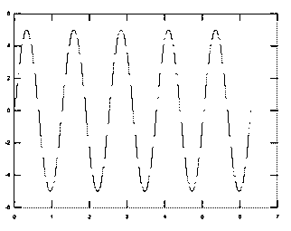

#### 5.为实时应用模拟生成正弦波

MATLAB 用于运行实时应用程序的模拟活动。来自应用的大多数信号本质上都是正弦信号。因此，利用 MATLAB 生成正弦波在 MATLAB 的仿真特性中起着重要的作用。

**举例**:

通过寄存器的电压和电流的关系如下

`Current i= voltage(v)/Registance(r)`

以下示例演示了从电压输入中提取电流值，并代表了两种信号。

`t = 0:pi/100:2*pi;r=10;v=20*sin(5*t);i=v./r;plot(t,v,t,i)`

**输出**:

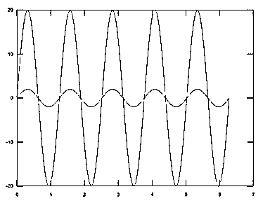

### 结论

使用 plot 函数生成正弦波信号是 MATLAB 的关键特性之一，这使它能够准确而精确地运行许多实时函数的仿真过程。正弦波显示定制的灵活性是其适用性的一个重要补充。

### 推荐文章

这是一个 Matlab 正弦波指南。这里，我们将讨论如何利用不同的轴对生成多个正弦波图，并给出示例。您也可以看看以下文章，了解更多信息–

1.  [Matlab 绘图标记](https://www.educba.com/matlab-plot-marker/)
2.  [Matlab 中的 Simulk 是什么](https://www.educba.com/what-is-simulink-in-matlab/)
3.  [Matlab stem()](https://www.educba.com/matlab-stem/)
4.  [Matlab 线条样式](https://www.educba.com/matlab-line-style/)

