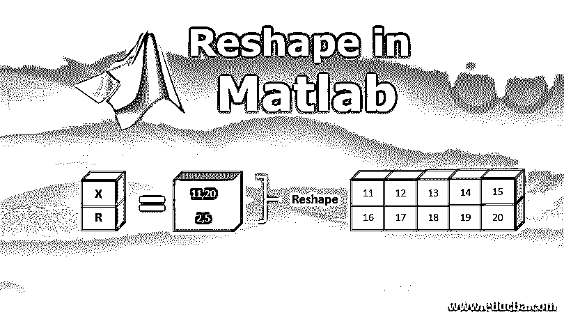
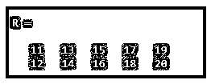
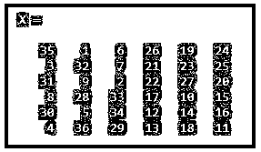
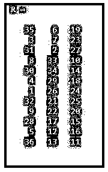
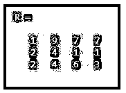
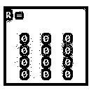

# 在 Matlab 中整形

> 原文：<https://www.educba.com/reshape-in-matlab/>

## Matlab 中的整形介绍

整形函数用于为具有指定行数和列数的数组提供新的形状。经过整形的数组应该与原始数组兼容。在 [Python 和 Matlab](https://www.educba.com/python-vs-matlab/) 中都使用它来执行数组中的各种操作。重塑数组后，它会相应地调整内存分配。整形可以是增加或减少阵列尺寸的形式。这些函数在许多领域都有应用，如数据科学或图像修改等。

### Matlab 中整形函数的使用

使用一维或二维数组可以执行许多操作。Matlab 中的 Reshape 函数用于将原始或现有的数组修改成不同维度或顺序的不同数组。

<small>Hadoop、数据科学、统计学&其他</small>

Matlab 中使用了各种语法，例如:

`R=reshape (X, size)`

该函数用于将 X 的原始矩阵整形为 R，其大小在向量“size”中定义。向量应该包含至少两个元素。

例如，如果它的 reshape (X，[1，3]):它会将 X 整形为一个 1 乘 3 的矩阵。

`R=reshape (X, size 1, size 2…. size n)`

此函数用于将整形为指定的尺寸，其中尺寸 1、尺寸 2 表示每个尺寸存在。我们可以将 dimension 指定为[]，它将自动计算维度，使得整形后的数组中的元素数与输入数组中的元素总数相匹配。输入数组，即“X”可以是向量、矩阵或多维数组，支持的数据类型有 single、double、int16、int8、int32、int64、unit8、uint16、unit32、unit64、char、string、logical、date time、duration。它也支持复数。

结果数组的大小应该用一个整数向量来指定，并且大小应该是这样的，元素的数量应该与原始数组相同。我们应该提供至少 2 个尺寸，如果最多有一个尺寸，那么它们可以指定为[]。输出或结果应该是向量、矩阵、多维数组和单元数组。经过整形的数组中的数据类型和元素数量应该始终与原始数组中的数据类型和元素数量相同。整形后的数组支持的数据类型有 single、double、int16、int8、int32、int64、unit8、uint16、unit32、unit64、char、string、logical、date time、duration。我们还可以重塑 Matlab 中的符号数组。

这些有不同的语法:

`R=reshape (X, y1, y2)`

这用于返回 y1 乘 y2 矩阵，该矩阵的元素数量与 X 的元素数量相等。结果矩阵中的元素是从给定的数组“X”中按列获取的。

`R=reshape (X, y1, y2…yn)`

这用于返回 y1 by …yn 矩阵，该矩阵的元素数量与 X 的元素数量相同。结果矩阵中的元素是从给定的数组“X”中按列获取的。在上面的语法中，输入数组是 X，它可以是符号向量、符号矩阵或符号多维数组。y1 和 y2 表示由逗号分隔的整形后的矩阵的维数，并且元素的数量应该与原始数组的数量相同。

例如，reshape(X，2，3)将整形后的数组作为 2 乘 3 的矩阵。如果有更多的维度，那么它们以同样的方式表示。

例如:shape(X，2，3，3)产生一个 2 乘 3 乘 3 的矩阵。

### Matlab 中的整形示例

以下是 Matlab 中的整形示例:

#### 示例#1

将一个 11:20 的矢量整形为一个 2 乘 5 的矩阵

`X = 11:20;
R = reshape(X,[2,5])`

**输出:**

#### 实施例 2

用输入参数中指定的列数来改变矩阵的形状。

`X = magic(6)`

**输出:**

在将上述矩阵的列数指定为 3，并给定[]而不是总行数之后，它会自动计算行数。应用所需功能后，请找到下面的矩阵:

`R = reshape(X,[],3)`

**输出:**

整形后的矩阵是 12×3 的矩阵，具有 12 行和 3 列，具有与原始阵列 X 相同数量的元素，即 36 个。

#### 示例 **#3**

将一个矩阵改造成 3 乘 4 的矩阵。

`X = [1 2 4 7 6 1; 2 9 4 1 7 3];
R = reshape(X,3,4)`

在将上面的矩阵改造成一个 3x 4 的矩阵后，我们得到了想要的矩阵，它的元素数量与原始数组的元素数量相同。

**输出:**

#### 实施例 4

对多维数组使用整形函数，并将它们转换成 4×3 的矩阵。输入数组是一个 2 乘 3 乘 2 的多维数组。

`X = zeros(2,3,2);
R = reshape(X,4,3)`

**输出:**

### 结论

整形函数用于人工智能、数据科学、图像压缩、图像扩展等。部门。无论是在 Matlab、R 还是 Python 中，理解 reshape 函数的工作原理都是很重要的，以便根据业务需求以期望的数组大小执行操作。如果输出和输入数组中的元素数量相同，则它们用于改变数组的维数，无论它是一维的还是多维的。

### 推荐文章

这是一个在 Matlab 中重塑的指南。这里我们分别用不同的例子来讨论 matlab 中整形函数的基本概念和工作原理。您也可以看看以下文章，了解更多信息–

1.  [NumPy 是什么？](https://www.educba.com/what-is-numpy/)
2.  [MATLAB 中的 3D 矩阵](https://www.educba.com/3d-matrix-in-matlab/)
3.  [C 中的多维数组](https://www.educba.com/multidimensional-array-in-c/)
4.  [NumPy 数组函数](https://www.educba.com/numpy-array-functions/)
5.  [Matlab 彩条标签指南](https://www.educba.com/matlab-colorbar-label/)
6.  如何使用 Matlab 细胞阵列？

