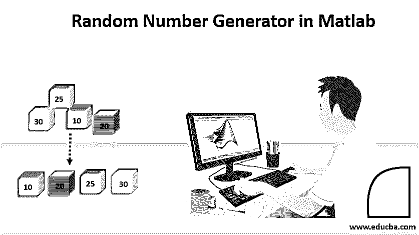

# Matlab 中的随机数生成器

> 原文：<https://www.educba.com/random-number-generator-in-matlab/>

## 什么是随机数生成器？

在了解 Matlab 中的随机数生成器之前，让我们先来研究一下什么是随机数生成器。随机数生成器是在没有任何决策或明显模式的情况下创建的随机数。在不同的应用中，MATLAB 有多种生成随机数的方法。它在许多编程语言中用于生成指定范围内的随机值。每种语言使用不同的函数。它们主要用于计算机科学领域、研究和统计相关的工作。

### Matlab 中的随机数生成器

在 MATLAB 中，使用 rand、randi 和 randn 等各种函数生成伪随机数。MATLAB 中的每个函数都有不同的用途，如下所示:

<small>Hadoop、数据科学、统计学&其他</small>

*   **rand:** 该函数用于生成均匀分布的随机值。
*   **randi:** 该函数用于生成正态分布的伪随机值。
*   **randn:** 该函数用于生成正态分布的随机值。
*   **randperm:** 用于创建置换的随机值。
*   **rng:** 控制随机数的生成
*   **RandStream:** 这是用于随机数的流。

rand、randn、randi 和 randperm 主要用于创建随机值数组。

### Matlab 中随机数生成器的函数

下面是 MATLAB 中用于不同目的的函数，如下所示:

#### 1.边缘

rand 函数用于分布均匀的情况，并且总是生成 0 到 1 之间的实数。它由函数 rand()表示。

**举例:** `a=rand(100,1)`

上面的例子解释了 a 是一个 100 乘 1 的列向量，它包含来自均匀分布的数字。包含 0 到 1 之间的值。这个图通常是平的，因为它是由均匀分布绘制的。

rand('state ')返回生成器的当前状态。我们还可以使用下面的代码来更改生成器的状态:

*   **rand('state '，s):** 重置为状态 s。
*   **rand('state '，0):** 将发电机设置为初始状态。
*   **rand('state '，k):** 对于 k 的任何值，它将发电机设置为其第 k 个状态。
*   **rand('state '，sum(100*clock)):** 每次都会重置为不同的状态。

#### 2.兰迪

此函数返回从离散和均匀分布中抽取的双整数。它是用 randi()表示的

**举例:** `b= randi(1,1000,100)`

这里 b 包含从 1 到 100 范围内的均匀分布中抽取的整数。结果集的图形通常是平坦的，因为它返回均匀分布的数字。

#### 3\. randn

该函数返回正态分布的整数。使用函数 randn()进行标注。结果集的图形遵循具有平均值 0 和标准偏差 1 的正态分布。

**举例:** `c=randn(100,1)`

randn('state ')返回生成器的当前状态。我们还可以使用下面的代码来更改生成器的状态:

*   randn('state '，s):它重置为状态 s
*   randn('state '，0):将生成器设置为初始状态
*   randn('state '，k):对于 k 的任何值，它将生成器设置为其第 k 个状态。
*   randn('state '，sum(100*clock)):它每次都重置为不同的状态。

#### 4\. randperm

该函数返回唯一值的数组。randi 和 randperm 的主要区别在于，randi 包含一个可以重复的值数组，而 randperm 包含一个唯一的整数数组。它是用 randperm()表示的。

**举例:** `d= randperm(20,10)`

这是一个 1 乘 10 的数组，包含范围在[1，20]内的整数。

### 随机数的函数生成

还有各种函数用于控制随机数的生成。请参考以下内容:

*   **rng (seed)** :它为随机数的生成播种，这样它就能产生可预测的随机数。
*   **rng (shuffle):** 这将根据当前时间生成随机数。因此，它在调用 rng 函数后生成数字。
*   **rng ('default'):** 该函数用于将 rand、randn、randi 函数使用的设置设置为默认状态。
*   **scurr:** 返回 rand，randn，randi 函数当前使用的设置。
*   **rng(s):** 恢复 rand，randn，randi 函数中用于创建随机数的设置。

### 结论–Matlab 中的随机数生成器

随机数生成在现实生活中有很多非常实用的应用。它们主要用于身份验证或安全目的。各种老虎机、气象学和研究分析遵循随机数生成器方法来生成各种实验的结果。因此，实际了解随机数产生的背景对于更好地理解随机数的应用是很重要的。

### 推荐文章

这是一个 Matlab 中的随机数生成器指南。这里我们详细讨论 Matlab 中随机数生成器的各种函数。您也可以浏览我们的其他相关文章，了解更多信息——

1.  [Matlab 简介](https://www.educba.com/introduction-to-matlab/)
2.  [Python 中的随机数生成器](https://www.educba.com/random-number-generator-in-python/)
3.  [反转 C 中的数字](https://www.educba.com/reverse-number-in-c/)
4.  [R 中的随机数发生器](https://www.educba.com/random-number-generator-in-r/)
5.  [c#中的随机数生成器|函数|示例](https://www.educba.com/random-number-generator-in-sharp/)
6.  [Matlab 编译器的应用](https://www.educba.com/matlab-compiler/)
7.  [Java 中的数字模式|前 14 个例子](https://www.educba.com/number-patterns-in-java/)

