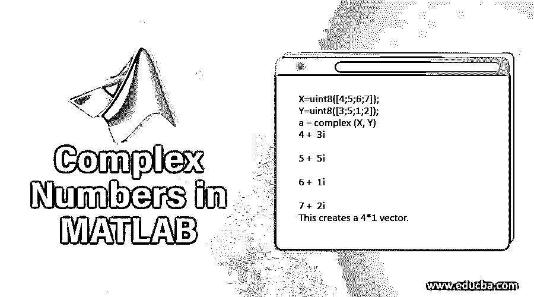

# MATLAB 中的复数

> 原文：<https://www.educba.com/complex-numbers-in-matlab/>

## MATLAB 中的复数介绍

复数是实数和虚数的组合，形式为 p+qi 其中 p 和 q 是实数，I 是虚数。定义了一个虚数，其中 I 是 a^2=-1.方程的结果我们可以用 I 或 j 来表示虚数单位。因为复数用于任何数学计算，而 Matlab 主要用于执行数学计算。所以，复数是学习 Matlab 的重要部分。

### MATLAB 中复数的生成

复数可以在 Matlab 中使用“复数”函数创建或声明。我们也可以通过求任何负数的平方根来创建复数。在 Matlab 中，我们可以用 I 或 j 来表示复数的虚部。

<small>Hadoop、数据科学、统计学&其他</small>

#### 例子

X= 4+5i

这里 X 是一个复数，它包含两个部分，即实部和虚部。4 是实部，5 是虚部。我们可以使用 Matlab 中的函数找到实部和虚部[。](https://www.educba.com/matlab-functions/)

*   a=实数(X) = 4(这给出了复数的实数部分)
*   b= imag(X)= 5(这给出了复数的虚部)
*   complex (6，7) = 6+7i(此函数用于创建复数)

我们还可以在 Matlab 中创建复杂的[数组，也可以使用复杂的函数来声明。](https://www.educba.com/arrays-in-matlab/)

*   a =复数(x，y)

x 和 y 有一定的条件，我们应该遵守，比如 x 和 y 不应该是单精度或双精度的。如果两个输入本质上是标量的，

*   X=复数(5，3)
*   X= 5.0000+3.0000i

类似地，如果我们有两个输入作为向量，则可以创建一个复向量。

*   X=uint8([4;5;6;7]);
*   y = uint 8([3；5;1;2]);
*   a =复数(X，Y)

4 + 3i

5 + 5i

6 + 1i

7 + 2i

我们可以创建一个只有一个标量的复数，

*   X =复数(10)
*   X= 10.0000+0.0000i

输入和输出参数应该遵循某些条件，

输入参数包含实部和虚部像 x any y. x 和 y 应该是标量，向量，多维数组或者 MATLAB 中的[矩阵。](https://www.educba.com/matrix-in-matlab/) x 和 y 尺寸应该相同。它们应该是相同的数据类型，但也有一些例外，如 double 可以与 single 一起使用，integer 可以与 double(标量)组合使用。

根据输入参数，数组的输出可以是向量、标量、矩阵或多维数组。输出的大小应该与输入的大小相同。如果输入参数的数据类型不同于确定输出的数据类型，

*   如果任一输入参数本质上是单一的，那么输出也应该是单一的。
*   如果任一输入参数本质上是整数，那么输出应该是整数数据类型。

我们可以通过使用 is real 函数来检查矩阵是实的还是虚的。

**代码:**

`X = [2+i,1];
Isreal(X)`

**输出:**

**代码:**

`Isreal (X (2))`

**输出:**

为了提取实部和虚部，我们可以使用 Matlab 中的实部和 imag 函数，

**代码:**

`real(X)`

**输出:**

**代码:**

`imag(X)`

**输出:**

### MATLAB 中复数的运算和函数

在 Matlab 中，有几个运算和函数可以使用复数来执行，比如

1.  **abs:** 该函数用于以 p+qi 的形式求任意复数的模。ABS(2+3i)= 2^2+3^2 的平方根= (13) ^0.5
2.  **角度:**求复数的相角。

要在 Matlab 中正确运行复数，需要遵循一些技巧，

*   我们应该避免使用 I 和 j 作为任何变量名的一部分，因为它们用于表示复数的虚部。
*   如果虚部是 1，我们应该避免使用 j 或 I。相反，我们可以使用 1j 或 1i。
*   当 I 和 j 在某部分用作变量名，输入参数不是单精度或双精度类型，虚部为零时，我们可以在 Matlab 中创建一个复函数。

### 结论

复数用于数学或工程领域。许多现实生活或实际应用都可以用复数的虚部来描述。因此，理解复数在各种平台中的使用和应用是非常重要的，尤其是当你处理任何物理或数学领域时。

### 推荐文章

这是一个 MATLAB 中的复数指南。这里我们讨论 matlab 中的简介和复数生成，包括它的操作和函数的例子。你也可以看看下面的文章来了解更多-

1.  [如何用 R 写函数？](https://www.educba.com/functions-in-r/)T3】
2.  [在 MATLAB 中创建 3D 矩阵](https://www.educba.com/3d-matrix-in-matlab/)
3.  [四大 MATLAB 函数](https://www.educba.com/matlab-functions/)
4.  [MATLAB 版本的特点和优势](https://www.educba.com/matlab-version/)
5.  [Matlab 梯度示例和语法](https://www.educba.com/matlab-gradient/)

