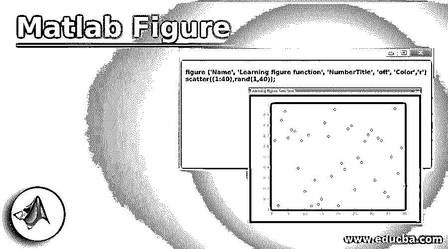
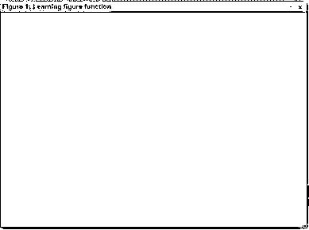
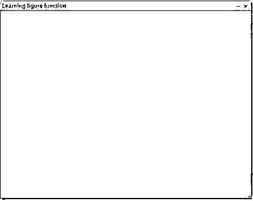
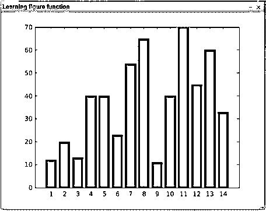
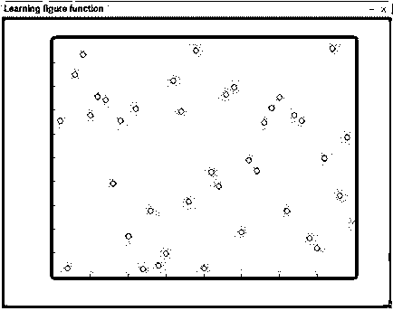

# Matlab 图形

> 原文：<https://www.educba.com/matlab-figure/>

## Matlab 图形介绍

MATLAB 为我们提供了大量的功能，在各种计算问题中非常有用。除了它的计算能力，MATLAB 也是一个很好的可视化工具。它为我们提供了绘制各种图表的能力。除了在控制台中显示图形输出，MATLAB 还可以在单独的窗口中显示图形输出。为了实现这一点，我们需要在 MATLAB 中使用图形函数创建一个“图形对象”，我们将在本文中学习。

**图功能，MATLAB**

<small>Hadoop、数据科学、统计学&其他</small>

为了创建图形对象，MATLAB 创建了一个单独的窗口。这个新窗口的特征可以使用指定为参数的图形属性来控制(关于自定义属性，请参考文章末尾)。

### 自定义属性表

以下是自定义属性的表格:

| **属性** | **描述** | **值/秒** |
| **[颜色](http://www.ece.northwestern.edu/local-apps/matlabhelp/techdoc/ref/figure_props.html#Color)** | 要设置背景颜色 | [预](http://www.ece.northwestern.edu/local-apps/matlabhelp/techdoc/ref/colorspec.html)-自定义颜色代码
默认:根据配色方案 |
| **[菜单栏](http://www.ece.northwestern.edu/local-apps/matlabhelp/techdoc/ref/figure_props.html#MenuBar)** | 打开/关闭菜单栏 | 无，图
默认:图 |
| **[名称](http://www.ece.northwestern.edu/local-apps/matlabhelp/techdoc/ref/figure_props.html#Name)** | 要设置标题 | 字符串
默认值:“(空字符串) |
| **数字标题** | 显示图号 | 开、关
默认:开 |
| **[调整大小](http://www.ece.northwestern.edu/local-apps/matlabhelp/techdoc/ref/figure_props.html#Resize)** | 使用鼠标调整图形窗口的大小 | 开、关
默认:开 |
| **[选择高亮](http://www.ece.northwestern.edu/local-apps/matlabhelp/techdoc/ref/figure_props.html#SelectionHighlight)** | 为了突出该图 | 开、关
默认:开 |
| **[可见](http://www.ece.northwestern.edu/local-apps/matlabhelp/techdoc/ref/figure_props.html#Visible)** | 使图形可见/不可见 | 开、关
默认:开 |
| **[窗口样式](http://www.ece.northwestern.edu/local-apps/matlabhelp/techdoc/ref/figure_props.html#WindowStyle)** | 正常/模态窗口 | normal, modal默认:正常 |

### 句法

`figure (Name, Value)`

我们将首先理解 figure 函数最简单的形式，我们将创建一个 figure &指定属性“Name”。对于这个例子，我们将传递“名称”属性作为“学习图形函数”

### 实现 Matlab 图形的例子

以下是提到的一些例子:

#### 示例#1

这是我们的输入和输出在 MATLAB 控制台中的样子:

**代码:**

`figure ('Name', 'Learning figure function')`

**输出:**

**解释:**在得到的输出中我们可以观察到，我们得到了一个新的窗口作为图形对象，我们的图形的名称是我们传递的“学习图形函数”。另外，请注意图名前的“Figure 1 ”,这是 MATLAB 的默认属性。然而，我们可以摆脱这一点。

#### 实施例 2

让我们来学习一下没有图号怎么取名字。为此，我们需要将 figure 函数的“Numbertitle”属性保持为“off”。这是我们的输入和输出在 MATLAB 控制台中的样子:

**代码:**

`figure('Name', 'Learning figure function','NumberTitle','off');`

**输出:**

**Note:** In the output that we have obtained a new window without the figure number.

#### 实施例 3

接下来，我们将学习如何在图形对象中获取图形。为了在新窗口中获得图形，我们首先如上所述创建图形对象，然后编写语法来创建所需的绘图。默认情况下，MATLAB 将绘图分配给最新创建的图形对象。

在我们的示例中，我们将在 figure 对象中创建一个条形图。

X = [12，20，13，40，40，23，54，65，11，40，70，45，60，33][创建条形图的输入数组]

这是我们的输入和输出在 MATLAB 控制台中的样子:

**代码:**

`X = [12, 20, 13, 40, 40, 23, 54, 65, 11, 40, 70, 45, 60, 33] figure ('Name', 'Learning figure function','NumberTitle','off')
bar (X)`

**输出:**

#### 实施例 4

如我们所见，我们的输出条形图位于一个新窗口中，其名称与我们传递的名称相同。我们还可以使用 figure 函数的“颜色”属性来更改新窗口的背景。让我们学习如何做到这一点。

在我们的示例中，我们将“颜色”属性设置为“c ”,这是青色的预定义颜色代码。

**Note:** In the above line of code that we have set the ‘Color’ property as ‘c’ to get Cyan color

这是我们的输入和输出在 MATLAB 控制台中的样子:

**代码:**

`X = [12, 20, 13, 40, 40, 23, 54, 65, 11, 40, 70, 45, 60, 33] figure ('Name', 'Learning figure function','NumberTitle','off', 'Color', 'c')
bar (X)`

**输出:**

**解释:**因此，我们现在有了青色的输出窗口。

#### 实施例 5

让我们再举一个例子，我们将使用图形功能在一个新窗口中创建一个散点图。对于这个例子，我们将得到红色的背景。

散点图((1:40)，和(1，40))；[使用随机值创建散点图]

如前所述，默认情况下，MATLAB 将在创建的 figure 对象中绘制图形。这是我们的输入和输出在 MATLAB 控制台中的样子:

**代码:**

`figure ('Name', 'Learning figure function', 'NumberTitle', 'off', 'Color','r')
scatter((1:40),rand(1,40));`

**输出:**

**解释:**正如我们在输出中看到的，我们在一个新窗口中用红色创建了散点图。

### 结论

如果我们想在一个单独的窗口中创建我们的图，可以使用 MATLAB 中的 figure 函数。我们可以使用 figure 函数的属性来控制新窗口的外观。

### 推荐文章

这是一个 Matlab 图形指南。在这里，我们讨论了 Matlab 图形介绍，自定义属性表，语法，代码和输出的例子。您也可以浏览我们的其他相关文章，了解更多信息——

1.  [Matlab 绘图圆](https://www.educba.com/matlab-plot-circle/)
2.  [Matlab 中的嵌套循环](https://www.educba.com/nested-loop-in-matlab/)
3.  [Matlab 中的颜色图](https://www.educba.com/colormap-in-matlab/)
4.  [Matlab 中的颜色](https://www.educba.com/colors-in-matlab/)

