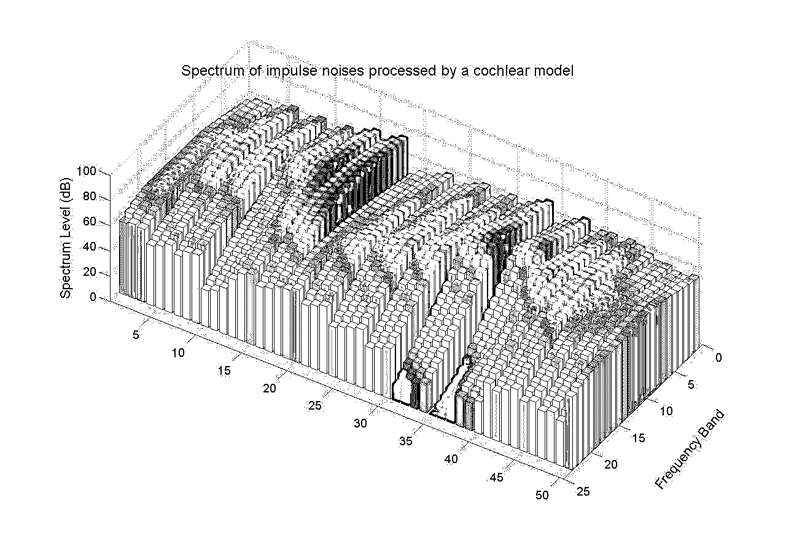
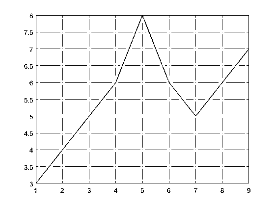

# MATLAB 技术计算

> 原文：<https://www.educba.com/matlab-technical-computing/>

 

## MATLAB 技术计算简介

**简单易学 MATLAB 技术—**在我进行技术计算部分之前，究竟什么是 MATLAB？它代表矩阵实验室。它由 Mathworks 开发，是第四代编程语言。当我是一个初学者，我想学习 MATLAB，我不知道它是什么。我一直以为那会是某种实验室，你可以在那里做一些测试之类的事情。

我没有完全正确，但我也没有错。这是一个计算环境。它是一种类似于其他语言的编程语言，但又不完全相同。让我们更深入地探讨一下，看看它到底是什么，它的目的是什么。

<small>Hadoop、数据科学、统计学&其他</small>

### MATLAB 是什么？

MATLAB 类似于 Python 和 Ruby，是一种高级编程语言。它有自己的交互环境。如果你学过 python，那么你就知道解释器是如何工作的。和那个没多大区别。但是，它比 python 庞大得多。它有助于您集中精力让您的想法步入正轨，并从虚拟化转化为现实。它的社区非常广泛，并且有一个发展良好的计算引擎。

在这里，你不仅可以将你的想法付诸实践，还可以通过在他们的网站上分享，与世界各地的许多研究人员分享。如果你不确定它是如何工作的，或者对此有一些疑问，你可以上传你的项目，在那里庞大的社区可以帮助你调试你的应用程序。它在图像处理、代数和信号处理以及控制系统领域也有一个庞大的图书馆。

### 功能和开发

如果我们谈论速度，那是另一回事。但是如果我们谈论代码处理和调试，这在 MATLAB 中是非常容易的。使用多核处理器、集群和图形处理单元来加快工作速度。它可以自动生成 C 相关代码，并根据 MATLAB 算法进行编译。如果这还不够，它还可以部署自己的组件。

它利用了我们机器的全部计算能力。代数和数值函数可以在多线程的基础上运行。这是所有 MATLAB 技术计算的默认设置。但是，您也可以根据需要进行配置。图像和信号处理等许多功能都是自动多线程的。此外，您可以运行多个 MATLAB 技术计算引擎，并并行执行它们，这样您就可以更加自由地控制并行性和多线程。

此外，您不仅可以使用多线程，还可以使用并行处理，利用一些知识，您甚至可以使用多台机器通过分布式服务器计算来处理这些信号。我不会再深入这个话题了。但这需要一些编程方面的高级知识，才能让 MATLAB 有效工作。

### MATLAB 编译器

[MATLAB 编译器](https://www.educba.com/matlab-compiler/)的 SDK 为您提供了从自己的程序中构建 C 和 C++共享库、点网程序集、其他 Java 和 Python 包的功能。稍后可以将它们编译成一个，然后部署到桌面或 web 应用程序中。它还包括一个用于产品服务器版本的开发工具包，用于代码调试和测试。它还内置了 Excel 插件，用于在将它们部署到其他应用程序之前进行调试。

### MATLAB 技术和数学

MATLAB 提供了许多数学函数。它有大量的数值计算方法，包括编码算法、分析数据结构和编写模型的方法。MATLAB 技术的重要功能使用高效优化的库，并使用核心处理器执行矩阵和向量的快速计算。

它在数学方面支持以下内容:

1.  初等数学，如离散数学、指数运算、三角学和类似的数学
2.  随机种子和分配算法
3.  线性代数方程，矩阵的分解和分析
4.  函数优化和约束问题
5.  数据插值
6.  积分和微分数值和非数值方程
7.  稀疏矩阵和重新排序算法
8.  计算几何学
9.  分析和数字滤波
10.  有向/无向图和网络算法

### 其他用途

这些只是数学方面的。除此之外，人们还可以使用计算 MATLAB 技术来构建图形用户界面、动画、电子表格计算、高级软件开发等等。

图形功能包括 2D，三维功能绘图，以虚拟可视化的数据和显示结果。用户可以选择交互定制这些图，也可以选择编程定制。几个例子是改变轴值位置和标签，或者在高度上显示彩色 3d 条和突出显示特定的形状级别。

以下是图形条的一个著名示例:

 

这只是音频处理、电平以及分析频谱和频带的一个基本示例。

与编程一样，MATLAB 可用于循环、分支和条件语句的控制流。它通过 MATLAB 搜索路径支持文件和函数操作。它有一个内置的代码编辑器，可以用来调试程序和问题。它在执行各种功能、确定保护源代码的依赖关系以及类似的事情方面效率极高。

以下是矩阵图形计算的基本示例:

对于这个例子，我将创建一个包含 9 个数字元素的简单向量，称为 y

`*y = [3 4 5 6 8 6 5 6 7]*`

现在，我们将从向量 y 中的每个元素中减去 3，所以，假设新的向量是 x。

`*x = [1 2 3 4 6 4 3 4 5]*`

现在，让我们创建一个图表。这其实很容易。我们还会用网格线画出矢量 x 和 y 的结果。所以，代码应该是:

`*plot(y)*`

`*grid (on)*`

现在，图表看起来像这样:

 

这里故意把 x 轴称为元素 as，把 y 轴称为元素 y，以便于理解。另一个例子，我可以给你一个初学者的部分如下:

人们可以用下列格式写矩阵:

`*A = [2 5 10; -3 4 9; 11 2 7]*`

*T2`B = [3 -7 -9; 7 4 0; 1 -8 6]`*

这将给 A 和 B 分配给定的矩阵。要将它们相乘并得到答案，可以执行以下操作:

`*C = A*B*`

给出的答案是:

`*C = [51 -74 42; 28 -35 81; 54 -125 -57]*`

你还可以计算更多的问题，比如:

`*B = A’*`

`*C = A .* B*`

`*OR*`

`*eig(A)*`

### 结论

这只是我刚开始学 MATLAB 时用的几个例子。这很容易，即使你是初学者，也会让你进步。但是，当我开始使用 MATLAB 时，我已经知道了 C，C++和 Python。所以，你的情况可能不一样。但是 MATLAB 似乎有很强的基础，学习它绝对不会浪费时间。

第一张*图片来源:pixabay.com*

### 推荐文章

这是 MATLAB 技术计算的指南。这里我们讨论了基本概念、编译器、功能和开发，以及其他用途。您可以阅读以下文章了解更多信息——

1.  [数据科学应用](https://www.educba.com/data-science-applications/)
2.  [数据科学生命周期](https://www.educba.com/data-science-lifecycle/)
3.  [数据科学机器学习](https://www.educba.com/data-science-machine-learning/)
4.  [数据科学技术](https://www.educba.com/data-science-techniques/)

