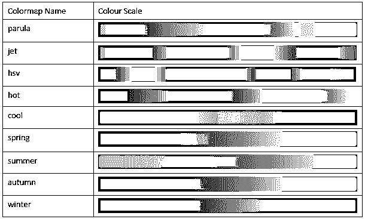
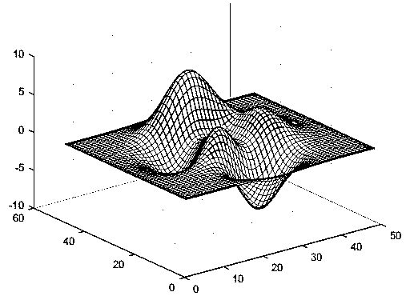
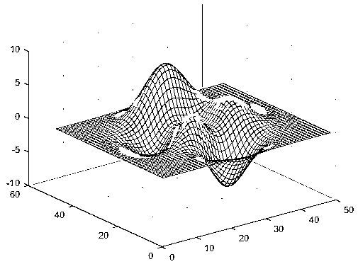
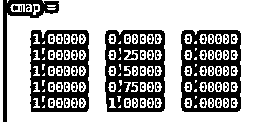
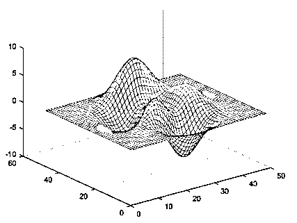

# Matlab 中的色彩映射表

> 原文：<https://www.educba.com/colormap-in-matlab/>

## MATLAB 中的色彩映射表介绍

MATLAB 或 Matrix Laboratory 是 MathWorks 开发的一种编程语言。这种强大的语言在技术计算中很有用。MATLAB 为我们提供了一个方便的环境，可以用来集成矩阵运算、绘制数据和函数、实现算法、创建用户界面等任务。MATLAB 也很方便，因为它以用户容易理解的形式给出了解决方案。它使用数学符号来显示解决方案。在这个主题中，我们将学习 Matlab 中的色彩映射表。

下面是我们可以使用 MATLAB 的几个领域:

<small>Hadoop、数据科学、统计学&其他</small>

*   计算
*   算法的发展
*   造型
*   模拟
*   样机研究
*   数据的分析和可视化
*   科学图表
*   工程制图
*   开发应用程序

MATLAB 包括许多技术和函数来执行上述功能。这篇文章的目的是彻底了解 MATLAB 中的色彩映射表。顾名思义，colormap 的目的是定义图像、曲面和面片对象等图形对象的颜色。色彩映射表基本上是一个矩阵，其值介于 0 和 1 之间。

色彩映射表可以有任意长度，但是宽度方向必须有 3 列。矩阵的每一行通过使用 RGB 三元组来定义一种颜色。正如您可能知道的，RGB 三元组是一个 3 元素的行向量，其元素指定了红色、绿色和蓝色的强度。如上所述，这些强度在范围[0，1]内。0 表示没有颜色& 1 表示颜色的最大强度。

**下面是获得各种颜色的 RGB 三元组列表:**

| **颜色** | **RGB 三元组** |
| 黄色 | [ 1 1 0 ] |
| 品红 | [ 1 0 1 ] |
| 蓝绿色 | [ 0 1 1 ] |
| 红色 | [ 1 0 0 ] |
| 绿色的 | [ 0 1 0 ] |
| 蓝色 | [ 0 0 1 ] |
| 怀特（姓氏） | [ 1 1 1 ] |
| 黑色 | [ 0 0 0 ] |

**MATLAB 还支持一些预定义的色彩映射表。**

下表显示了这些预定义色彩映射表的代码:

**下面是用于色彩映射表的语法列表:**

`colormap(map)`

`cmap = colormap`

`cmap = colormap`

### Matlab 中的色图示例

现在让我们借助例子来逐一理解这些:

#### 1.彩色地图

该命令用于将图形的颜色设置为某个预定义的颜色图。使用此命令时，我们无法根据自己的选择指定色彩映射表的长度。图中的轴和图表将使用与我们选择的预定义颜色图相同的颜色图。

**示例**:我们将创建一个表面图，并将色彩图设置为“summer”(这是一个预定义的色彩图)

我们的命令看起来像这样:

`surf(peaks)
colormap winter`

**输出:**

我们可以简单地使用以下命令将输出值改回默认值:

`colormap default`

#### 2.彩色地图

如果我们想将当前图形的色彩映射表设置为参数‘map’指定的色彩映射表，我们可以使用此命令。

因此，根据上表中的色彩映射表代码，让我们使用“parula”作为我们的色彩映射表，并使用 5 作为我们希望在“parula”色彩映射表中使用的颜色数。

我们的命令看起来像:

`mesh(peaks)colormap(parula(5))`

**输出:**

#### 3.cmap =色彩映射表

该命令使用 RGB 三元组以 3 列矩阵的形式返回当前图形的色彩映射表。矩阵的每一行都将是 RGB 三元组颜色值，它将指定色彩映射表的一种颜色。

我们的命令是这样的:

`cmap = colormap`

**输出:**

为了理解这一点，让我们首先创建一个带有一些色彩映射表的表面图:

`mesh(peaks)
colormap(autumn (5))`

**输出:**

现在，如果我们传递命令:

`cmap = colormap;`

**输出:**

### 结论

MATLAB 是一个利用数组作为基本数据元素的系统。正如你所熟悉的，数组不需要任何维数计算，这使得 MATLAB 能够解决与计算相关的问题，特别是那些涉及矩阵和向量公式的问题，性能更好。

除了计算能力之外，MATLAB 还为用户提供了绘制和可视化数据的能力，以便更好地理解和推断。

与 c 等非交互式编程语言相比，MATLAB 可以在更短的时间内实现所有这些功能。

### 推荐文章

这是一个 Matlab 中的色图指南。在这里，我们讨论了介绍，RGB 三元组和 Matlab 中的颜色图的例子。您也可以参考我们的其他相关文章，了解更多信息——

1.  [Matlab 中的 3D 绘图](https://www.educba.com/3d-plots-in-matlab/)
2.  [Matlab 上的网格](https://www.educba.com/grid-on-matlab/)
3.  [Matlab 梯度](https://www.educba.com/matlab-gradient/)
4.  [在 Matlab 中整形|工作](https://www.educba.com/reshape-in-matlab/)
5.  [Matlab 彩条标签|如何工作？](https://www.educba.com/matlab-colorbar-label/)

